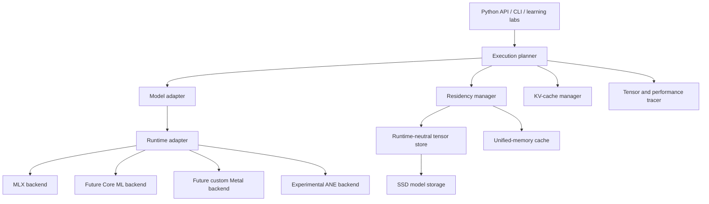
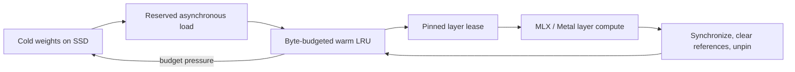

# Strata

Strata is an Apple Silicon runtime and learning laboratory for memory-tiered
large language model inference.

Its engineering objective is to run the largest useful model with the smallest
practical RAM footprint while preserving as much token throughput as possible.
The current baseline uses MLX and Metal. SSD weight paging, runtime-neutral
scheduling, MoE expert paging, and experimental Apple Neural Engine backends
remain staged work.

> The installable distribution is named `strata-llm`. The Python import
> namespace remains `ollm` temporarily for compatibility.

## Current verified baseline

The offline test suite currently verifies:

- Numerically stable chunked grouped-query attention against a NumPy reference
- Causal masking across query and key chunks
- Absolute query positions during cached decode
- RoPE against a deterministic NumPy reference
- Prompt prefill followed by one-token decode
- Cached decode logits against full causal forward passes in deterministic,
  two-layer Llama and DeepSeek fixtures
- KV-cache values, lengths, disk round trips, and replay rejection
- Tensor shape, dtype, byte size, phase timing, and MLX memory trace records
- Byte-budgeted layer residency, pinned-weight safety, exact next-layer
  prefetch, and warm-layer reuse across forwards

No network access or model download is required for these tests. Real-model
throughput and memory claims are intentionally separate from this deterministic
correctness baseline.

## Architecture direction



The architectural boundary is deliberate: Strata should own residency,
prefetching, eviction, cache policy, and measurement. MLX or another runtime
should own tensor computation and device kernels.

## Strata Governor

The first rearchitected runtime slice is a persistent Apple Silicon memory
governor:



The governor prefetches layer `N+1` before synchronizing layer `N`, measures
total load time separately from demand stall time, and retains hot layers when
the configured budget permits it. See
[docs/STRATA_GOVERNOR.md](docs/STRATA_GOVERNOR.md) for the design, equations,
state machine, hardware profile, and explicit limitations.

## Repository map

| Path | Purpose |
|---|---|
| `src/ollm/backends/mlx_ops.py` | Chunked grouped-query attention and causal masking |
| `src/ollm/llama_mlx.py` | Custom Llama-family MLX adapter |
| `src/ollm/deepseek_mlx.py` | Custom DeepSeek-family MLX adapter scaffold |
| `src/ollm/mlx_kvcache.py` | In-memory and SSD-backed MLX KV cache |
| `src/ollm/generation.py` | Shared prefill and incremental decode loop |
| `src/ollm/tracing.py` | Runtime-neutral tensor and operation trace records |
| `src/ollm/core/` | Runtime-neutral tensor, group, capability, and plan contracts |
| `src/ollm/storage/` | Cold tensor-store and manifest adapters |
| `src/ollm/scheduling/` | Residency manager, prefetch scheduler, and dense pipeline |
| `src/ollm/backends/mlx_governor.py` | MLX hardware profile and governor builder |
| `docs/AGENTIC_ENGINEERING.md` | Agent roles, evidence ladder, and integration gates |
| `docs/WAVE1_EVIDENCE.md` | Local M1 CPU, Metal, and ANE evidence and limitations |
| `tests/` | Deterministic offline correctness suite |
| `animations/prefill_vs_decode.py` | First Manim learning lesson |
| `STRATA_ENGINEERING_CONTEXT.md` | Architecture, equations, roadmap, and handoff context |

## Local setup

Strata targets Apple Silicon and Python 3.10 or newer.

```bash
python3 -m venv strata_env
source strata_env/bin/activate
python -m pip install -e ".[dev]"
```

Run the deterministic suite from the repository root:

```bash
PYTHONPATH=src python -m pytest -q
```

The custom model adapters do not download weights during unit tests. Loading a
real model is a separate operation and may require Hugging Face authentication,
license acceptance, and substantial local storage.

## Tracing

Pass a `TensorTracer` to a custom MLX model adapter to collect metadata without
retaining the underlying tensors:

```python
from ollm import TensorTracer
from ollm.llama_mlx import MLXLlamaForCausalLM

tracer = TensorTracer()
model = MLXLlamaForCausalLM(config, tracer=tracer)

# After a model call:
for event in tracer.events:
    print(event)
```

When tracing is enabled, attention execution is synchronized so duration and
MLX active/peak memory readings describe completed device work. This adds
measurement overhead and should be disabled for throughput benchmarks.

## Roadmap

1. Benchmark real layer files and adapt the governor to standard `mlx_lm`
   modules.
2. Make the weight budget adapt to KV-cache growth and memory pressure.
3. Add router-driven MoE expert paging using the same residency contracts.
4. Evaluate Core ML and experimental ANE execution only after the MLX reference
   path is correct and benchmarked.

See [STRATA_ENGINEERING_CONTEXT.md](STRATA_ENGINEERING_CONTEXT.md) for the full
technical design and teaching context.

## License

See [LICENSE](LICENSE).
