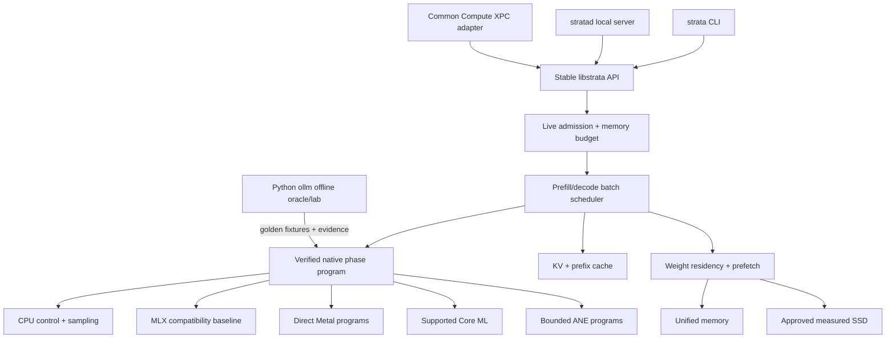
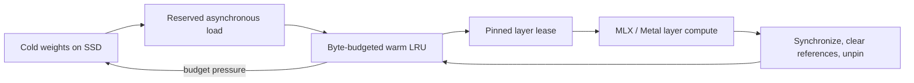

# Strata

Strata is a standalone Apple-Silicon LLM engine and learning laboratory for
adaptive, memory-tiered inference. Its intended product surface is a native
library, CLI, and local model server; Common Compute is its first proving-ground
integration through a separate adapter.

For each model and request, Strata admits a safe memory budget and selects a
measured execution plan for the hardware identity, prompt/decode phase, shape,
service objective, and live memory/thermal/power state.

Its engineering objective is to run the largest useful model with the smallest
practical RAM footprint while preserving as much token throughput as possible.
The current baseline uses MLX, a runtime-neutral IR and adaptive planner, a
versioned SSD weight-pack path, native Metal probes, and an isolated private-ANE
qualification worker. Full-model heterogeneous execution and MoE expert paging
remain staged work.

> The installable distribution is named `strata-llm`. The Python import
> namespace remains `ollm` temporarily for compatibility.

## Current verified baseline

The offline test suite and serialized local M1 probes currently verify:

- Numerically stable chunked grouped-query attention against a NumPy reference
- Causal masking across query and key chunks
- Absolute query positions during cached decode
- RoPE against a deterministic NumPy reference
- Prompt prefill followed by one-token decode
- Cached decode logits against full causal forward passes in deterministic,
  two-layer Llama and DeepSeek fixtures
- KV-cache values, lengths, disk round trips, and replay rejection
- Tensor shape, dtype, byte size, phase timing, and MLX memory trace records
- Byte-budgeted layer residency, pinned-weight safety, exact next-layer
  prefetch, and warm-layer reuse across forwards
- Evidence-scoped prefill/decode planning with an MLX fallback
- Live-platform admission with explicit service objectives, safe memory budgets,
  full/paged residency decisions, and fail-closed SSD qualification
- Checksummed, aligned weight-pack exact-range and read-only mmap access
- Direct private-ANE compilation, IOSurface dispatch, and CPU numerical parity
  for one fixed fp16 projection on the local M1
- Exact StrataIR lowering into that fixed callable ANE prefill segment
- Weight-pack ranges loaded through the real residency and prefetch pipeline
- Evidence-gated resident MLX batch-one routing for exact Qwen, Llama, and
  Gemma workloads, with safe continuous-batch fallback

No network access or model download is required for these tests. Real-model
throughput and memory claims are intentionally separate from this deterministic
correctness baseline.

### Model-path status

| Model or path | Current status |
| --- | --- |
| `deepseek-coder-1.3b` | Verified end-to-end MLX smoke path |
| `deepseek-coder-6.7b` | Loader path exists; model weights and local validation are required |
| `llama3-1B-chat`, `llama3-3B-chat`, `llama3-8B-chat` | Compatibility loader uses `mlx-lm`; Hugging Face access and local validation are required |
| Pinned Qwen, Llama, and Gemma benchmark fixtures | Evidence-gated resident-route planning is verified; serialized results are not a universal hardware claim |
| `qwen3-next-80B`, `gemma3-12B` | Architecture targets; not implemented in the current compatibility loader |
| `gpt-oss-20B`, `gpt-oss-120B` | Manifest and planning targets; full MXFP4 execution is not implemented |

The following remain targets rather than shipped capabilities: a persistent
production XPC server, multi-request continuous batching, complete native
Metal/ANE model execution, production SSD paging, and the separate
`strata_llm` distribution.

> Storage boundary: `/Volumes/Tyler HDD` is the source checkout, not an SSD.
> Strata must not use it for SSD offload, SSD benchmarking, or model/cache
> placement intended to represent SSD behavior. SSD experiments require a
> separate destination approved by the user.

## Architecture direction



The boundary is deliberate: Strata owns model import, the persistent inference
hot path, batching, KV state, residency, backend selection, and measurement.
Integrators own their networking and business concepts. Python produces test
fixtures and evidence but is not part of the production token hot path.

See [docs/STANDALONE_RUNTIME.md](docs/STANDALONE_RUNTIME.md) for the native
product boundary, implementation stack, portable-model/capsule split, and
compute-engine ownership. See
[docs/PERFORMANCE_CONTRACT.md](docs/PERFORMANCE_CONTRACT.md) for the benchmark
vector, evidence ladder, competitor baselines, and promotion gates.
See [docs/MAXIMUM_SPEED_RUNTIME.md](docs/MAXIMUM_SPEED_RUNTIME.md) for the
full-resident SSD-off policy, ANE toggles, shared MLX speedup gate, and native
route to a model-wide MLX-LM win.
The first named external scorecard is
[docs/DARKBLOOM_TARGET.md](docs/DARKBLOOM_TARGET.md), with fail-closed
machine-readable M4 Max gates under `benchmarks/targets/`.
Dynamic whole-model and partial-weight SSD residency is specified in
[docs/DYNAMIC_SSD_RESIDENCY.md](docs/DYNAMIC_SSD_RESIDENCY.md); it always stages
weights into unified memory and never treats the checkout HDD as SSD.

See [docs/COMMON_COMPUTE_RUNTIME.md](docs/COMMON_COMPUTE_RUNTIME.md) for the
canonical ownership map, XPC protocol, adaptation loop, migration waves, and
acceptance gates.

See [docs/STRATA_ENGINE_ARCHITECTURE.md](docs/STRATA_ENGINE_ARCHITECTURE.md)
for the high-detail internal engine design: modules and ownership, request and
model state machines, continuous batching, KV and weight memory accounting,
backend handoffs, failure recovery, evidence, and implementation order.

See [docs/MODEL_ADAPTIVE_ARCHITECTURE.md](docs/MODEL_ADAPTIVE_ARCHITECTURE.md)
for the capability-driven model manifest, Common Compute catalog bridge,
architecture-family lowering, SoC placement policy, and first-class GPT-OSS
20B/120B plan.

## Strata Governor

The first rearchitected runtime slice is a persistent Apple Silicon memory
governor:



The governor prefetches layer `N+1` before synchronizing layer `N`, measures
total load time separately from demand stall time, and retains hot layers when
the configured budget permits it. See
[docs/STRATA_GOVERNOR.md](docs/STRATA_GOVERNOR.md) for the design, equations,
state machine, hardware profile, and explicit limitations.

## Repository map

| Path | Purpose |
|---|---|
| `src/ollm/backends/mlx_ops.py` | Chunked grouped-query attention and causal masking |
| `src/ollm/llama_mlx.py` | Custom Llama-family MLX adapter |
| `src/ollm/deepseek_mlx.py` | Custom DeepSeek-family MLX adapter scaffold |
| `src/ollm/mlx_kvcache.py` | In-memory and SSD-backed MLX KV cache |
| `src/ollm/generation.py` | Shared prefill and incremental decode loop |
| `src/ollm/tracing.py` | Runtime-neutral tensor and operation trace records |
| `src/ollm/core/` | Runtime-neutral tensor, group, capability, and plan contracts |
| `src/ollm/core/model_manifest.py` | Versioned architecture, tokenizer, artifact, and model identity contracts |
| `src/ollm/core/platform.py` | Common Compute service objective, live-state, storage, and admission contracts |
| `src/ollm/core/runtime_policy.py` | Maximum-speed, SSD, ANE, backend allowlist, and MLX speedup policy |
| `src/ollm/planning/adaptive_planner.py` | Evidence-gated prefill/decode target selection |
| `src/ollm/storage/` | Cold tensor-store and manifest adapters |
| `src/ollm/storage/weight_pack.py` | Versioned aligned pack, checksums, exact reads, and mmap |
| `src/ollm/storage/weight_pack_store.py` | Pack-backed group loading for residency and prefetch |
| `src/ollm/scheduling/` | Residency manager, prefetch scheduler, and dense pipeline |
| `src/ollm/backends/mlx_governor.py` | MLX hardware profile and governor builder |
| `src/ollm/runtime/resident_mlx.py` | Evidence-gated resident MLX single-sequence versus continuous-batch routing |
| `docs/STANDALONE_RUNTIME.md` | Standalone library, CLI, daemon, adapter, and native SoC architecture |
| `docs/PERFORMANCE_CONTRACT.md` | Benchmark dimensions, evidence ladder, suites, and promotion gates |
| `docs/MAXIMUM_SPEED_RUNTIME.md` | Strict full-resident fast profile and intelligent ANE participation |
| `docs/DARKBLOOM_TARGET.md` | Exact Darkbloom comparison matrix and performance architecture |
| `docs/DYNAMIC_SSD_RESIDENCY.md` | Auto/full/paged weight policy, native Metal I/O path, and safe resizing |
| `docs/AGENTIC_ENGINEERING.md` | Agent roles, evidence ladder, and integration gates |
| `docs/COMMON_COMPUTE_RUNTIME.md` | Common Compute boundary, adaptive objective, and native-runtime roadmap |
| `docs/STRATA_ENGINE_ARCHITECTURE.md` | Detailed Strata engine modules, state machines, hot path, and build order |
| `docs/MODEL_ADAPTIVE_ARCHITECTURE.md` | Dynamic model manifest, catalog bridge, family lowerings, and GPT-OSS design |
| `docs/COMMON_COMPUTE_MODEL_BENCHMARKS.md` | Pinned M1 model ladder, MLX-LM runner, and Darkbloom comparison boundary |
| `integrations/commoncompute/strata-wire-v1/` | Portable v1 request/control/event/receipt contract, Swift reference types, golden fixtures, verifier, and integration gates |
| `docs/WAVE1_EVIDENCE.md` | Local M1 CPU, Metal, and ANE evidence and limitations |
| `docs/WAVE2_EVIDENCE.md` | Adaptive planner, weight pack, and direct-ANE projection proof |
| `docs/WAVE3_EVIDENCE.md` | Callable ANE segment and pack-backed residency evidence |
| `docs/WAVE4_EVIDENCE.md` | Strict model manifests, logical GPT-OSS KV planning, and Metal phase-program evidence |
| `native/ane/` | Isolated private-runtime discovery and opt-in projection worker |
| `native/metal/linear_projection_bench.mm` | Generated-fixture native CPU/direct-Metal projection benchmark |
| `src/ollm/backends/ane_executor.py` | Bounded fixed-shape ANE request client |
| `src/ollm/backends/ane_segment.py` | Exact StrataIR-to-ANE linear lowering |
| `tests/` | Deterministic offline correctness suite |
| `animations/prefill_vs_decode.py` | First Manim learning lesson |
| `STRATA_ENGINEERING_CONTEXT.md` | Architecture, equations, roadmap, and handoff context |

## Local setup

Strata targets macOS on Apple Silicon with Python 3.10 or newer. The supported
compatibility path requires MLX and `mlx-lm`; CUDA and PyTorch are not required.

```bash
python3 -m venv strata_env
source strata_env/bin/activate
python -m pip install -e ".[dev]"
```

Run the deterministic suite from the repository root:

```bash
PYTHONPATH=src python -m pytest -q
```

The smallest model smoke test is:

```bash
python quick_demo.py
```

Model downloads use Hugging Face. Authenticate before loading gated models and
place downloaded weights on a volume with enough free space; do not use the
checkout HDD as an SSD-performance test target.

The custom model adapters do not download weights during unit tests. Loading a
real model is a separate operation and may require Hugging Face authentication,
license acceptance, and substantial local storage.

## Tracing

Pass a `TensorTracer` to a custom MLX model adapter to collect metadata without
retaining the underlying tensors:

```python
from ollm import TensorTracer
from ollm.llama_mlx import MLXLlamaForCausalLM

tracer = TensorTracer()
model = MLXLlamaForCausalLM(config, tracer=tracer)

# After a model call:
for event in tracer.events:
    print(event)
```

When tracing is enabled, attention execution is synchronized so duration and
MLX active/peak memory readings describe completed device work. This adds
measurement overhead and should be disabled for throughput benchmarks.

## Roadmap

1. Freeze the versioned Common Compute request, live-state, admission, and
   receipt schema; mirror it in Swift with cross-language golden fixtures.
2. Prove fixed-request streaming, cancellation, path confinement, and restart
   through the no-network XPC service with a generated fixture.
3. Run one pinned model in a persistent native MLX XPC worker with exact
   `mlx_llm` compatibility and fallback.
4. Add bounded continuous batching with separate/chunked prefill and one-token
   decode scheduling, independent streams, fairness, and cancellation.
5. Connect adaptive KV/residency budgets and qualified SSD paging with explicit
   host/runtime copy and demand-stall accounting.
6. Grow Metal/Core ML/ANE operation envelopes into verified transformer
   segments and keep only alternatives that improve the full serving plan.

See [STRATA_ENGINEERING_CONTEXT.md](STRATA_ENGINEERING_CONTEXT.md) for the full
technical design and teaching context.

## License

See [LICENSE](LICENSE).
