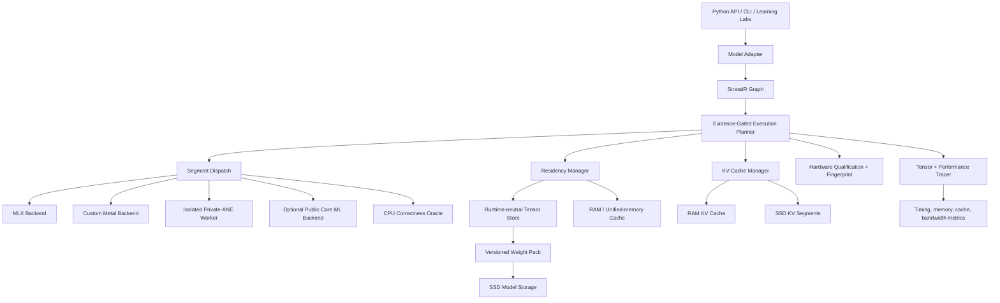
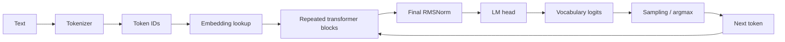
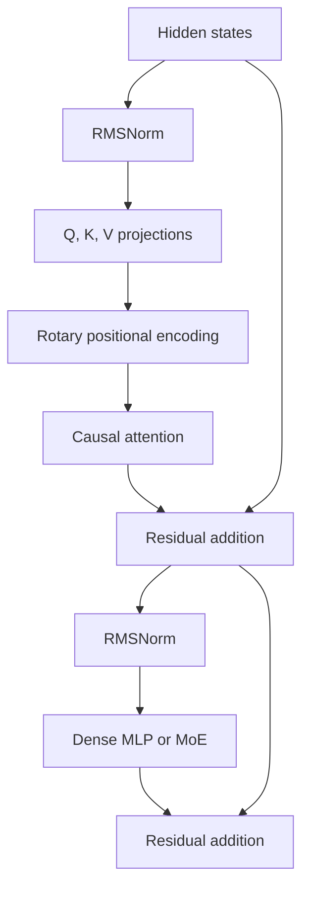
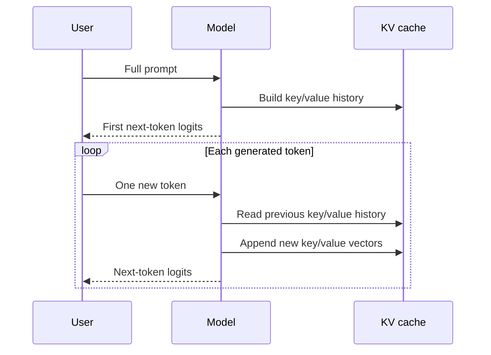
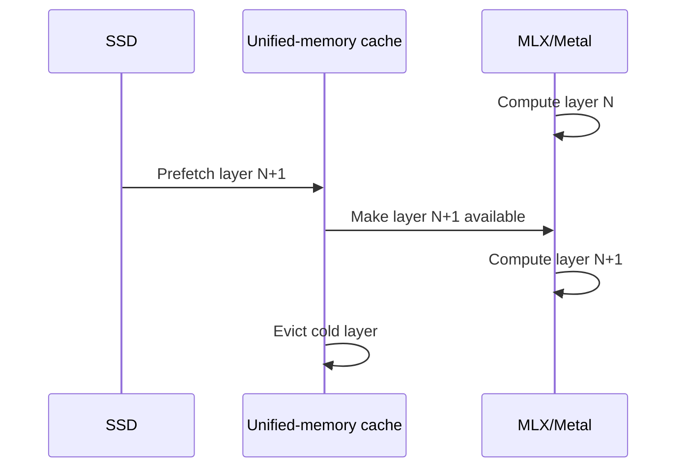
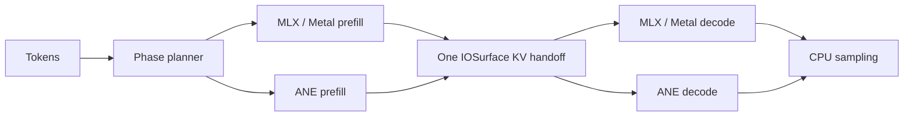

# Strata Engineering Context

This document is the shared design and learning context for Strata. Future work should use it as the project reference.

The canonical detailed internal engine design is
[`docs/STRATA_ENGINE_ARCHITECTURE.md`](docs/STRATA_ENGINE_ARCHITECTURE.md).
The canonical Common Compute/Strata ownership and native service boundary is
[`docs/COMMON_COMPUTE_RUNTIME.md`](docs/COMMON_COMPUTE_RUNTIME.md). This context
document retains the teaching-oriented explanation and historical roadmap.

## 1. Project identity

**Project name:** Strata

**Repository:** `https://github.com/Ikaikaalika/strata`

**Local path:** `/Volumes/Tyler HDD/strata`

**Current Python import namespace:** `ollm`

The Python namespace remains `ollm` temporarily for compatibility. The public project identity is now Strata.

## 2. Mission

Strata is an Apple Silicon runtime and learning laboratory for memory-tiered large language model inference.

The primary engineering objective is:

> Run the largest useful LLM possible with the smallest practical RAM footprint while preserving as much tokens-per-second performance as possible.

The system should explore:

- MLX and Metal GPU execution
- SSD-backed model-weight paging
- RAM/unified-memory caching
- KV-cache management
- Dense-layer prefetching
- Mixture-of-Experts expert paging
- Runtime-neutral scheduling
- Experimental Apple Neural Engine execution
- Low-level tensor tracing and performance education

Strata is both:

1. A working inference system.
2. A transparent learning tool for understanding LLMs close to the hardware.

## 3. Teaching and communication rules

Explanations should use:

- Markdown headings and tables
- LaTeX for equations
- Mermaid for static architecture and data-flow diagrams
- Manim animations for dynamic behavior when useful
- A definition for every technical term and every equation symbol
- Direct connections between concepts, repository files, tests, and measurements

Useful animation topics include:

- Prompt prefill versus token decoding
- Causal attention
- KV-cache growth
- Weights moving from SSD to unified memory
- Layer prefetching and eviction
- MoE router decisions
- Expert-cache hits and misses
- Runtime/backend selection

The first Manim lesson is:

- Source: `animations/prefill_vs_decode.py`
- Concept: prompt prefill, one-token decode, and KV-cache growth

## 4. Target architecture



### Architectural rule

The runtime should own tensor computation. Strata should own memory residency and scheduling.

Strata should decide:

- Which layer or expert is needed
- Which weights are on SSD
- Which weights are cached in RAM
- Which weights should be prefetched
- Which data should be evicted
- Which KV-cache blocks should remain resident
- How to fall back when a runtime lacks a capability

The runtime should execute:

- Matrix multiplication
- Attention kernels
- Quantized operations
- Metal command execution
- ANE graph execution
- Device-specific synchronization

## 5. Full LLM inference pipeline



### 5.1 Tokenization

A **token** is an integer representing a piece of text. A tokenizer maps text to token IDs:

```text
"hello world" → [15339, 1917]
```

If the vocabulary size is (V), each token ID satisfies:

\[
0 \leq \text{token\_id} < V
\]

Tokenization is normally CPU work.

### 5.2 Embedding lookup

The embedding matrix is:

\[
E \in \mathbb{R}^{V \times d}
\]

Where:

| Symbol | Meaning |
|---|---|
| (E) | Learned embedding matrix |
| (V) | Vocabulary size |
| (d) | Hidden dimension |
| (​\mathbb{R}) | Set of real-valued numbers |

For token (x), the embedding is:

\[
h = E[x]
\]

For a sequence of (T) tokens:

\[
H \in \mathbb{R}^{T \times d}
\]

### 5.3 Transformer block



#### RMSNorm

For a hidden vector (x):

\[
\operatorname{RMSNorm}(x)
=
\gamma \odot
\frac{x}{\sqrt{\operatorname{mean}(x^2)+\epsilon}}
\]

Where:

| Term | Meaning |
|---|---|
| (x) | Input hidden vector |
| (gamma) | Learned element-wise scale vector |
| (odot) | Element-wise multiplication |
| (operatorname{mean}) | Average across vector elements |
| (epsilon) | Small positive value preventing division by zero |

#### Query, key, and value projections

\[
Q = H W_Q
\]

\[
K = H W_K
\]

\[
V = H W_V
\]

Where:

| Term | Meaning |
|---|---|
| (H) | Hidden-state matrix |
| (Q) | Query tensor; what each token is looking for |
| (K) | Key tensor; what each token offers for matching |
| (V) | Value tensor; information returned after matching |
| (W_Q, W_K, W_V) | Learned projection weight matrices |

Typical tensor shapes are:

```text
Q: [batch, query_heads, sequence, head_dimension]
K: [batch, kv_heads, sequence, head_dimension]
V: [batch, kv_heads, sequence, head_dimension]
```

A **head** is an independent attention sub-calculation. A **query head** produces queries. A **KV head** produces keys and values.

#### Rotary positional encoding

RoPE rotates pairs of vector coordinates according to token position:

\[
q' = q \odot \cos(\theta) + \operatorname{rotate}(q) \odot \sin(\theta)
\]

\[
k' = k \odot \cos(\theta) + \operatorname{rotate}(k) \odot \sin(\theta)
\]

Where:

| Term | Meaning |
|---|---|
| (q'), (k') | Position-aware query and key vectors |
| (	heta) | Position-dependent rotation angle |
| (cos), (sin) | Trigonometric functions |
| (operatorname{rotate}) | Swaps and negates vector coordinate pairs |

#### Causal attention

The raw attention scores are:

\[
S = \frac{QK^\mathsf{T}}{\sqrt{d_h}}
\]

Where (d_h) is the dimension of one attention head and (K^\mathsf{T}) is the transpose of the key tensor.

The causal mask (M) prevents a token from seeing future tokens:

\[
M_{ij} =
\begin{cases}
0 & j \leq i \\
-\infty & j > i
\end{cases}
\]

The attention probabilities are:

\[
P = \operatorname{softmax}(S+M)
\]

The attention output is:

\[
O = PV
\]

The stable softmax equation is:

\[
\operatorname{softmax}(z_i)
=
\frac{e^{z_i-m}}{\sum_j e^{z_j-m}}
\quad\text{where}\quad
m=\max_j(z_j)
\]

Subtracting (m) prevents exponential overflow.

#### Dense MLP

A common SwiGLU-style MLP is:

\[
a = H W_{\text{gate}}
\]

\[
b = H W_{\text{up}}
\]

\[
u = \operatorname{SiLU}(a) \odot b
\]

\[
\operatorname{MLP}(H) = u W_{\text{down}}
\]

Where:

\[
\operatorname{SiLU}(x)=x\cdot\operatorname{sigmoid}(x)
\]

An **activation** is an intermediate value produced during a forward pass. A **weight** is a learned parameter stored as part of the model.

#### Mixture-of-Experts MLP

An MoE layer contains multiple expert MLPs and a router:

\[
g = H W_{\text{router}}
\]

\[
p = \operatorname{softmax}(g)
\]

\[
\operatorname{MoE}(H)
=
\sum_{i \in \operatorname{TopK}(p)} p_i E_i(H)
\]

Where:

| Term | Meaning |
|---|---|
| (g) | Router scores for each expert |
| (p) | Router probabilities |
| (E_i) | Expert (i)'s MLP |
| (operatorname{TopK}) | Selects the (k) highest-scoring experts |
| (p_i) | Weight assigned to expert (i) |

## 6. Prefill, decode, and the KV cache

Inference has two distinct phases:



**Prefill** processes the entire input prompt. **Decode** processes one newly generated token at a time.

The current project must ensure that decode does not repeatedly process the entire growing sequence.

## 7. Memory mathematics

### 7.1 Model weights

For (N) parameters and (b) bytes per parameter:

\[
M_{\text{weights}} = Nb
\]

Approximate storage:

| Format | Bytes per parameter |
|---|---:|
| FP32 | (4) |
| FP16/BF16 | (2) |
| INT8 | (1) |
| INT4 | approximately (0.5), plus scales and metadata |

**Quantization** stores numerical values with fewer bits. A **scale** is an additional number used to approximately reconstruct the original value.

### 7.2 KV-cache memory

\[
M_{\text{KV}}
=
2 B L T H_{\text{KV}} d_h b
\]

Where:

| Symbol | Meaning |
|---|---|
| (M_{\text{KV}}) | KV-cache memory |
| (B) | Batch size; number of sequences processed together |
| (L) | Number of transformer layers |
| (T) | Number of cached tokens |
| (H_{\text{KV}}) | Number of key/value heads |
| (d_h) | Dimension of one attention head |
| (b) | Bytes per numerical element |
| (2) | One copy for keys and one for values |

Reducing (H_{\text{KV}}) through grouped-query attention reduces KV memory linearly.

### 7.3 Attention temporary memory

If the score matrix is materialized:

\[
M_{\text{scores}}
=
B H T_q T_k b
\]

Where:

| Symbol | Meaning |
|---|---|
| (H) | Number of query heads |
| (T_q) | Number of query tokens |
| (T_k) | Number of key tokens |
| (b) | Bytes per score value |

Chunked or online attention avoids materializing the full score matrix.

### 7.4 Total working memory

\[
M_{\text{total}}
=
M_{\text{resident weights}}
+M_{\text{active layer}}
+M_{\text{KV}}
+M_{\text{activations}}
+M_{\text{temporary}}
+M_{\text{prefetch}}
+M_{\text{runtime overhead}}
\]

The engineering goal is to measure and control every term.

## 8. SSD offload strategies

> **Local storage boundary:** `/Volumes/Tyler HDD` is a confirmed HDD and is
> source-checkout storage only. It is not an SSD test or offload target. Use a
> separate user-approved SSD destination for model weights, caches, and storage
> qualification runs.

### 8.1 Dense layer paging

Dense transformer execution order is predictable:



The key overlap condition is:

\[
t_{\text{load}}(N+1) \leq t_{\text{compute}}(N)
\]

If true, loading the next layer can be hidden behind current computation.

### 8.2 MoE expert paging

For an MoE layer:

```text
Router selects experts
        ↓
Expert cache lookup
        ↓
Cache hit: execute immediately
Cache miss: load expert from SSD
        ↓
Execute selected expert MLPs
        ↓
Weighted combination
```

Use three residency tiers:

```text
Hot:  currently executing weights in runtime memory
Warm: recently used or predicted weights in RAM
Cold: remaining weights on SSD
```

### 8.3 KV-cache SSD offload

KV-cache offload is useful for very long contexts or inactive sessions, but it is slower than keeping active KV blocks in RAM.

The preferred order is:

1. Keep active KV blocks resident.
2. Compress or quantize KV blocks if possible.
3. Use sliding-window attention when model architecture permits it.
4. Move cold or inactive KV blocks to SSD.

### 8.4 What should remain resident

Usually resident:

- Current hidden states
- Active attention tensors
- Router weights
- Current layer weights
- Active MoE experts
- Frequently used KV blocks

Good SSD candidates:

- Cold dense layer weights
- Cold MoE expert weights
- Inactive-session KV blocks
- Large rarely used model components

## 9. Prefetching

For dense models, the next layer is known exactly:

\[
\text{prefetch}(\text{layer }N+1)
\quad\text{while computing layer }N
\]

For MoE models, expert selection depends on the current hidden state:

\[
\text{expert IDs}
=
\operatorname{TopK}
\left(
\operatorname{softmax}(H W_{\text{router}})
\right)
\]

Exact expert loading can start after the router runs. Speculative prefetching can use recent routing history.

A candidate prefetch score can be modeled as:

\[
\operatorname{score}(w)
=
P(\text{use }w)\cdot C_{\text{stall}}(w)
-C_{\text{memory}}(w)
-C_{\text{eviction}}(w)
\]

Where:

| Term | Meaning |
|---|---|
| (w) | Candidate weight page or expert |
| (P(\text{use }w)) | Estimated probability the weight will be needed |
| (C_{\text{stall}}) | Cost of waiting for a late load |
| (C_{\text{memory}}) | Cost of occupying RAM |
| (C_{\text{eviction}}) | Cost of removing another cached item |

## 10. Neural Engine strategy

The Apple Neural Engine (ANE) is a specialized Apple accelerator. The public Apple route is Core ML. Direct ANE access through reverse-engineered private APIs is experimental and version-fragile.

Strata requires ANE participation when a compatible ANE path passes its local
capability and correctness probes. It must not, however, force every operation
onto the ANE. The execution planner chooses the ANE work at phase and graph-
segment granularity because ANE wins depend on model shape, sequence length,
chip generation, compiler behavior, and transfer cost.

Potential ANE backends:

| Backend | Role |
|---|---|
| MLX | Primary flexible GPU backend |
| Core ML | Supported public ANE path |
| ANEForge | First experimental direct-ANE adapter and correctness oracle |
| Native ANE worker | Eventual isolated MIL/IOSurface execution service |
| Custom Metal | Future low-level GPU backend |
| CPU reference | Correctness and teaching backend |

### 10.1 What has been reverse engineered

The current direct-ANE projects converge on the same underlying mechanism:

1. Describe a graph in Apple's Model Intermediate Language (MIL).
2. Compile it through private `_ANECompiler` and in-memory model-descriptor
   APIs.
3. Load and evaluate it through private `_ANEClient` methods or the `aned`
   service.
4. Exchange fp16 or quantized tensors through IOSurface-backed buffers.
5. Represent linear layers as ANE-friendly convolutions over four-dimensional,
   channels-first tensors.

The most useful implementation references serve different purposes:

| Project | What Strata should take from it |
|---|---|
| [ANEForge](https://github.com/sbryngelson/ANEForge) | Python integration, operator probes, resident KV state, Llama/Qwen loaders, graph segmentation, and direct execution that cannot silently fall back to GPU |
| [ane.cpp](https://github.com/skyfallsin/ane.cpp) | Measurement-driven LLM kernel partitioning, baked-weight convolution kernels, fused QKV/FFN projections, W-lane batching, and persistent compile caching |
| [maderix/ANE](https://github.com/maderix/ANE) | Minimal `_ANEClient`/`_ANECompiler` bridge, dynamic-weight experiments, MIL generation, IOSurface I/O, and GPU-to-ANE shared-buffer experiments |
| [ane-infer](https://github.com/thebasedcapital/ane-infer) | A hybrid counterexample in which ANE handles batched prefill while Metal handles token decode |

These projects are research evidence, not stable API contracts. Reported
benchmarks are project- and machine-specific until reproduced on the target
M1.

Strata now has one reproduced direct-runtime result on that M1. The isolated
worker generates an fp16 MIL 1.0/ios16 projection with shape
`[1, 256, 1, 64]`, compiles and loads it through `_ANEInMemoryModel`, dispatches
through IOSurface, and compares readback with a deterministic CPU reference.
On macOS 26.5.2 build 25F84 the maximum absolute error was `0.0`. This qualifies
the local ANE runtime but does not yet authorize arbitrary linear shapes or a
full transformer segment. See `docs/WAVE2_EVIDENCE.md`.

### 10.2 Phase-adaptive heterogeneous execution

The planner must benchmark and select among multiple valid phase assignments,
not hard-code a single device sequence:



The **prefill phase** processes many prompt tokens and favors large parallel GPU operations. The **decode phase** processes one token repeatedly and may benefit from a compiled ANE graph with resident state.

That intuition is not universal. ANE short-sequence transformer work is often
memory-bandwidth-bound, while batched prefill creates greater weight reuse.
Therefore Strata measures at least these plans per model, context bucket, and
machine:

- MLX prefill plus MLX decode, as the correctness and fallback baseline.
- ANE prefill plus MLX decode.
- MLX prefill plus ANE decode.
- ANE prefill plus ANE decode.

When ANE is available and correct, the selected production plan must include at
least one ANE segment. A diagnostic override may run the all-MLX baseline for
comparison.

The ANE should be treated as a compiled graph accelerator, not as a general MLX device.

### 10.3 Direct-ANE process boundary

Private framework code belongs in a separate, restartable `strata-ane-worker`,
not in the main Python process. The worker owns:

- private symbol discovery and OS-build compatibility checks
- MIL compilation and persistent compiled-program caching
- IOSurface allocation and buffer aliasing
- graph-segment load, evaluate, unload, and telemetry
- recovery from compiler resource leaks or daemon/runtime failures

The Python backend communicates with the worker through a small versioned C ABI
or local IPC protocol. ANEForge is the fastest first adapter; a native worker
can replace it after Strata has reproducible M1 measurements without changing
the scheduler contract.

### 10.4 Capability and correctness gate

Direct ANE is enabled only after a startup or install-time probe records:

- Apple chip family, macOS build, ANE compiler/runtime fingerprint
- MIL compile, load, dispatch, and unload success
- supported fp16, int8, and optional int4 graph variants
- IOSurface shape/alignment behavior
- baked-weight and dynamic-weight behavior
- per-operator numerical error against the MLX reference
- compile count, resident bytes, dispatch latency, and transfer latency

The result is cached by chip plus macOS build. Any OS change invalidates it.
Failure disables only the private backend and leaves Core ML and MLX available.

### 10.5 ANE and SSD residency

The ANE does not execute weights directly from SSD. SSD remains a cold backing
tier. Direct projects commonly bake weights into compiled convolution programs,
then stream those weights from unified memory during evaluation. Other projects
pack dynamic weights into runtime IOSurface inputs, but that behavior is not yet
portable enough across M1 through M5 to be Strata's baseline.

The governor therefore manages two different objects:

- model files and compiled ANE programs on SSD
- a measured warm set of loaded ANE program segments and resident state in
  unified memory

Compiled programs are segmented by layer group and loaded ahead of demand. The
runtime must measure whether unload/reload actually releases resident memory;
it must not equate an on-disk compile cache with live ANE weight paging. Active
KV state stays resident during decode. SSD KV offload remains for cold or
inactive sessions, with one restore before the session becomes runnable.

Important limitations:

- Direct APIs are private and undocumented.
- Operator and tensor-shape support must be measured.
- Runtime behavior may change across macOS versions and chips.
- Dynamic SSD paging may not map cleanly to compiled ANE programs.
- Data movement between SSD, host memory, GPU, and ANE can erase compute gains.
- Core ML can allow ANE use but does not prove that every requested operation
  executed there; direct-ANE mode is the research path that provides that
  certainty.
- Private APIs are unsuitable for an App Store-safe production dependency and
  can break after any macOS update.

ANE research references:

- [Apple: Deploying Transformers on the Apple Neural Engine](https://machinelearning.apple.com/research/neural-engine-transformers)
- [Apple: MLComputeUnits](https://developer.apple.com/documentation/coreml/mlcomputeunits)
- [maderix/ANE](https://github.com/maderix/ANE)
- [ANEForge](https://github.com/sbryngelson/ANEForge)
- [ane.cpp](https://github.com/skyfallsin/ane.cpp)
- [ane-infer](https://github.com/thebasedcapital/ane-infer)

## 11. Runtime decision

Do not build the entire runtime from first principles. Use this division:

\[
\begin{aligned}
\text{First principles:}&\quad \text{math, reference kernels, memory model, scheduler}\\
\text{MLX:}&\quad \text{primary GPU execution}\\
\text{Core ML:}&\quad \text{supported ANE execution}\\
\text{ANEForge:}&\quad \text{experimental direct ANE execution}
\end{aligned}
\]

Build from first principles:

- Attention reference implementation
- Causal mask
- Tensor shape reasoning
- Memory accounting
- Residency manager
- SSD page cache
- Prefetch and eviction policy
- Correctness comparisons
- Profiling and educational traces

Reuse existing runtimes for:

- Metal execution
- Device-specific kernels
- ANE compilation
- Quantized matrix multiplication
- Tokenizers
- Safetensor/GGUF parsing where practical

## 12. Build plan

### Chunk 0: Baseline cleanup

Goal: make the current project trustworthy.

Tasks:

- Keep low-level imports independent from tokenizer/download imports.
- Remove stale PyTorch assumptions from active tests.
- Add a tiny deterministic model fixture.
- Make tests independent of network downloads.
- Update documentation to match the MLX state.

Definition of done:

```text
Package imports
Backend tests run
Tiny fixture loads
No network is required for unit tests
```

### Chunk 1: Transformer correctness

Goal: make the LLM math correct before optimizing it.

Tasks:

- Implement and test causal masking.
- Separate prompt prefill from one-token decode.
- Verify RoPE.
- Verify grouped-query attention.
- Verify residual connections.
- Verify KV-cache lengths and values.

Definition of done:

\[
\text{cached output}
\approx
\text{uncached output}
\]

within an explicitly defined numerical tolerance.

### Chunk 2: Learning instrumentation

Add tracing for:

- Tensor name
- Tensor shape
- Tensor dtype
- Tensor byte size
- Layer number
- Operation duration
- SSD read duration
- Cache hit/miss
- Peak memory

Example trace:

```text
Layer 4
  hidden: [1, 16, 2048], BF16
  query:  [1, 32, 16, 64], BF16
  key/value: [1, 8, 16, 64], BF16
  attention: 2.1 ms
  MLP: 4.8 ms
```

### Chunk 3: Runtime-neutral interfaces

Add:

```text
src/ollm/core/
  model_spec.py
  tensor_ref.py
  capabilities.py
  execution_plan.py

src/ollm/storage/
  tensor_store.py
  manifest.py
  page_cache.py

src/ollm/scheduling/
  residency_manager.py
  prefetch_scheduler.py
  eviction_policy.py
```

Core contracts should not depend directly on `mx.array`, `torch.Tensor`, or `ggml_tensor`.

### Chunk 4: Dense SSD weight paging

Goal: keep only the active layer and prefetch buffer in runtime memory.

Tasks:

- Per-layer weight manifest
- Configurable memory budget
- LRU eviction
- Async prefetch
- Double buffering
- Resident versus paged output comparison
- SSD bandwidth and stall measurement

### Chunk 5: MoE expert paging

Goal: keep routers and shared layers resident while paging selected experts.

Tasks:

- Real MoE model adapter
- Per-expert storage
- Expert LRU cache
- Exact router-driven loads
- Batch union of selected experts
- Speculative expert prefetch
- Resident-versus-paged output comparison

### Chunk 6: Additional Apple Silicon backends

Recommended order:

1. MLX
2. Core ML
3. Experimental ANEForge adapter
4. Custom Metal
5. Other runtime adapters

Each backend should declare capabilities:

```python
supports_weight_paging
supports_expert_paging
supports_async_prefetch
supports_external_kv_cache
supports_quantized_weights
supports_graph_capture
```

### Chunk 7: Learning labs and animations

Create lessons for:

- Tokens and embeddings
- Transformer blocks
- Attention
- RoPE
- KV caching
- SSD paging
- Prefetching
- MoE routing
- ANE versus GPU execution

Each lesson should follow:

```text
Concept
  ↓
Definitions
  ↓
Equation
  ↓
Tensor shapes
  ↓
Repository code
  ↓
Test
  ↓
Animation
  ↓
Benchmark interpretation
```

## 13. Optimization objective

The system should optimize:

\[
\min M_{\text{RAM}}
\]

subject to:

\[
\text{tokens per second} \geq \text{target}
\]

\[
\text{output}_{\text{optimized}}
\approx
\text{output}_{\text{resident reference}}
\]

Every optimization must measure:

- Peak RAM
- Tokens per second
- Prompt-prefill latency
- Decode latency
- SSD bandwidth
- SSD wait time
- Cache hit rate
- Numerical error

## 14. Current repository status

Current active implementation:

- MLX backend registered as the default backend
- Custom Llama and DeepSeek MLX model implementations
- MLX weight-loader scaffolding
- Memory-only and explicitly SSD-backed MLX KV cache
- Numerically stable chunked grouped-query attention with causal masking
- Prompt prefill followed by one-token cached decode
- Runtime-neutral tensor and operation trace records
- Runtime-neutral tensor, weight-group, capability, and execution-plan contracts
- Common Compute service-objective, live-platform, storage-qualification, and
  adaptive-admission contracts
- Validated StrataIR graphs and deterministic CPU reference execution
- Evidence-gated adaptive prefill/decode planner with an MLX fallback
- Version-one aligned, checksummed weight packs with exact-range and mmap reads
- Pack-backed group loading through the real prefetch and residency pipeline
- Strata Governor: byte-budgeted LRU residency with pinned layer leases
- Exact dense-layer prefetch with load, stall, bandwidth, compute, and memory traces
- Optional governed execution in the custom Llama and DeepSeek adapters
- Initial Manim animation
- Native Metal correctness probe for fixed-shape fused RMSNorm plus residual
- Isolated private-ANE schema-v2 worker with explicit fp16 projection
  qualification on the local M1
- Exact operation envelopes plus a bounded callable StrataIR-to-ANE prefill
  projection with logical/physical layout conversion

Known work remaining:

- Real-model validation is still needed for the Llama and DeepSeek adapters.
- Real-file SSD bandwidth, page-cache state, token throughput, and memory
  pressure behavior still need measurement on a separate user-approved SSD.
- The weight pack is not yet connected to asynchronous MLX/Metal residency
  leases. The historical 16 MiB reads came from the checkout HDD, are not
  controlled cold-cache results, and are excluded from SSD planning.
- Standard `mlx_lm` modules are not yet adapted to governed layer leases.
- The residency budget does not yet adapt to KV-cache growth.
- MoE loading exists as scaffolding, but full router/expert execution is not complete.
- Qwen3-Next, Gemma, and GPT-OSS paths remain incomplete.
- The direct-ANE executor covers one fixed projection; no general multi-operator
  executor, operator corpus, or persistent compiled-program cache exists.
- The fixed ANE segment recompiles on every request and does not support the
  one-token decode shape; one evaluate observation is not token throughput.
- The Python package namespace is still `ollm` for compatibility.

Recent baseline work:

- Lazy package imports were added.
- Stale PyTorch backend tests were replaced with MLX tests.
- Causal and unmasked attention match independent NumPy references.
- RoPE matches a deterministic NumPy reference.
- Cached decode logits match full causal forward passes on deterministic,
  two-layer Llama and DeepSeek fixtures.
- KV-cache values, lengths, disk round trips, and replay rejection are tested.
- Tensor traces capture shape, dtype, bytes, phase, duration, and MLX memory.
- Loading reservations count against a hard budget before I/O begins.
- Deterministic tests prove pinned-layer safety, prefetch-before-compute ordering,
  demand fallback, LRU eviction, and warm-layer reuse.
- Governed Llama output matches the non-governed MLX path.
- The offline test suite and source compilation pass with `PYTHONPATH=src`.

## 15. Immediate next step

The next implementation milestone is:

```text
Versioned Common Compute request/state/admission/receipt schema
+ Swift mirror types and cross-language golden fixtures
+ deterministic streaming/cancellation fixture through the no-network XPC service
+ one pinned model in a persistent native MLX worker with mlx_llm parity
+ two-request continuous batching with independent streams and correct metering
+ adaptive KV/residency budgets and verified weight-pack-to-MLX copy tracing
+ restartable ANE worker and heterogeneous segments after the serving baseline
```

This milestone must start with generated deterministic weights. Before any real
checkpoint is downloaded, the user must choose the destination and approve its
size. The MLX path remains the correctness oracle and fallback. Router-driven
MoE expert groups and direct-ANE expansion follow after the persistent,
correctly metered serving path and adaptive memory loop establish a measurable
baseline.
