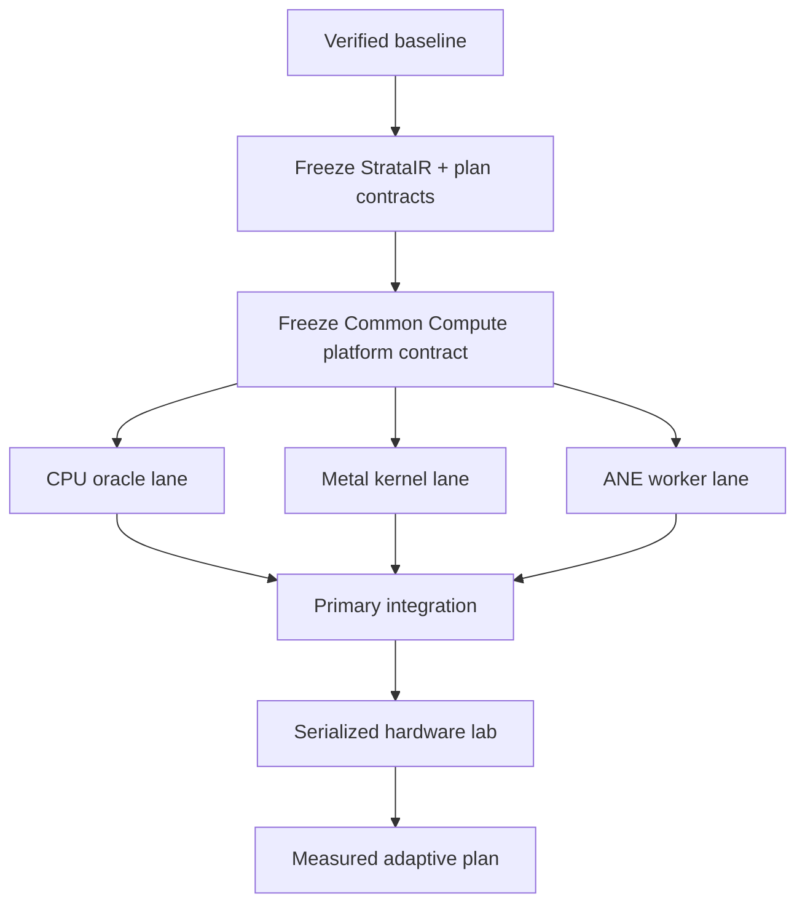

# Agentic engineering for Strata

Strata uses agents as bounded engineering specialists. Agents may implement in
parallel only after the primary integrator freezes the interfaces they share.
Hardware benchmarks run serially on the target Mac so GPU, ANE, memory, and
thermal contention do not corrupt comparisons.

## Evidence ladder

Every result is labeled as one of:

1. **Correctness evidence**: deterministic comparison against an independent
   reference.
2. **Synthetic evidence**: a scheduler or hardware model that does not execute
   the real workload.
3. **Hardware evidence**: a measured operation on the fingerprinted physical
   machine.

Synthetic evidence can justify the next experiment. It cannot justify a token-
throughput, SSD-throughput, energy, or accelerator-execution claim.

## Dependency waves



The primary integrator owns `src/ollm/core/`, backend registration, shared
documentation, and final verification. A specialist receives exclusive paths
and must not edit another agent's files.

## Required task contract

Each agent task declares:

```text
Objective:
Owned paths:
Read-only interfaces:
Out of scope:
Correctness oracle:
Required tests:
Required measurements:
Failure and fallback behavior:
Deliverable:
```

An agent reports exact commands and limitations. It does not download packages
or model data without an approved destination, does not silently weaken a test,
and does not claim an accelerator ran from configuration alone.

## Integration gate

Before accepting a lane, the primary integrator checks:

- No ownership overlap or unrelated modifications.
- Deterministic tests pass on the known local runtime.
- Unsupported operations fail closed.
- Capability declarations match what was actually executed.
- Hardware reports include the chip, macOS build, runtime fingerprint, warmup,
  repetitions, numerical error, and units.
- The full offline suite still passes.

## Performance loop

For one fixed model, prompt, batch, context, quantization, and cache state:

1. Measure the MLX baseline.
2. Replace one segment with CPU, Metal, or ANE work.
3. Verify its outputs before timing it.
4. Measure prefill and decode separately.
5. Record memory, demand stall, and energy when available.
6. Keep the segment only when the end-to-end plan improves.

The optimization target is end-to-end latency, throughput, memory, or energy;
isolated kernel speed is supporting evidence rather than the final objective.
