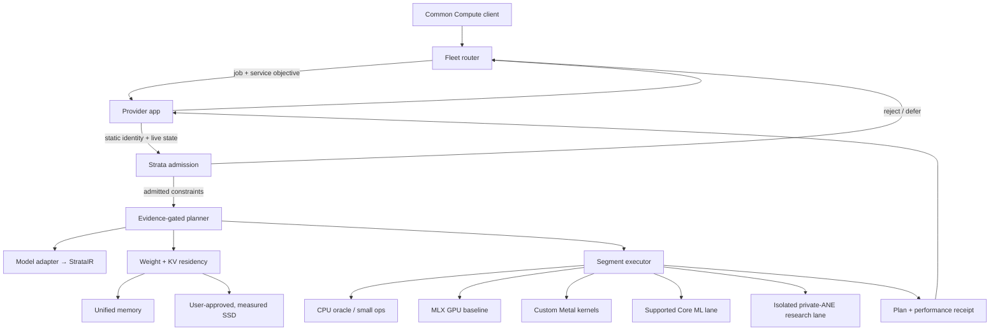
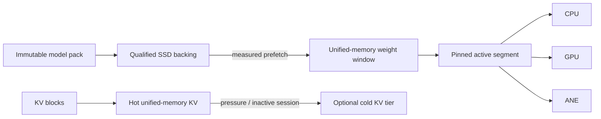

# Strata for Common Compute

Status: architecture and admission-contract freeze. The Python implementation
is a correctness laboratory; it is not yet wired into the Common Compute Swift
provider or its XPC service.

The current adaptive planner also assigns the whole graph to one backend per
phase. Per-operation heterogeneous segmentation described below is the target
architecture, not a completed capability.

## Decision

Strata will be the per-Mac inference control plane beneath Common Compute. It
will not be one more fixed `mlx_llm` runner. Common Compute decides **which Mac
receives a job**; Strata decides **whether that Mac should admit it and how that
specific request should execute now**.

"Best" therefore means the best verified plan for this tuple:

```text
(model revision, quantization, prompt shape, output budget, service objective,
 Apple chip, macOS/runtime build, current memory, thermal/power state,
 model residency, and qualified storage)
```

There is no globally best CPU/GPU/ANE split. Using every engine is useful only
when end-to-end measurements, including synchronization and data-layout costs,
show that the combined plan wins.

## Control boundary



This is a two-level scheduler:

1. The Common Compute fleet scheduler uses coarse, trustworthy envelopes:
   model support, memory floor, cached-model state, availability, and recent
   reliability.
2. The local Strata scheduler uses fine-grained state that should not churn in
   the cloud: GPU allocation, memory pressure, thermals, power mode, KV growth,
   backend health, compile caches, and local performance evidence.

## Frozen input contract

The first code contract is `ollm.core.platform`.

| Contract | Meaning |
|---|---|
| `HardwareProfile` | Static identity and measured ceilings; keys reusable evidence |
| `LivePlatformState` | Short-lived memory, thermal, power, and qualified-storage snapshot |
| `ServiceObjective` | Interactive, throughput, or background intent plus explicit limits |
| `RuntimeDemand` | Full-resident and minimum-paged working-set estimates |
| `AdmissionDecision` | Admit/reject, memory budget, residency mode, storage ID, API policy |

Static and dynamic facts remain separate. A thermal change must trigger a new
admission/replan decision; it must not generate a new hardware identity. A
macOS, backend-runtime, or ANE-worker change must invalidate old evidence.

Storage targets are opaque IDs rather than paths. Adaptive paging requires all
of the following:

- the user approved the destination;
- the host classified it as an internal or external SSD;
- its bandwidth was measured under an evidence-recorded protocol;
- it has enough space for the requested placement.

An HDD never qualifies, regardless of an apparently fast page-cache read.

## Optimization objective

For candidate plan \(P\), Strata selects from the correctness-verified feasible
set by maximizing:

\[
U(P) = w_T T(P) - w_F F(P) - w_L L(P) - w_E E(P) - w_S S(P) - w_R R(P)
\]

where:

- \(T(P)\): sustained decode throughput in tokens per second;
- \(F(P)\): time to first token;
- \(L(P)\): end-to-end latency or deadline overrun;
- \(E(P)\): energy per useful token when measurable;
- \(S(P)\): storage and residency stall time;
- \(R(P)\): operational risk penalty, including private APIs and recent faults;
- \(w_*\): weights derived from the Common Compute service objective.

The feasible set enforces:

\[
M(P,t) \le B(t), \qquad \operatorname{error}(P) \le \epsilon
\]

where \(M(P,t)\) is runtime memory at time \(t\), \(B(t)\) is the current
safe budget, and \(\epsilon\) is the numerical-error limit established by the
correctness oracle. Serious thermal pressure, critical memory pressure, stale
hardware state, unsupported operations, or an unqualified storage tier remove
a plan from the feasible set rather than merely lowering its score.

Service-class weights are intentionally different:

| Class | Primary goal | Typical policy |
|---|---|---|
| Interactive | First-token and per-token latency | resident model, batch 1, no speculative storage stalls |
| Throughput | Useful tokens per wall-clock second | continuous batching, prefix reuse, larger queues |
| Background | Energy and fleet economics | efficient quantization, bounded paging, thermal cooperation |

## Phase-adaptive execution

Prefill and decode are separate optimization problems.

### Prefill

Prefill processes many prompt tokens and often has enough arithmetic intensity
to benefit from GPU batching or a qualified fixed-shape ANE/Core ML segment.
The planner may use CPU and GPU streams concurrently for independent work, but
must include synchronization in the end-to-end measurement.

### Decode

Decode usually processes one new token at a time and repeatedly reads model and
KV state. Memory traffic, launch overhead, and cache growth can dominate. The
default recovery path remains MLX on the GPU; CPU handles tokenization,
streaming, request control, and small operations only when measurement supports
that split. ANE decode is enabled only for exact, correctness-verified shapes
whose transition and readback costs still improve the full token loop.

### Replanning boundaries

The runtime may re-evaluate policy at request admission, after prefill, between
decode tokens, or between batched iterations. It does not migrate a live native
operation halfway through dispatch. Critical pressure cancels or falls back at
the next safe boundary.

## Memory tiers



Apple Silicon's unified memory lets CPU and GPU operations use the same MLX
arrays without explicit device copies, but execution dependencies and storage
ingress still cost time. SSD data first enters host/unified memory; Strata does
not claim direct SSD execution.

Admission chooses one of three outcomes:

1. **Full residency** when weights, KV, activations, and temporary buffers fit
   inside the live budget.
2. **Paged residency** when the minimum active window fits and a qualified SSD
   target exists.
3. **Reject/defer/reroute** when neither is safe. Thrashing is not a runtime
   strategy.

## Production and research lanes

Common Compute production defaults to supported Apple and MLX APIs. Core ML may
be configured to permit ANE use, but configuration alone is not execution
proof. Strata records it as ANE evidence only after compile, dispatch, readback,
and numerical verification.

Direct private-ANE work remains a separate, restartable, fail-closed research
worker. `DeploymentMode.SUPPORTED` prevents private backends from entering a
plan. A canary device can opt into `DeploymentMode.RESEARCH`; failure returns to
the verified MLX plan and must not fail the customer job.

## Runtime shape for Common Compute

The production target should be native rather than a long-lived Python process:

```text
Common Compute Swift app
  └─ StrataKit Swift client
      └─ signed, sandboxed strata-runtime XPC service
          ├─ MLX Swift model compatibility backend
          ├─ Metal kernel backend
          ├─ supported Core ML backend
          ├─ residency / KV / batch scheduler
          └─ opt-in private-ANE child worker (research only)

Python Strata lab
  ├─ independent NumPy/MLX correctness oracles
  ├─ generated fixtures and hardware qualification
  └─ versioned evidence and plan fixtures consumed by native tests
```

The current Python contracts are executable specifications for the future Swift
types. A versioned serialization schema and cross-language golden fixtures come
before connecting the provider runner.

## Learning loop

The first adaptive system is deterministic, not unconstrained online learning:

1. Probe supported capabilities and build the hardware fingerprint.
2. Verify every candidate against the oracle.
3. Benchmark comparable end-to-end plans serially on that Mac.
4. Store a Pareto frontier by model, shape bucket, phase, and hardware/runtime
   fingerprint.
5. Select from the verified frontier using the current service objective and
   live constraints.
6. Update measurements from real jobs only after filtering warmup, failure,
   thermal, and cache-state metadata.
7. Explore new plans only on generated canaries or explicitly eligible idle
   work; never experiment on an unconsenting customer request.

This makes adaptation auditable. A selected plan has a plan ID, evidence IDs,
decision reasons, fallback, and a completion receipt.

## Common Compute bridge contract

The provider-to-Strata request should eventually contain:

- job ID and immutable model revision/hash;
- quantization and model graph/adapter ID;
- context length, output ceiling, batch, and sampling contract;
- service class, first-token/decode/deadline objectives;
- memory ceiling and explicit spill permission;
- supported-only or research deployment mode.

Strata returns:

- admit, defer, reject, or reroute reason;
- selected model representation and quantization;
- prefill and decode segments;
- memory/KV/residency budgets and opaque storage target ID;
- fallback plan and safe replanning triggers;
- plan/evidence fingerprints;
- measured first-token, decode, memory, stall, energy, and error fields when
  available.

The cloud needs the compact outcome, not raw local paths or high-frequency
telemetry.

## Delivery waves

1. **Contract bridge:** versioned request/state/decision/receipt schema, Swift
   mirror types, and cross-language golden fixtures.
2. **Native MLX baseline:** replace the generic Common Compute LLM runner behind
   a feature flag while preserving its output and metering contract.
3. **Live admission:** feed provider memory, thermal, power, engine-load, and
   model-residency state into `AdaptiveAdmissionPolicy` semantics.
4. **Phase planner:** benchmark and choose separate prefill/decode plans; add
   safe fallback and invalidation.
5. **Memory adaptation:** KV-aware budgets, continuous batching, prefix caching,
   and qualified SSD paging only on a user-approved destination.
6. **Heterogeneous kernels:** grow exact Metal/Core ML/ANE segments one verified
   transformer block at a time.
7. **Fleet learning:** aggregate privacy-safe evidence by fingerprint and roll
   out plan changes through canaries.

Wave 1 is complete only when Python and Swift round-trip identical golden
fixtures. Wave 2 is complete only when a local Common Compute provider job
matches the current MLX result, streaming, usage, cancellation, and teardown
behavior. Neither gate is a production deployment.

## Platform references

- [MLX unified memory](https://github.com/ml-explore/mlx/blob/main/docs/src/usage/unified_memory.rst)
- [MLX lazy evaluation](https://github.com/ml-explore/mlx/blob/main/docs/src/usage/lazy_evaluation.rst)
- [Metal recommended working-set size](https://developer.apple.com/documentation/metal/mtldevice/recommendedmaxworkingsetsize)
- [Foundation ProcessInfo thermal and low-power state](https://developer.apple.com/documentation/foundation/processinfo)
- [Core ML compute-unit policy](https://developer.apple.com/documentation/coreml/mlcomputeunits)
