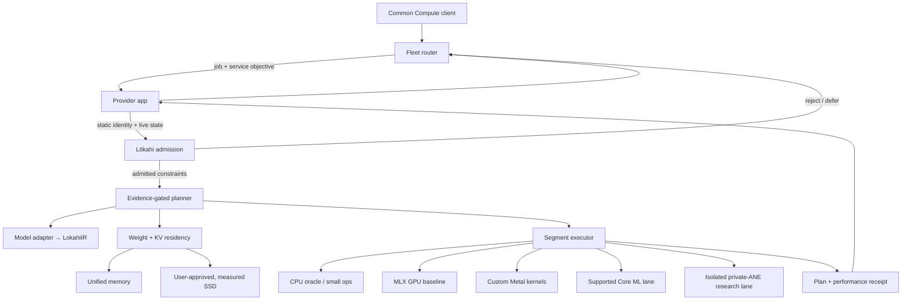
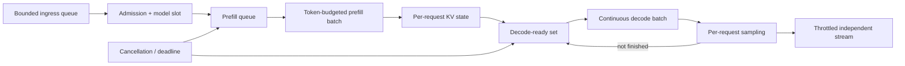
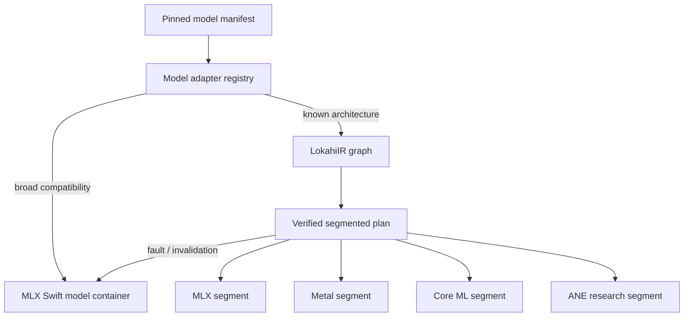
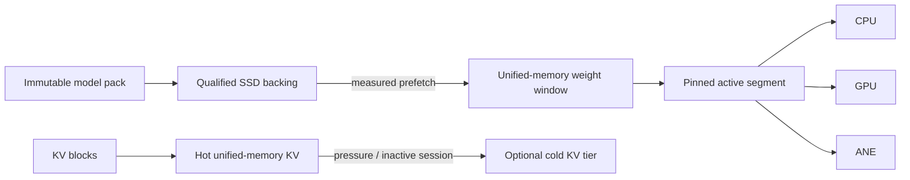

# Lōkahi for Common Compute

Status: canonical target architecture and admission-contract freeze. The
Python implementation is a correctness laboratory; it is not yet wired into
the Common Compute Swift provider or its XPC service.

The current adaptive planner also assigns the whole graph to one backend per
phase. Per-operation heterogeneous segmentation described below is the target
architecture, not a completed capability.

## Decision

Lōkahi will be the per-Mac inference control plane beneath Common Compute. It
will not be one more fixed `mlx_llm` runner. Common Compute decides **which Mac
receives a job**; Lōkahi decides **whether that Mac should admit it and how that
specific request should execute now**.

"Best" therefore means the best verified plan for this tuple:

```text
(model revision, quantization, prompt shape, output budget, service objective,
 Apple chip, macOS/runtime build, current memory, thermal/power state,
 model residency, and qualified storage)
```

There is no globally best CPU/GPU/ANE split. Using every engine is useful only
when end-to-end measurements, including synchronization and data-layout costs,
show that the combined plan wins.

## Architecture invariants

These boundaries preserve the efficient Lōkahi architecture while adding
Common Compute serving:

1. **Lōkahi owns the hot inference path.** Admission, continuous batching,
   prefill/decode scheduling, KV state, residency, prefetch, eviction, backend
   selection, cancellation safe points, and runtime metrics live together in
   one persistent engine.
2. **Common Compute owns the distributed system.** Authentication, provider
   identity, WebSockets, leases, fleet routing, artifact transfer, billing,
   customer streaming, provider UI, releases, and revocation remain outside
   Lōkahi.
3. **XPC is a process boundary, not another scheduler.** The host submits and
   cancels requests; it does not reserve the GPU independently for every
   admitted Lōkahi request or choose batch membership.
4. **MLX is the compatibility baseline and recovery plan.** Metal, Core ML,
   and ANE segments enter production only with matching correctness evidence
   and superior end-to-end hardware evidence.
5. **Static identity, live state, and learned evidence remain separate.** A
   thermal event changes admission; a runtime or macOS change invalidates plan
   evidence; neither silently rewrites model identity.
6. **Memory is budgeted before work begins.** Weights, KV, activations,
   temporary buffers, prefetch reservations, and runtime overhead all count.
7. **Storage is a cold tier, never a compute engine.** HDD is forbidden for
   model/KV offload and SSD data always enters unified memory before compute.
8. **The public API stays model-first.** Customers request `llm.generate` and
   a model; `lokahi_llm` and `mlx_llm` are internal implementation lanes.
9. **Broad compatibility and deep optimization are different promises.** An
   MLX adapter may make a model runnable; a specialized Lōkahi plan is claimed
   only for the exact model revision, shape bucket, quantization, and hardware
   fingerprint that passed the evidence gates.
10. **Partial output changes recovery semantics.** Before the first streamed
    byte, a request may fall back or retry safely. After output begins, failure
    must terminate that stream explicitly unless a future resumable protocol
    proves replay-safe continuation.

## Current versus target

| Area | Verified current state | Target state |
|---|---|---|
| Correctness | Python/NumPy and MLX deterministic fixtures | Same fixtures consumed by native Swift tests |
| Planning | One whole-graph backend per prefill/decode phase | Multiple verified operation segments per phase |
| Residency | Byte-budgeted generated-fixture governor and pack-backed loading | Native model/KV/prefix ownership inside persistent XPC |
| Serving | Custom one-request prefill/decode loops; no production server | Bounded multi-request continuous batching |
| Common Compute | Existing `mlx_llm` executes in the host process | Internal `lokahi_llm` batched lane through XPC |
| XPC | Fixed no-network service exists but returns `unsupportedRunner` | Signed native engine with streaming callbacks and self-test |
| Metal | Fixed correctness probe | Measured transformer segments |
| ANE | One fixed fp16 prefill projection; per-request compile/load | Cached exact segments; research-only until full-plan evidence |
| Storage | Pack format and correctness path; checkout HDD excluded | User-approved measured SSD, traced copy/stall, bounded paging |
| Fleet evidence | Local serialized M1 evidence records | Privacy-safe per-fingerprint receipts and canary rollout |

Nothing in the target column is a current production claim.

## Control boundary



This is a three-level scheduler plus an offline evidence loop:

1. The Common Compute fleet scheduler uses coarse, trustworthy envelopes:
   model support, memory floor, cached-model state, availability, and recent
   reliability.
2. The provider host performs local lifecycle admission: user availability,
   assignment ownership, runtime revision, XPC health, bounded queue capacity,
   and task staging.
3. The Lōkahi engine schedules the hot path using state that should not churn
   in the cloud: memory pressure, thermals, power mode, KV growth, model
   residency, batch composition, backend health, compile caches, and local
   performance evidence.
4. The qualification lab verifies and benchmarks candidate plans, then
   publishes versioned evidence for the online planner. Customer requests are
   not uncontrolled experiments.

## Ownership map

| Concern | Common Compute control plane | Provider host | Lōkahi XPC engine |
|---|---|---|---|
| Customer API, auth, quota, billing | Owns | Relays | Does not access |
| Fleet placement and retry | Owns | Reports capability | Returns admit/decline reasons |
| WebSocket, leases, heartbeats | Owns protocol | Owns connection | No network access |
| Artifact download and verification | Authorizes manifest | Downloads and stages | Re-verifies and loads |
| Model residency and eviction | Uses compact reports | Does not choose | Owns |
| Request queue and continuous batching | Supplies objectives | Applies bounded ingress | Owns batch membership |
| Tokenization, prefill, decode, sampling | Does not access | Does not execute | Owns |
| KV and prefix cache | Does not access | Does not mutate | Owns |
| CPU/GPU/ANE placement | Does not choose | Does not choose | Owns from evidence |
| Streaming | Relays to customer | Relays bounded events | Produces throttled deltas |
| Cancellation | Initiates | Forwards | Applies at safe boundaries |
| Runtime update and rollback | Publishes policy | Owns installation | Reports revision/health |
| Private-ANE research | Never assumes | Enables only on canary | Isolated child worker |

## Frozen input contract

The first code contract is `lokahi.core.platform`.

| Contract | Meaning |
|---|---|
| `HardwareProfile` | Static identity and measured ceilings; keys reusable evidence |
| `LivePlatformState` | Short-lived memory, thermal, power, and qualified-storage snapshot |
| `ServiceObjective` | Interactive, throughput, or background intent plus explicit limits |
| `RuntimeDemand` | Full-resident and minimum-paged working-set estimates |
| `AdmissionDecision` | Admit/reject, memory budget, residency mode, storage ID, API policy |

Static and dynamic facts remain separate. A thermal change must trigger a new
admission/replan decision; it must not generate a new hardware identity. A
macOS, backend-runtime, or ANE-worker change must invalidate old evidence.

Storage targets are opaque IDs rather than paths. Adaptive paging requires all
of the following:

- the user approved the destination;
- the host classified it as an internal or external SSD;
- its bandwidth was measured under an evidence-recorded protocol;
- it has enough space for the requested placement.

An HDD never qualifies, regardless of an apparently fast page-cache read.

## Optimization objective

For candidate plan \(P\), Lōkahi selects from the correctness-verified feasible
set by maximizing:

\[
U(P) = w_T T(P) - w_F F(P) - w_L L(P) - w_E E(P) - w_S S(P) - w_R R(P)
\]

where:

- \(T(P)\): sustained decode throughput in tokens per second;
- \(F(P)\): time to first token;
- \(L(P)\): end-to-end latency or deadline overrun;
- \(E(P)\): energy per useful token when measurable;
- \(S(P)\): storage and residency stall time;
- \(R(P)\): operational risk penalty, including private APIs and recent faults;
- \(w_*\): weights derived from the Common Compute service objective.

The feasible set enforces:

\[
M(P,t) \le B(t), \qquad \operatorname{error}(P) \le \epsilon
\]

where \(M(P,t)\) is runtime memory at time \(t\), \(B(t)\) is the current
safe budget, and \(\epsilon\) is the numerical-error limit established by the
correctness oracle. Serious thermal pressure, critical memory pressure, stale
hardware state, unsupported operations, or an unqualified storage tier remove
a plan from the feasible set rather than merely lowering its score.

Service-class weights are intentionally different:

| Class | Primary goal | Typical policy |
|---|---|---|
| Interactive | First-token and per-token latency | resident model, batch 1, no speculative storage stalls |
| Throughput | Useful tokens per wall-clock second | continuous batching, prefix reuse, larger queues |
| Background | Energy and fleet economics | efficient quantization, bounded paging, thermal cooperation |

## Phase-adaptive execution

Prefill and decode are separate optimization problems.

### Compute-engine roles

| Engine | Default responsibility | Expansion rule |
|---|---|---|
| CPU | Request control, tokenization, sampling, storage/checksum work, small overhead-bound operations, correctness oracle | Move a graph operation here only when shared-memory CPU execution improves the full plan |
| GPU through MLX | Broad model compatibility, attention/matmul baseline, primary decode recovery path | Remains available for every supported model plan |
| Custom Metal | Fused kernels whose exact layouts and shapes are measured | Requires numerical parity and end-to-end improvement over MLX |
| Core ML / ANE | Stable fixed-shape, compute-dense segments, initially prefill-biased | Requires compile, dispatch, readback, parity, and transition-cost evidence |

CPU, GPU, and ANE may overlap only for dependency-independent work with memory
already budgeted for all concurrent segments. "Use every engine" is not a
planner goal; useful work per second within the service objective is.

### Prefill

Prefill processes many prompt tokens and often has enough arithmetic intensity
to benefit from GPU batching or a qualified fixed-shape ANE/Core ML segment.
The planner may use CPU and GPU streams concurrently for independent work, but
must include synchronization in the end-to-end measurement.

### Decode

Decode usually processes one new token at a time and repeatedly reads model and
KV state. Memory traffic, launch overhead, and cache growth can dominate. The
default recovery path remains MLX on the GPU; CPU handles tokenization,
streaming, request control, and small operations only when measurement supports
that split. ANE decode is enabled only for exact, correctness-verified shapes
whose transition and readback costs still improve the full token loop.

### Replanning boundaries

The runtime may re-evaluate policy at request admission, after prefill, between
decode tokens, or between batched iterations. It does not migrate a live native
operation halfway through dispatch. Critical pressure cancels or falls back at
the next safe boundary.

## Persistent serving engine

Lōkahi is one long-lived engine per XPC service, not one runtime instance per
task. Model state and batch scheduling survive across requests while individual
request state remains isolated.



The scheduler has two cooperating lanes:

- **Prefill lane:** forms batches under a token budget, prioritizes interactive
  first-token objectives, and can chunk long prompts so one request does not
  monopolize the engine.
- **Decode lane:** continuously batches one-token steps across ready requests,
  removes cancelled or completed sequences, and preserves per-request sampling
  state and output ordering.

The first scheduler is deterministic and bounded:

- maximum queued requests, total queued prompt tokens, active sequences, and
  per-model slots are explicit;
- admission reserves estimated KV and temporary memory before queueing;
- oldest-deadline/weighted-fair ordering prevents starvation;
- cancellation is checked before prefill, between prefill chunks, and between
  decode iterations;
- a request that cannot meet its memory or deadline envelope returns a
  retryable decline before consuming accelerator work;
- the host acquires one **shared Lōkahi lane**, not one exclusive GPU lease per
  customer task.

Continuous batching is an execution policy inside Lōkahi. Common Compute may
route several assignments to the same ready model slot, but it does not dictate
which token step joins which batch.

## Model compatibility and specialization

The catalog-to-engine contract and architecture-family matrix are canonical in
[`MODEL_ADAPTIVE_ARCHITECTURE.md`](MODEL_ADAPTIVE_ARCHITECTURE.md). Common
Compute catalog status remains separate from Lōkahi compatibility and local
hardware qualification.



Every model enters through a pinned adapter and manifest. The compatibility
path delegates the complete model to MLX Swift. Architectures with exact
LokahiIR lowering may use specialized residency and heterogeneous segments.
Unsupported architecture, operation, dtype, quantization, layout, or shape
fails closed to the compatible MLX plan or rejects the model; it never guesses.

Initial production scope should be one already-supported, quantized text model
with stable tokenizer and chat-template behavior. Broad catalog migration comes
after single-model batching, streaming, metering, cancellation, and soak gates.

## Memory tiers



Apple Silicon's unified memory lets CPU and GPU operations use the same MLX
arrays without explicit device copies, but execution dependencies and storage
ingress still cost time. SSD data first enters host/unified memory; Lōkahi does
not claim direct SSD execution.

Admission chooses one of three outcomes:

1. **Full residency** when weights, KV, activations, and temporary buffers fit
   inside the live budget.
2. **Paged residency** when the minimum active window fits and a qualified SSD
   target exists.
3. **Reject/defer/reroute** when neither is safe. Thrashing is not a runtime
   strategy.

## Platform adaptation loop

Lōkahi adapts at different cadences rather than running one unstable global
feedback controller:

| Cadence | Inputs | Allowed decisions |
|---|---|---|
| Install/update | Chip, RAM, GPU working set, macOS, runtime fingerprints | Qualify backends; invalidate stale evidence |
| Model load | Weight/KV estimates, model revision, free budget, cache state | Full, paged, alternate quantization, or reject |
| Request admission | Context/output bounds, deadline, queue, thermal/power state | Admit, defer, reroute, reserve memory |
| Prefill boundary | Actual prompt tokens, batch composition, memory | Chunk/batch prefill; select verified phase plan |
| Decode iteration | Ready sequences, KV growth, cancellations, deadline | Reform batch; stop/cancel; reduce admission |
| Post-request | TTFT, token rate, memory, stalls, errors, energy/thermal metadata | Append evidence; do not mutate a live plan |

Key reactions are fail-closed:

| Signal | Runtime response |
|---|---|
| More unified memory available | Consider larger resident set or batch only if evidence supports it |
| KV growth approaches budget | Stop admitting, shrink batch, evict inactive prefix state, or terminate bounded requests |
| Memory warning | Reduce prefetch/resident slack at safe boundaries; stop new admissions |
| Critical memory pressure | Cancel or fail at the next safe boundary and drain |
| Fair thermal state | Reduce exploration and optional prefetch; retain measured service if objectives remain feasible |
| Serious/critical thermal state | Stop admission and drain/cancel according to the request contract |
| Battery or Low Power Mode | Follow explicit provider policy; default admission is off |
| Backend crash/numerical mismatch | Quarantine the plan fingerprint and use verified fallback before output |
| Qualified SSD unavailable | Use full residency or reroute; never substitute HDD |

Machine classes do not receive hard-coded marketing tiers. A 16 GB Mac may be
excellent for a small resident model, while a high-memory Ultra may favor more
model slots or a larger batch. The planner learns from measurements keyed to
the real fingerprint rather than assuming that a newer chip always implies the
same optimal plan.

## Production and research lanes

Common Compute production defaults to supported Apple and MLX APIs. Core ML may
be configured to permit ANE use, but configuration alone is not execution
proof. Lōkahi records it as ANE evidence only after compile, dispatch, readback,
and numerical verification.

Direct private-ANE work remains a separate, restartable, fail-closed research
worker. `DeploymentMode.SUPPORTED` prevents private backends from entering a
plan. A canary device can opt into `DeploymentMode.RESEARCH`; failure returns to
the verified MLX plan and must not fail the customer job.

## Runtime shape for Common Compute

The production target should be native rather than a long-lived Python process:

```text
Common Compute Swift app
  └─ LokahiKit Swift client
      └─ signed, sandboxed lokahi-runtime XPC service
          ├─ MLX Swift model compatibility backend
          ├─ Metal kernel backend
          ├─ supported Core ML backend
          ├─ residency / KV / batch scheduler
          └─ opt-in private-ANE child worker (research only)

Python Lōkahi lab
  ├─ independent NumPy/MLX correctness oracles
  ├─ generated fixtures and hardware qualification
  └─ versioned evidence and plan fixtures consumed by native tests
```

The current Python contracts are executable specifications for the future Swift
types. A versioned serialization schema and cross-language golden fixtures come
before connecting the provider runner.

### Common Compute lane mapping

```text
public operation:          llm.generate
requested model:          immutable catalog model ID + revision
primary implementation:   lokahi_llm
compatibility fallback:   mlx_llm
host runner mode:          batched
engine process:            persistent no-network XPC service
```

`XPCLokahiRunner` conforms to Common Compute's host-side runner protocol, but it
contains no MLX execution. It serializes the fixed request, forwards
cancellation, converts bounded XPC events into the existing progress/partial-
text path, and converts the terminal receipt into the existing result/metering
contract.

The router may prefer `lokahi_llm` only when the provider advertises a passing
XPC self-test, matching runtime revision, requested model support, and bounded
queue capacity. During migration, failure to qualify leaves `mlx_llm`
available; it does not silently advertise Lōkahi.

### Fixed XPC protocol

Do not reuse the generic runtime profile containing arbitrary entrypoints,
arguments, environments, or package-install flags. The Lōkahi protocol is a
versioned data contract with four message families:

| Message | Direction | Required role |
|---|---|---|
| `LokahiStartRequest` | Host → XPC | Immutable model/request/objective and scoped task reference |
| `LokahiControl` | Host → XPC | Cancel, drain, health, and capability query |
| `LokahiEvent` | XPC → Host | Progress, batched text delta, queue state, and warning |
| `LokahiReceipt` | XPC → Host | Terminal result, usage, plan/evidence IDs, metrics, and failure class |

The protocol must provide:

- schema version and maximum encoded size;
- task ID, model ID, model revision/digest, runtime revision, context/output
  bounds, sampling values, deadline, service objective, and memory ceiling;
- no executable path, arbitrary environment, package installation, network
  capability, or customer-supplied code;
- exactly one terminal event per accepted request;
- monotonic per-request event sequence numbers;
- bounded delta coalescing, initially targeting roughly 50–100 ms rather than
  one XPC message per token;
- cancellation acknowledgement and explicit `not_started`, `running`, or
  `partial_output` failure stage;
- request and receipt golden fixtures shared by Python and Swift.

### Sandboxed data boundary

The host and XPC service share one app-group container with narrow ownership:

```text
group.ai.commoncompute.provider/
  Tasks/<task-id>/
    request/
    input/
    output/
  Models/<model-id>/<revision>/
  Runtime/lokahi/<runtime-revision>/
  Cache/
    compiled/
    prefix/
```

The host downloads authorized artifacts and stages task inputs. The XPC service
re-verifies manifest digests, resolves every path beneath the app-group root,
rejects symlink escapes, enforces byte/file-count limits, and owns model/KV/
prefix residency. It receives no network, keychain, arbitrary user-filesystem,
subprocess, package-install, or dynamic-extension capability.

An app-group sandbox reduces accidental and compromised-runtime reach. It does
not make a provider-owned Mac blind to plaintext. Provider confidentiality is a
separate cryptographic and attestation problem and must not be claimed from XPC
isolation alone.

### Process and failure model

- The provider host survives XPC crashes and can restart the signed service.
- The XPC engine rejects new work while draining or restoring model state.
- A backend fault invalidates that backend/plan fingerprint before reuse.
- Fallback inside an accepted request is permitted only before externally
  visible output, unless the fallback preserves exact continuation state.
- After partial output, the service emits a terminal structured failure; the
  control plane does not blindly replay the prompt and duplicate text.
- Model, compiled-program, and prefix caches are revisioned and may be rebuilt;
  customer task directories are deleted after the retention policy permits.
- Crash-loop, memory-pressure, and thermal circuit breakers make the provider
  stop advertising `lokahi_llm` until its self-test passes again.

## Learning loop

The first adaptive system is deterministic, not unconstrained online learning:

1. Probe supported capabilities and build the hardware fingerprint.
2. Verify every candidate against the oracle.
3. Benchmark comparable end-to-end plans serially on that Mac.
4. Store a Pareto frontier by model, shape bucket, phase, and hardware/runtime
   fingerprint.
5. Select from the verified frontier using the current service objective and
   live constraints.
6. Update measurements from real jobs only after filtering warmup, failure,
   thermal, and cache-state metadata.
7. Explore new plans only on generated canaries or explicitly eligible idle
   work; never experiment on an unconsenting customer request.

This makes adaptation auditable. A selected plan has a plan ID, evidence IDs,
decision reasons, fallback, and a completion receipt.

## Common Compute bridge contract

The provider-to-Lōkahi request should eventually contain:

- job ID and immutable model revision/hash;
- quantization and model graph/adapter ID;
- context length, output ceiling, batch, and sampling contract;
- service class, first-token/decode/deadline objectives;
- memory ceiling and explicit spill permission;
- supported-only or research deployment mode.

Lōkahi returns:

- admit, defer, reject, or reroute reason;
- selected model representation and quantization;
- prefill and decode segments;
- memory/KV/residency budgets and opaque storage target ID;
- fallback plan and safe replanning triggers;
- plan/evidence fingerprints;
- measured first-token, decode, memory, stall, energy, and error fields when
  available.

The cloud needs the compact outcome, not raw local paths or high-frequency
telemetry.

## Delivery waves

0. **Architecture freeze — complete:** hot-path ownership, public/internal lane
   mapping, adaptation boundaries, security model, and acceptance ladder.
1. **Contract bridge:** versioned start/control/event/receipt schema, Swift
   mirror types, cross-language golden fixtures, and protocol fuzz/size tests.
2. **XPC fixture:** host client, callback stream, cancellation, health/self-test,
   app-group path validation, and deterministic tiny execution with no MLX.
3. **Native MLX parity:** one pinned text model inside a persistent XPC worker;
   exact chat template, sampling, streaming, usage, cancellation, and teardown
   parity with `mlx_llm` behind a disabled-by-default feature flag.
4. **Continuous batching:** shared `lokahi_llm` host lane, bounded admission,
   separate/chunked prefill, continuous decode, independent streams, fairness,
   and cancellation under concurrency.
5. **Adaptive memory:** live provider state, KV-aware reservations, prefix
   caching, model slots, prefetch/eviction, and qualified SSD paging only after
   the user approves an SSD destination.
6. **Phase and segment planning:** comparable MLX baselines, separate
   prefill/decode choices, operation segmentation, safe fallback, and evidence
   invalidation.
7. **Heterogeneous kernels:** grow exact Metal/Core ML/ANE segments one verified
   transformer block at a time; private ANE remains canary-only research.
8. **Fleet learning:** privacy-safe receipts, fingerprinted Pareto frontiers,
   canary rollout, automatic rollback, and router preference for proven plans.

## Acceptance ladder

| Gate | Proof required | Claim unlocked |
|---|---|---|
| A: Contract | Python and Swift round-trip identical valid/invalid fixtures | Stable bridge ABI |
| B: Boundary | XPC fixture streams, cancels, rejects escapes/oversize input, and restarts | Real sandboxed execution path |
| C: Single request | Pinned model matches `mlx_llm` output/usage behavior and survives cancellation | Lōkahi compatibility lane on one Mac |
| D: Batched request | Two or more requests share one resident model, stream independently, remain fair, and match separate-reference results | Continuous batching correctness |
| E: Performance | Serialized warm/cold tests record TTFT, prefill/decode/aggregate rates, memory, stalls, thermals, and errors | Hardware-specific plan preference |
| F: Reliability | Fault injection plus 24-hour bounded-memory soak recovers from XPC/network/cancel/model faults | Staging-fleet eligibility |
| G: Fleet | Same signed revision passes on several Macs with accurate accounting and rollback | Router preference rollout |

No gate is skipped because a microkernel is fast. CPU/GPU/ANE coexistence,
SSD effectiveness, and fleet-scale throughput remain unclaimed until their
corresponding end-to-end hardware and reliability gates pass.

## Platform references

- [MLX unified memory](https://github.com/ml-explore/mlx/blob/main/docs/src/usage/unified_memory.rst)
- [MLX lazy evaluation](https://github.com/ml-explore/mlx/blob/main/docs/src/usage/lazy_evaluation.rst)
- [Metal recommended working-set size](https://developer.apple.com/documentation/metal/mtldevice/recommendedmaxworkingsetsize)
- [Foundation ProcessInfo thermal and low-power state](https://developer.apple.com/documentation/foundation/processinfo)
- [Core ML compute-unit policy](https://developer.apple.com/documentation/coreml/mlcomputeunits)
