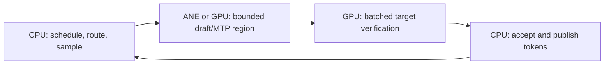

# Darkbloom Benchmark Target

Status: external target definition and engineering strategy. Strata has not yet
run the required real-model M4 Max matrix and therefore does not claim to exceed
Darkbloom.

## What “exceed” means

Darkbloom publishes kernel, in-engine, provider, production-traffic, and fleet
numbers. These have different timing boundaries and cannot be substituted for
one another. Strata will maintain three scoreboards:

1. **Engine:** same Mac, model snapshot, prompt/output tokens, batch, cache,
   sampling, warm state, and statistic.
2. **Provider:** public API through the complete provider boundary, including
   scheduling, streaming, cancellation, and memory accounting.
3. **Fleet:** useful tokens per online Mac, success rate, latency SLOs, and
   energy/cost over a declared traffic mix.

The first executable target is Darkbloom's public 2026-07-27 M4 Max engine
sweep. The source report is
[`2026-07-27-v080-post-release-engine-bench.md`](https://github.com/Layr-Labs/d-inference/blob/master/docs/reports/2026-07-27-v080-post-release-engine-bench.md).
Its machine-readable Strata gates are in
[`benchmarks/targets/darkbloom_m4_max_v080.json`](../benchmarks/targets/darkbloom_m4_max_v080.json).

Each latency/throughput gate is 10 percent better than Darkbloom's strongest
comparable reported cell; peak memory may not regress. The target fixes:

- Apple M4 Max, 16 CPU cores, 128 GiB unified memory, macOS build 25F84;
- GPT-OSS 20B MXFP4-Q8 revision `773a7da...`;
- Gemma 4 26B A4B QAT 4-bit revision `0e3cbab...`;
- 128 greedy decode steps, warm model, prefix cache disabled;
- at least five alternating-order repetitions with medians reported;
- serialized, thermally clean, uncontended hardware execution.

Headline gates include:

| Cell | Darkbloom best | Strata gate |
|---|---:|---:|
| GPT-OSS B1 decode | 108.9 tok/s | at least 119.79 tok/s |
| GPT-OSS B8 aggregate | 129.6 tok/s | at least 142.56 tok/s |
| GPT-OSS 8K prefill | 1,097 tok/s | at least 1,206.7 tok/s |
| Gemma B1 decode | 107.5 tok/s | at least 118.25 tok/s |
| Gemma B8 aggregate | 138.6 tok/s | at least 152.46 tok/s |
| Gemma 8K prefill | 1,091 tok/s | at least 1,200.1 tok/s |

Strata must pass every manifest cell and correctness check for the unqualified
statement “Strata exceeds the Darkbloom v0.8.0 engine benchmark.” A partial win
is reported by metric, not generalized.

## Why the current M1 is not the head-to-head machine

The local development Mac is a base M1 with 16 GiB. It is useful for native
kernel correctness, launch-overhead work, normalized bandwidth efficiency, and
architecture bring-up. It cannot produce a comparable M4 Max/128 GiB result,
and Gemma's reported in-memory footprint does not safely fit its memory budget.

No large model should be downloaded until the user selects its destination.
`/Volumes/Tyler HDD` is excluded from model placement and all SSD/offload
evidence. The final head-to-head requires access to equivalent M4 Max hardware
and user-approved model storage.

## Performance architecture aimed at the gap

### 1. Native phase programs, not isolated dispatches

Darkbloom already uses continuous batching, prompt-output narrowing, final-row
pruning, packed prefill, and multi-layer prefill submissions. Strata cannot win
by reproducing those features through a slower abstraction.

The Strata compiler should encode a complete prefill or decode epoch with
persistent pipelines, buffers, weight layouts, KV ownership, and the fewest
possible command-buffer boundaries. Our first tiled projection reduced GPU
device time 57 percent but complete wall time only 27 percent, showing that
submission and synchronization must be amortized at program scale.

### 2. Direct-Metal attention for Gemma head dimensions

Darkbloom's analysis reports that MLX prefill falls back to composed
matmul-mask-softmax-matmul for Gemma head dimensions 256 and 512, materializing
large score tensors. This is Strata's clearest prefill opening.

Build an online-softmax direct-Metal attention family with:

- 128-row query sub-blocks;
- causal and sliding-window block skipping;
- head-dimension 256 and 512 variants;
- fused RoPE where its register/layout cost wins;
- no full score-tensor materialization;
- exact long-context memory accounting.

Promotion requires full-prefill TTFT and peak-memory wins, not only a faster
attention microbenchmark.

### 3. Quantized MoE programs that minimize bytes per token

Decode is primarily limited by weight traffic. Strata needs specialized
dequantize-and-multiply kernels for batch-1 matrix-vector and batched
matrix-matrix regimes, rather than one universal tile.

The MoE plan should keep router/shared weights resident, deduplicate selected
experts across the batch, sort tokens once, use adaptive tail tiles, and read
only selected expert ranges. Evidence must report physical bytes read per token,
expert uniqueness, padding inflation, and effective memory bandwidth.

### 4. Heterogeneous speculative execution

Using CPU, GPU, and ANE simultaneously is valuable only if it changes the
critical path. The most promising form is coarse speculative execution:



An ANE-resident draft or MTP segment can overlap with GPU target work and may
produce multiple accepted tokens per expensive target-weight read. This attacks
the bandwidth roofline directly. It is eligible only after persistent ANE
compile/load, repeated dispatch/readback, numerical verification, acceptance
rate, duplicated-weight memory, handoff time, and end-to-end token latency are
measured. Otherwise the GPU-only plan remains selected.

### 5. Scheduler advantage

Use separate decode-ready and chunked-prefill queues with iteration-level
admission. Select batch width from measured memory-bandwidth saturation and TTFT
deadlines. Keep prefix caching disabled in the primary benchmark so reuse cannot
inflate results; measure it separately as a product capability.

## Build sequence

1. Implement the exact result emitter consumed by the checked-in target
   comparator, first with generated model fixtures.
2. Build a persistent native decode epoch around tiled quantized matvec and KV.
3. Build the head-dimension 256/512 online-attention prefill program.
4. Add continuous batching and MoE expert deduplication.
5. Make the existing fixed ANE projection resident and measure 5 warmups plus 50
   dispatches; then test an ANE draft/MTP role.
6. On approved storage and comparable M4 Max hardware, run MLX, Darkbloom, and
   Strata in alternating order and feed the Strata JSON into:

```sh
PYTHONPATH=. /usr/bin/python3 benchmarks/compare_target.py \
  benchmarks/targets/darkbloom_m4_max_v080.json \
  /path/to/strata-result.json
```

The comparator exits zero only when every numeric and correctness gate passes.

## Separate provider and fleet targets

Darkbloom's reported provider-side Gemma B8 result of 247.3 aggregate token/s
uses a different workload than the public engine sweep. It remains an
aspirational target until its exact request shapes and timing boundary are
captured. The five-billion-token/day and reliability timeline is a fleet outcome,
not evidence that one runtime kernel is faster.

After the engine gate passes, Common Compute should establish a separate
provider gate of at least 272 aggregate token/s for the reproduced Gemma B8
workload, at least 99.5 percent successful terminal receipts under a 24-hour
soak, and then a per-online-Mac fleet-throughput gate before comparing total
daily traffic.
