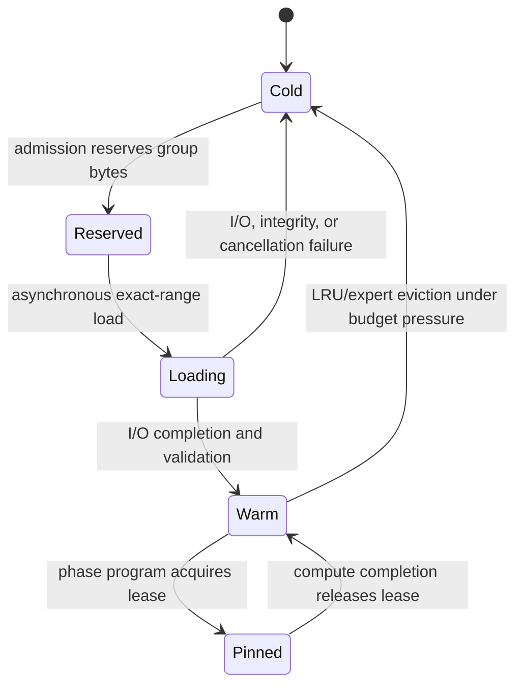

# Dynamic SSD Weight Residency

Status: target native architecture with an executable Python control-plane
specification. The current repository implements admission modes, immutable
weight packs, exact-range reads, byte-budgeted residency, pinned leases,
prefetch, LRU eviction, and safe budget resizing. Native Metal I/O and a
qualified cold-SSD native result are not yet implemented. The current
real-model result is a warm-state Python/MLX paging laboratory measurement.

## User-visible option

Strata exposes one residency preference per model load or request policy:

| Preference | Behavior |
|---|---|
| `auto` | Keep the model fully resident when it safely fits; otherwise select paged weights only when spilling is permitted and a qualified SSD exists |
| `full` | Require all weights in unified memory; reject instead of silently using storage |
| `paged` | Keep only the configured warm-weight window in unified memory, even if the full model would fit |

The runtime resolves this preference to the concrete `full` or `paged` mode
during admission. `paged` is explicit permission to spill. `auto` retains the
legacy `allow_weight_spill` permission so existing callers remain fail closed.

Public request shape:

```json
{
  "ssd_offload": {
    "mode": "auto",
    "max_resident_weight_bytes": 8589934592,
    "storage_target_id": "approved-internal-ssd",
    "prefetch_distance": 1,
    "io_workers": 1
  }
}
```

The executable `SSDOffloadPolicy` accepts `disabled`, `auto`, or `required`.
`disabled` requires full residency; `auto` permits paging only through qualified
admission; `required` selects capacity mode even when it cannot meet the normal
latency objective. The public request contains an opaque approved target ID, never an arbitrary
filesystem path. The host resolves the ID inside its model-storage policy.

## Apple M1 Llama paging result

Hardware evidence captured 2026-08-25 on the pinned Common Compute Llama 3.2
1B 4-bit artifact. The explicit total weight cap was 256 MiB: 147,755,008 bytes
of embedding/norm weights remained pinned and 120,680,448 bytes were available
to the 547,487,744-byte decoder-layer set.

| Metric | MLX-LM full | Strata paged lab | Change |
|---|---:|---:|---:|
| Decode | 69.94 tok/s | 3.75 tok/s | -94.64% |
| TTFT | 560.76 ms | 1,115.73 ms | 98.97% slower |
| Peak MLX memory | 1.211 GB | 0.592 GB | **51.14% lower** |
| Exact greedy tokens | reference | pass | no regression |

Each paged repetition loaded 70,078,431,232 layer bytes: the complete layer set
once per generated token. Mean scheduler load work was 27,385.98 ms and
compute-visible acquire stall was 11,786.10 ms. There were zero resident hits;
ordinary LRU cannot preserve reuse across a repeated cyclic scan when the full
dense layer set does not fit.

Raw result:
[`apple_m1_strata_paged_mlx_llama_3_2_1b_b1_512_128_256mib_v1.json`](../benchmarks/results/apple_m1_strata_paged_mlx_llama_3_2_1b_b1_512_128_256mib_v1.json).

This proves controlled capacity paging and token parity in the Python/MLX lab.
It is not a native-runtime, cold-SSD bandwidth, or performance-win claim. The
adaptive consequence is:

- fitting dense models use full residency;
- `auto` rejects paging when the measured storage ceiling misses the declared
  decode objective;
- `required` may admit the same plan as disclosed capacity mode;
- MoE paging remains promising because selected experts can have temporal and
  batch reuse that a full dense-layer cycle does not.

### Recursive residency improvement

The zero-hit trace motivated a pinned tier. With a 384 MiB total cap, Strata
kept five decoder layers pinned and preserved room for the current plus one
prefetched rolling layer. Against the original 256 MiB all-LRU plan:

| Metric | All LRU | Pinned five | Improvement |
|---|---:|---:|---:|
| Decode | 3.75 tok/s | 4.70 tok/s | **25.44%** |
| Inter-token latency | 268.14 ms | 212.84 ms | **20.62%** |
| TTFT | 1,115.73 ms | 1,065.09 ms | 4.54% |
| Layer bytes/repetition | 70.08 GB | 48.18 GB | 31.25% |
| Peak MLX memory | 0.592 GB | 0.728 GB | 23.13% more |

The improved plan still uses 39.84% less peak MLX memory than fully resident
MLX-LM, but remains 93.28% slower in decode, so it is not promoted as the
default. The runtime now derives the maximum safe pinned-layer count from the
resident budget and prefetch distance automatically.

Raw improved result:
[`apple_m1_strata_paged_mlx_llama_3_2_1b_b1_512_128_384mib_pin5_v1.json`](../benchmarks/results/apple_m1_strata_paged_mlx_llama_3_2_1b_b1_512_128_384mib_pin5_v1.json).

### Flexible parameter tuning

Paging speed is now a measured policy decision over four bounded parameters:

| Parameter | Effect |
|---|---|
| Resident-weight cap | Trades warm layers and traffic against unified-memory use |
| Pinned-layer count | May be explicit or the maximum safe prefix derived from the cap |
| Prefetch distance | Trades look-ahead overlap against extra rolling slots and reads |
| I/O workers | Bounds concurrent range loads; more workers are not assumed faster |

The selector applies mandatory exact-token parity plus optional peak-memory,
TTFT, and minimum-decode constraints. Among eligible measurements it uses
configurable logarithmic decode/TTFT/memory weights. The result is scoped to
the exact model, hardware, OS build, and workload fingerprint.

On the full 512/128 protocol, the throughput-first M1 capacity profile is a
640 MiB cap, zero prefetch distance, one I/O worker, and fourteen automatically
pinned layers:

| Metric | 384 MiB pinned-five | Tuned 640 MiB | Change |
|---|---:|---:|---:|
| Decode | 4.73 tok/s | **6.36 tok/s** | **34.46% faster** |
| Inter-token latency | 211.83 ms | **161.06 ms** | **23.97% lower** |
| TTFT | 1,047.84 ms | **1,038.61 ms** | **0.88% lower** |
| Layer bytes/repetition | 48.18 GB | **8.76 GB** | **81.82% lower** |
| Peak MLX memory | 0.728 GB | 1.002 GB | 37.57% more |

The tuned profile preserved exact MLX-LM greedy tokens. It uses 17.24% less
peak MLX memory than full-resident MLX-LM but remains 90.92% slower in decode.
It is therefore promoted only as the throughput-first `required` paging
profile under an approximately 1.05 GB peak-memory objective. Full residency
remains the speed choice whenever admission says the model fits.

The two-worker candidate initially exposed a completed-prefetch eviction race.
The scheduler now reloads a demanded group fail-closed under the same byte cap;
a deterministic regression test covers that interleaving. After the fix,
two workers with distance two remained slower on this fingerprint because the
extra rolling traffic and contention outweighed overlap.

Raw evidence:

- [`apple_m1_strata_paged_mlx_llama_3_2_1b_b1_512_128_cap640_pd0_io1_v1.json`](../benchmarks/results/apple_m1_strata_paged_mlx_llama_3_2_1b_b1_512_128_cap640_pd0_io1_v1.json)
- [`apple_m1_strata_paged_mlx_llama_3_2_1b_b1_512_128_cap640_pd1_io1_v1.json`](../benchmarks/results/apple_m1_strata_paged_mlx_llama_3_2_1b_b1_512_128_cap640_pd1_io1_v1.json)
- [`apple_m1_strata_paged_mlx_llama_3_2_1b_b1_512_128_tuning_decision_v1.json`](../benchmarks/results/apple_m1_strata_paged_mlx_llama_3_2_1b_b1_512_128_tuning_decision_v1.json)
- [`apple_m1_strata_paged_640mib_pd0_vs_mlx_llama_3_2_1b_v1.json`](../benchmarks/results/apple_m1_strata_paged_640mib_pd0_vs_mlx_llama_3_2_1b_v1.json)

## Physical data path

Weights never execute on SSD. The native path is:

```text
immutable Strata weight pack on approved SSD
        │ exact aligned range
        ▼
MTLIOCommandQueue or bounded pread fallback
        │ completion event
        ▼
reserved MTLBuffer in unified memory
        │ pinned weight lease
        ▼
Metal / CPU / supported ANE program
```

Metal fast resource loading can encode file-to-`MTLBuffer` loads and synchronize
I/O and compute with shared events. This avoids an unnecessary application-level
copy, but the destination is still a Metal resource backed by memory; it is not
direct SSD execution.

## Model packing and residency groups

The compiler divides a model into immutable groups that load and evict
atomically:

| Tier | Typical contents | Policy |
|---|---|---|
| Pinned | tokenizer-independent metadata, embeddings/LM head when repeatedly used, norms, routers, shared MoE weights | Resident for the model slot when the budget permits |
| Rolling | current fused layer/segment and the next measured prefetch window | Loaded ahead, pinned through completion, then becomes evictable |
| Expert cache | selected MoE experts | Frequency/recency-aware; batch requests deduplicate the same expert |
| Cold | inactive layers or experts | Remains only in the immutable SSD pack |

Group boundaries are compiler decisions. They balance I/O request size,
quantized-kernel layout, reuse, prefetch overlap, and eviction granularity. A
tensor used by one native phase program cannot be evicted until that program's
completion event releases its lease.

## Unified memory equation

At every admission or safe resize boundary:

\[
B_{weights}
=
\min\left(
B_{user},
B_{runtime}-B_{KV}-B_{activation}-B_{temporary}
\right)
\]

| Symbol | Meaning |
|---|---|
| \(B_{weights}\) | Warm weight residency budget |
| \(B_{user}\) | Optional user cap for weights in memory |
| \(B_{runtime}\) | Admission-granted total runtime memory after macOS/runtime safety headroom |
| \(B_{KV}\) | Reserved KV and prefix-cache bytes |
| \(B_{activation}\) | Phase-program activation arena |
| \(B_{temporary}\) | I/O, dequantization, handoff, and kernel temporary buffers |

The admission policy computes \(B_{runtime}\) after applying its system reserve,
unified-memory fraction, current availability, Metal recommended-working-set
limit, and any caller total-memory cap. Safety headroom is therefore not
subtracted a second time from the weight budget.

KV growth reduces the warm-weight budget only at a decode-iteration boundary.
The manager evicts oldest unpinned groups until it satisfies the new budget. If
loading or pinned groups alone exceed it, resize fails without mutating state;
admission pauses or the request drains instead of invalidating live buffers.

## Prefetch distance

The compiler begins with a measured prefetch distance:

\[
d = \left\lceil\frac{t_{load,p95}}{t_{compute,p50}}\right\rceil
\]

subject to the warm-weight and in-flight-I/O budgets. The runtime may select a
precompiled distance variant at a prefill-chunk or decode-iteration boundary.
It does not change the window in the middle of a GPU/ANE program.

The trace distinguishes:

- bytes loaded and evicted;
- resident, prefetch-ready, prefetch-wait, and cold-miss acquisitions;
- total I/O time versus compute-visible stall time;
- effective bandwidth and p50/p95 latency per group bucket;
- current/pinned/loading weight bytes and KV/activation bytes;
- page-cache state when it can be established honestly.

## Dense versus MoE behavior

SSD paging expands capability; it does not automatically improve speed.

For dense batch-1 decode, all nonresident layer weights may be reread for every
token. A hard upper bound is approximately:

\[
R_{decode} \le \frac{BW_{SSD}}{W_{cold/token}}
\]

This is normally far below in-memory Apple-Silicon bandwidth, so the
Darkbloom-comparison performance plan remains fully resident.

MoE creates a better opportunity: routers and shared layers stay resident while
only selected experts enter the warm cache. Routing-history prediction and
batch expert deduplication may hide part of the load. Every claimed gain must
report hit rate, prediction waste, bytes/token, and demand stall.

## Native runtime state machine



Cancellation waits for submitted I/O/compute completion before recycling the
destination buffer. A failed or missing SSD never causes fallback to an HDD.

## Storage qualification

A paging target must be:

- explicitly approved by the user;
- verified as internal or external solid-state storage;
- bound to a stable volume identity, not merely a path string;
- large enough for the immutable pack plus update headroom;
- measured for aligned sequential and random-range throughput, p50/p95 latency,
  queue depth, cold/warm cache state, sustained thermals, and error behavior;
- requalified after material OS, device, filesystem, or connection changes.

`/Volumes/Tyler HDD` is permanently excluded from SSD qualification, model
placement intended to represent SSD behavior, and offload performance claims.

## Current implementation map

| Contract | Path |
|---|---|
| `auto/full/paged` request policy and admission | `src/ollm/core/platform.py` |
| Immutable aligned pack and exact reads | `src/ollm/storage/weight_pack.py` |
| Pack-backed atomic group loader | `src/ollm/storage/weight_pack_store.py` |
| Hard-budget LRU, pinning, eviction, resizing | `src/ollm/scheduling/residency_manager.py` |
| Async prefetch and stall accounting | `src/ollm/scheduling/prefetch_scheduler.py` |
| Dense next-layer overlap | `src/ollm/scheduling/dense_pipeline.py` |
| Public SSD parameter | `src/ollm/core/ssd_offload.py` |
| Quantized paged Llama laboratory | `src/ollm/runtime/paged_mlx_llama.py` |
| Real-model paging benchmark | `benchmarks/benchmark_strata_paged_mlx.py` |
| Objective-driven paging tuner | `src/ollm/planning/paging_tuner.py` and `benchmarks/tune_strata_paged_mlx.py` |

## Native implementation sequence

1. Port the pack manifest, range validation, and group table to C++.
2. Add a generated-fixture `MTLIOCommandQueue` probe with readback parity and
   serialized cold/warm timing.
3. Implement a fixed native buffer pool, shared-event handoff, leases, and
   cancellation.
4. Run a dense generated-model phase with one-, two-, and four-group windows.
5. Add router-driven MoE expert groups and batch deduplication.
6. After the user selects an SSD destination, qualify it and run real-model
   full-versus-paged TTFT, decode, memory, energy, and stall comparisons.
