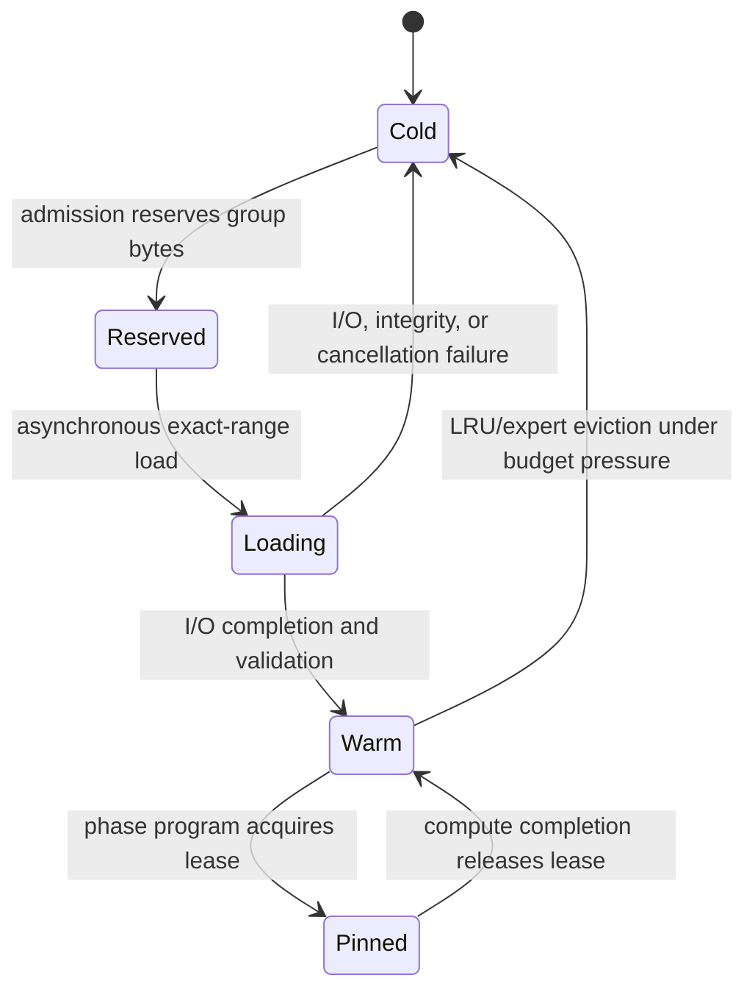

# Dynamic SSD Weight Residency

Status: target native architecture with an executable Python control-plane
specification. The current repository implements admission modes, immutable
weight packs, exact-range reads, byte-budgeted residency, pinned leases,
prefetch, LRU eviction, and safe budget resizing. Native Metal I/O and a
real-model SSD result are not yet implemented.

## User-visible option

Strata exposes one residency preference per model load or request policy:

| Preference | Behavior |
|---|---|
| `auto` | Keep the model fully resident when it safely fits; otherwise select paged weights only when spilling is permitted and a qualified SSD exists |
| `full` | Require all weights in unified memory; reject instead of silently using storage |
| `paged` | Keep only the configured warm-weight window in unified memory, even if the full model would fit |

The runtime resolves this preference to the concrete `full` or `paged` mode
during admission. `paged` is explicit permission to spill. `auto` retains the
legacy `allow_weight_spill` permission so existing callers remain fail closed.

Target public request shape:

```json
{
  "residency": {
    "mode": "auto",
    "max_resident_weight_bytes": 8589934592,
    "storage_target_id": "approved-internal-ssd"
  }
}
```

The public request contains an opaque approved target ID, never an arbitrary
filesystem path. The host resolves the ID inside its model-storage policy.

## Physical data path

Weights never execute on SSD. The native path is:

```text
immutable Strata weight pack on approved SSD
        │ exact aligned range
        ▼
MTLIOCommandQueue or bounded pread fallback
        │ completion event
        ▼
reserved MTLBuffer in unified memory
        │ pinned weight lease
        ▼
Metal / CPU / supported ANE program
```

Metal fast resource loading can encode file-to-`MTLBuffer` loads and synchronize
I/O and compute with shared events. This avoids an unnecessary application-level
copy, but the destination is still a Metal resource backed by memory; it is not
direct SSD execution.

## Model packing and residency groups

The compiler divides a model into immutable groups that load and evict
atomically:

| Tier | Typical contents | Policy |
|---|---|---|
| Pinned | tokenizer-independent metadata, embeddings/LM head when repeatedly used, norms, routers, shared MoE weights | Resident for the model slot when the budget permits |
| Rolling | current fused layer/segment and the next measured prefetch window | Loaded ahead, pinned through completion, then becomes evictable |
| Expert cache | selected MoE experts | Frequency/recency-aware; batch requests deduplicate the same expert |
| Cold | inactive layers or experts | Remains only in the immutable SSD pack |

Group boundaries are compiler decisions. They balance I/O request size,
quantized-kernel layout, reuse, prefetch overlap, and eviction granularity. A
tensor used by one native phase program cannot be evicted until that program's
completion event releases its lease.

## Unified memory equation

At every admission or safe resize boundary:

\[
B_{weights}
=
\min\left(
B_{user},
B_{runtime}-B_{KV}-B_{activation}-B_{temporary}
\right)
\]

| Symbol | Meaning |
|---|---|
| \(B_{weights}\) | Warm weight residency budget |
| \(B_{user}\) | Optional user cap for weights in memory |
| \(B_{runtime}\) | Admission-granted total runtime memory after macOS/runtime safety headroom |
| \(B_{KV}\) | Reserved KV and prefix-cache bytes |
| \(B_{activation}\) | Phase-program activation arena |
| \(B_{temporary}\) | I/O, dequantization, handoff, and kernel temporary buffers |

The admission policy computes \(B_{runtime}\) after applying its system reserve,
unified-memory fraction, current availability, Metal recommended-working-set
limit, and any caller total-memory cap. Safety headroom is therefore not
subtracted a second time from the weight budget.

KV growth reduces the warm-weight budget only at a decode-iteration boundary.
The manager evicts oldest unpinned groups until it satisfies the new budget. If
loading or pinned groups alone exceed it, resize fails without mutating state;
admission pauses or the request drains instead of invalidating live buffers.

## Prefetch distance

The compiler begins with a measured prefetch distance:

\[
d = \left\lceil\frac{t_{load,p95}}{t_{compute,p50}}\right\rceil
\]

subject to the warm-weight and in-flight-I/O budgets. The runtime may select a
precompiled distance variant at a prefill-chunk or decode-iteration boundary.
It does not change the window in the middle of a GPU/ANE program.

The trace distinguishes:

- bytes loaded and evicted;
- resident, prefetch-ready, prefetch-wait, and cold-miss acquisitions;
- total I/O time versus compute-visible stall time;
- effective bandwidth and p50/p95 latency per group bucket;
- current/pinned/loading weight bytes and KV/activation bytes;
- page-cache state when it can be established honestly.

## Dense versus MoE behavior

SSD paging expands capability; it does not automatically improve speed.

For dense batch-1 decode, all nonresident layer weights may be reread for every
token. A hard upper bound is approximately:

\[
R_{decode} \le \frac{BW_{SSD}}{W_{cold/token}}
\]

This is normally far below in-memory Apple-Silicon bandwidth, so the
Darkbloom-comparison performance plan remains fully resident.

MoE creates a better opportunity: routers and shared layers stay resident while
only selected experts enter the warm cache. Routing-history prediction and
batch expert deduplication may hide part of the load. Every claimed gain must
report hit rate, prediction waste, bytes/token, and demand stall.

## Native runtime state machine



Cancellation waits for submitted I/O/compute completion before recycling the
destination buffer. A failed or missing SSD never causes fallback to an HDD.

## Storage qualification

A paging target must be:

- explicitly approved by the user;
- verified as internal or external solid-state storage;
- bound to a stable volume identity, not merely a path string;
- large enough for the immutable pack plus update headroom;
- measured for aligned sequential and random-range throughput, p50/p95 latency,
  queue depth, cold/warm cache state, sustained thermals, and error behavior;
- requalified after material OS, device, filesystem, or connection changes.

`/Volumes/Tyler HDD` is permanently excluded from SSD qualification, model
placement intended to represent SSD behavior, and offload performance claims.

## Current implementation map

| Contract | Path |
|---|---|
| `auto/full/paged` request policy and admission | `src/ollm/core/platform.py` |
| Immutable aligned pack and exact reads | `src/ollm/storage/weight_pack.py` |
| Pack-backed atomic group loader | `src/ollm/storage/weight_pack_store.py` |
| Hard-budget LRU, pinning, eviction, resizing | `src/ollm/scheduling/residency_manager.py` |
| Async prefetch and stall accounting | `src/ollm/scheduling/prefetch_scheduler.py` |
| Dense next-layer overlap | `src/ollm/scheduling/dense_pipeline.py` |

## Native implementation sequence

1. Port the pack manifest, range validation, and group table to C++.
2. Add a generated-fixture `MTLIOCommandQueue` probe with readback parity and
   serialized cold/warm timing.
3. Implement a fixed native buffer pool, shared-event handoff, leases, and
   cancellation.
4. Run a dense generated-model phase with one-, two-, and four-group windows.
5. Add router-driven MoE expert groups and batch deduplication.
6. After the user selects an SSD destination, qualify it and run real-model
   full-versus-paged TTFT, decode, memory, energy, and stall comparisons.
