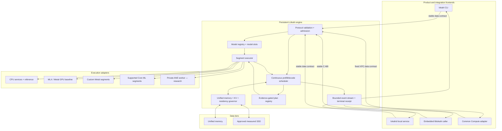
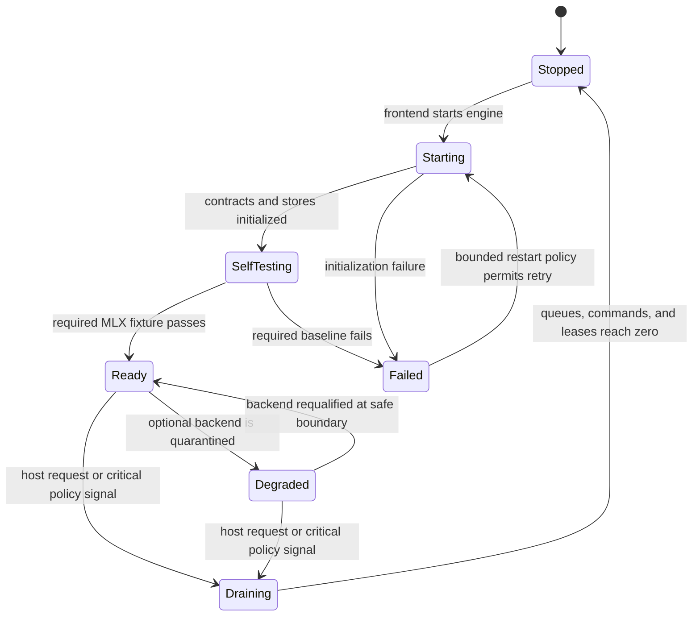
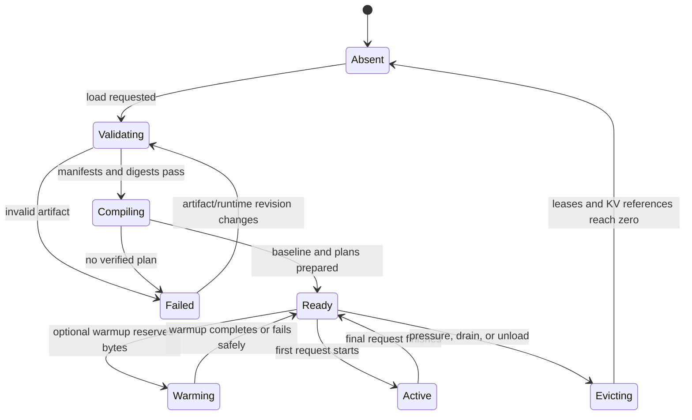
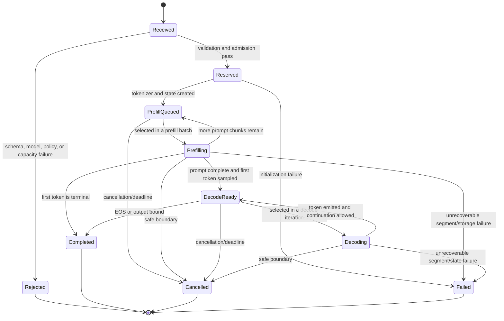
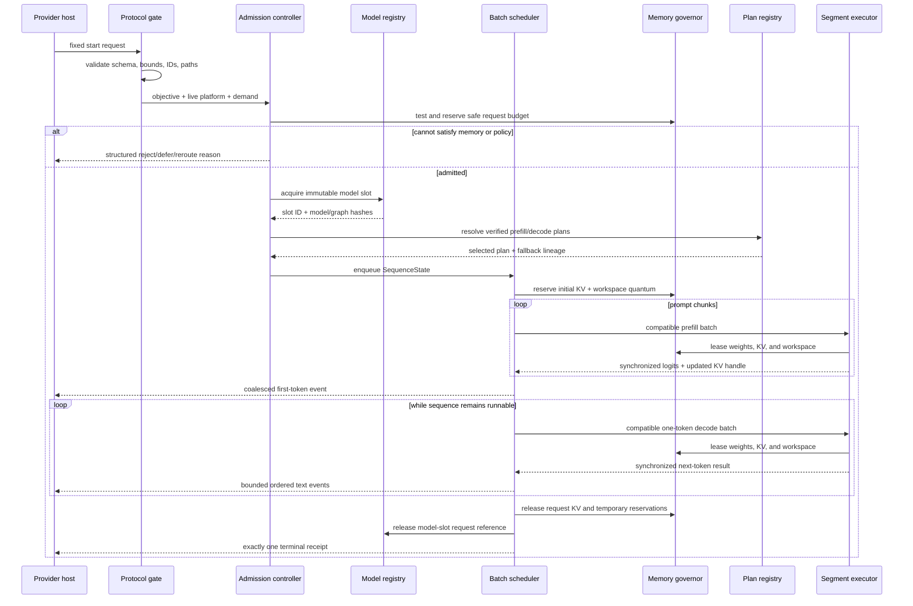
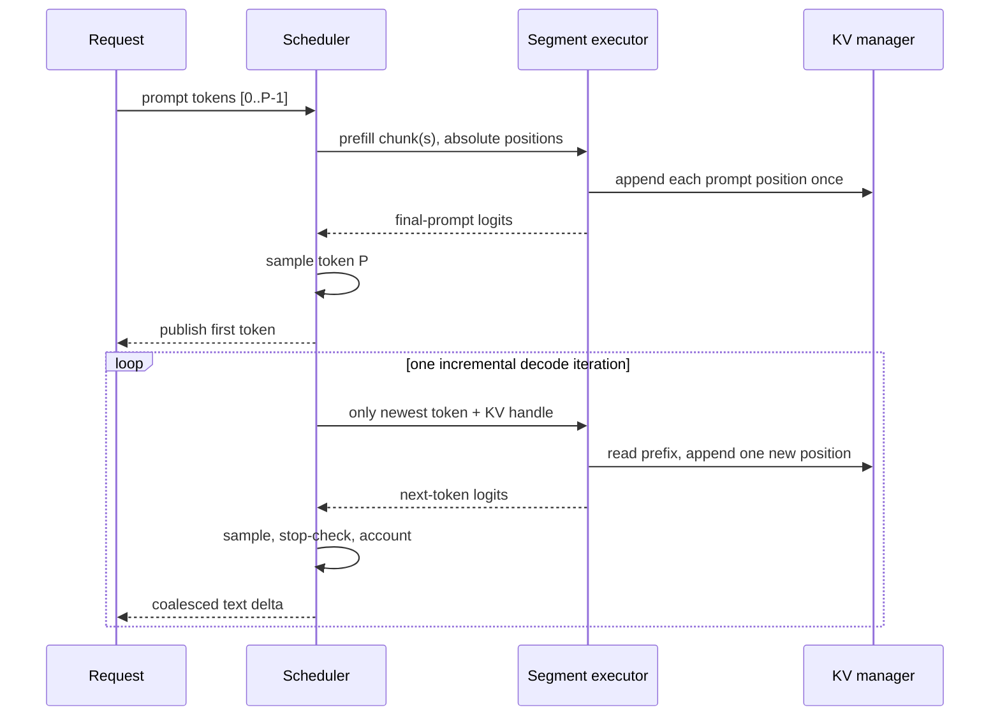
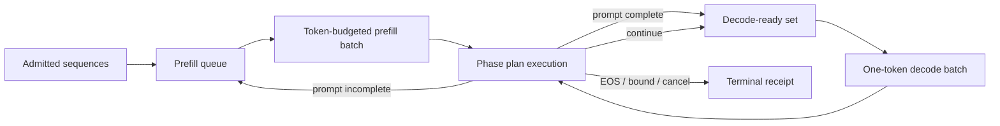
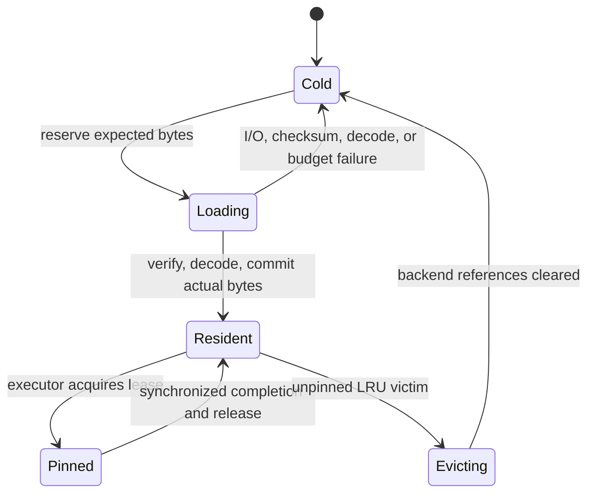
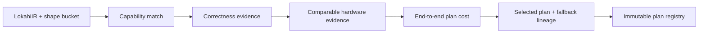

# Lōkahi Engine Architecture

Status: canonical detailed target architecture, grounded in the current Python
implementation as of 2026-08-24. A component marked **current** exists in the
repository and has deterministic tests or bounded hardware evidence. A
component marked **target** is a contract to implement, not a present runtime
capability. **Research** components may use private APIs and may not enter the
supported production lane.

This document describes Lōkahi itself: a standalone adaptive per-Mac LLM
inference engine shared by its CLI, local service, embedding API, and external
integrations. The public product boundary is specified in
[`STANDALONE_RUNTIME.md`](STANDALONE_RUNTIME.md). Common Compute is the first
proving-ground integration; its provider, fleet, XPC, billing, and network
boundaries are specified in [`COMMON_COMPUTE_RUNTIME.md`](COMMON_COMPUTE_RUNTIME.md).
The capability-driven model contract, Common Compute catalog bridge, family
lowerings, and GPT-OSS specialization are frozen in
[`MODEL_ADAPTIVE_ARCHITECTURE.md`](MODEL_ADAPTIVE_ARCHITECTURE.md).

## 1. Mission and optimization target

Lōkahi should run the most useful model that a particular Apple Silicon Mac can
safely serve, then choose the fastest verified execution strategy for the
actual request and live machine state.

“Use all available compute” does **not** mean keeping CPU, GPU, and ANE busy for
their own sake. It means using every engine whose contribution reduces an
end-to-end objective after synchronization, data-layout conversion, memory
pressure, thermal effects, and failure risk are counted.

For a candidate plan \(P\), the target score is conceptually:

\[
C(P) =
\lambda_{f}T_{f}(P)
+ \lambda_{d}T_{d}(P)
+ \lambda_{s}T_{s}(P)
+ \lambda_{m}\max(0, M_{p}(P)-B)
+ \lambda_{r}R(P)
\]

| Symbol | Definition |
|---|---|
| \(P\) | One immutable execution plan for a model, shape bucket, and hardware fingerprint |
| \(C(P)\) | Lower-is-better plan cost |
| \(T_f(P)\) | Measured time to first output token, including prompt prefill |
| \(T_d(P)\) | Measured steady-state decode time over a defined output length |
| \(T_s(P)\) | Measured storage, transfer, or backend-handoff stall time |
| \(M_p(P)\) | Measured peak runtime memory |
| \(B\) | Admission-granted runtime memory budget |
| \(R(P)\) | Explicit reliability or unsupported-API risk penalty |
| \(\lambda_f,\lambda_d,\lambda_s,\lambda_m,\lambda_r\) | Service-objective weights fixed before plan selection |

The current planner does not yet implement this multi-term score. It selects a
whole-graph backend independently for prefill and decode, admits non-MLX
targets only with matching correctness evidence, and uses comparable hardware
tokens-per-second evidence when available. `RuntimePerformancePolicy` now
enforces a configurable improvement margin, target allowlist, public/private
ANE boundary, and a strict full-resident `maximum_speed` profile. The equation
defines the remaining multi-term target planner.

The concrete maximum-speed parameters and native performance route are in
[`MAXIMUM_SPEED_RUNTIME.md`](MAXIMUM_SPEED_RUNTIME.md).

## 2. Non-negotiable invariants

1. **Correctness before speed.** A non-baseline segment is ineligible until it
   matches an independent oracle for the exact operation, shape, dtype, layout,
   phase, model revision, and runtime fingerprint.
2. **Prefill once, decode incrementally.** The prompt is evaluated once. Each
   later decode call consumes only the newly sampled token and the existing KV
   state.
3. **Admission precedes allocation or I/O.** Lōkahi reserves memory before
   loading weights or accepting KV growth.
4. **Memory has one accountant.** Model weights, KV state, activations,
   temporary buffers, prefetch reservations, backend caches, and safety
   headroom all draw from the same admission budget.
5. **Weights have immutable identity.** Model ID, revision/digest,
   quantization, tensor metadata, and weight-pack checksums are fixed for the
   lifetime of a loaded model slot.
6. **Plans do not mutate mid-kernel.** Replanning occurs only at explicit safe
   boundaries: model load, request admission, prefill chunk boundary, decode
   iteration boundary, or before any output is visible.
7. **Fallback is state-safe.** Before visible output, a request may restart on
   a verified fallback. After visible output, fallback requires provably
   compatible KV and sampling state; otherwise the request fails explicitly.
8. **SSD is a cold tier, not a compute engine.** The physical path is storage
   to host/unified-memory allocation to the selected compute runtime. Lōkahi
   makes no direct-SSD-execution claim.
9. **An HDD is never silently accepted as SSD.** `/Volumes/Tyler HDD` is source
   checkout storage only. Paged execution requires a distinct, user-approved,
   measured SSD target.
10. **Private ANE use is isolated.** Private APIs remain an opt-in research
    backend with a restartable worker, exact envelopes, and an MLX recovery
    path.

## 3. System boundary



Lōkahi owns everything on the inference hot path after a fixed request reaches
the engine: validation, admission, tokenization, model state, batching, prefill,
decode, sampling, KV, weights, backend dispatch, cancellation, metrics, and the
terminal receipt. Each frontend owns its transport and external policy. Common
Compute additionally owns remote routing, provider leases, customer
authorization, artifact staging, billing, and fleet lifecycle.

A daemon or XPC service is a process and security boundary, not another
scheduler. There must be exactly one authoritative Lōkahi scheduler for each
engine instance.

## 4. Control plane and data plane

Lōkahi has two internal planes that communicate through immutable IDs and
bounded commands.

### 4.1 Control plane

The control plane performs work that decides *what* may run:

- validate request and model identity;
- probe static hardware and capture live platform state;
- estimate memory demand;
- admit, defer, reject, or request rerouting;
- load or locate a model slot;
- select an evidence-backed plan;
- build prefill and decode work items;
- enforce deadlines, cancellation, fairness, and drain state;
- quarantine failed plan/backend fingerprints;
- produce trace summaries and receipts.

### 4.2 Data plane

The data plane performs work that moves or transforms tensors:

- read checksum-verified weight ranges;
- decode or dequantize weight groups;
- create and update KV blocks;
- execute backend segments;
- transfer or reinterpret boundary tensors;
- synchronize backend completion;
- sample the next token;
- release temporary values and residency leases.

The control plane never treats “dispatch submitted” as “work completed.” A
segment is complete only after its completion primitive has fired and its
outputs are safe for the next owner.

## 5. Target native process topology

```text
lokahi CLI / lokahid / embedded app / Common Compute adapter
  └─ stable liblokahi C ABI or versioned local protocol
      └─ persistent native Lōkahi runtime
          ├─ EngineSupervisor
          ├─ ModelRegistry
          │   └─ ModelSlot[model digest, quantization]
          ├─ AdmissionController
          ├─ BatchScheduler
          ├─ MemoryGovernor
          │   ├─ WeightResidency
          │   ├─ KVBlockPool
          │   └─ PrefixCache
          ├─ PlanRegistry + EvidenceStore
          ├─ SegmentExecutor
          │   ├─ MLXBackend
          │   ├─ MetalBackend
          │   ├─ CoreMLBackend
          │   └─ ANEResearchClient
          ├─ StorageReader pool
          └─ EventEmitter + ReceiptBuilder

Python Lōkahi laboratory
  ├─ LokahiIR and contract prototypes
  ├─ NumPy/MLX correctness oracles
  ├─ generated fixtures
  ├─ hardware qualification executables
  └─ versioned golden evidence for native tests
```

The production target is Swift plus native Apple frameworks and MLX Swift. The
current Python package remains the executable specification, research lab, and
correctness oracle. The import package is `lokahi` (formerly `ollm`).

### 5.1 Engine lifecycle



`Ready` means the baseline runtime, protocol loop, generated model fixture,
cancellation path, and receipt path all passed for the current runtime
revision. `Degraded` may remain serviceable through MLX after an optional
Metal/Core ML/ANE plan is removed. `Failed`, `Starting`, `SelfTesting`, and
`Draining` are not advertised as available capacity.

## 6. Authoritative identities and contracts

Every mutable runtime object refers back to immutable identities. This prevents
measurements, caches, and fallback state from being reused outside the context
in which they were proven.

| Identity | Required fields | Purpose |
|---|---|---|
| `HardwareFingerprint` | chip, macOS version/build, unified memory, CPU cores, compute units, GPU working-set ceiling, ANE runtime fingerprint, qualified storage measurement | Keys plans and invalidates stale evidence |
| `ModelIdentity` | catalog model ID, immutable revision/digest, architecture, tokenizer digest, quantization, weight-format version | Prevents weights/tokenizer/config drift |
| `GraphIdentity` | graph ID, ordered operations, tensor metadata, symbolic-shape rules | Defines logical computation |
| `PlanIdentity` | model hash, graph hash, hardware fingerprint, runtime revision, batch bucket, context bucket, phase segments | Reconstructs the exact execution choice |
| `RequestIdentity` | task/request ID, schema version, objective, prompt digest, sampling seed/settings, bounds | Drives idempotence, tracing, and cancellation |
| `StateIdentity` | request ID, model hash, processed-token count, KV layout/version, RNG counter | Guards continuation and fallback |

### 6.1 Current executable contracts

| Current type | Repository path | Meaning |
|---|---|---|
| `HardwareProfile` | `src/lokahi/core/hardware.py` | Stable hardware facts and a deterministic fingerprint |
| `LivePlatformState` | `src/lokahi/core/platform.py` | Short-lived memory, thermal, power, and approved-storage snapshot |
| `ServiceObjective` | `src/lokahi/core/platform.py` | Workload class, context/output bounds, latency/rate goals, and policy flags |
| `RuntimeDemand` | `src/lokahi/core/platform.py` | Weight, KV, activation, temporary, and minimum-window estimates |
| `AdmissionDecision` | `src/lokahi/core/platform.py` | Admit/reject, total and weight budgets, full/paged mode, storage ID, and reasons |
| `TensorSpec`, `IROperation`, `LokahiIRGraph` | `src/lokahi/core/ir.py` | Runtime-neutral logical tensor graph |
| `OperationEnvelope`, `RuntimeCapabilities` | `src/lokahi/core/capabilities.py` | Exact backend eligibility facts |
| `AdaptiveExecutionPlan` | `src/lokahi/core/adaptive_plan.py` | Phase-specific backend segments keyed to model and hardware |
| `EvidenceRecord` | `src/lokahi/core/evidence.py` | Correctness, synthetic, or hardware observation |
| `TensorRef`, `WeightGroup`, `ModelSpec` | `src/lokahi/core/` | Storage references and atomic residency units |
| `PortableModelManifest` and semantic specs | `src/lokahi/core/model_manifest.py` | Immutable artifact, architecture, attention, MoE, tokenizer, and capability identity |

The native implementation should mirror these types with a versioned wire
schema and cross-language golden fixtures before it accepts customer work.

## 7. Module ownership

| Module | Owns | Must not own | Status |
|---|---|---|---|
| Engine supervisor | lifecycle, self-test, drain, crash circuit breaker | tensor scheduling policy | Target |
| Protocol gate | schema, size/path bounds, idempotence | arbitrary commands or environment | Target; outer contract documented |
| Model adapter | tokenizer/config interpretation, graph lowering, weight/KV schema | backend selection | Partial current |
| Model registry | immutable model slots and load state | request fairness | Target |
| Admission controller | safe memory budget and residency mode | per-operation backend scoring | Current contract |
| Batch scheduler | queues, phase transitions, fairness, deadlines, cancellation | raw storage decoding | Target |
| Plan registry | verified plans and fallback lineage | live request mutation | Partial current |
| Memory governor | all runtime byte reservations | sampling or network state | Partial current |
| Weight store | exact verified byte ranges | eviction policy | Current |
| KV manager | request/prefix KV blocks and positions | model weights | Partial current |
| Segment executor | ordered dispatch, handoff, synchronization | admission | Target; bounded executors current |
| Backend adapter | native program/kernel execution | global residency policy | Partial current |
| Tracer | scalar events and evidence metadata | retaining live tensors | Current |
| Receipt builder | terminal usage and plan/evidence summary | billing mutation | Target |

## 8. Model adaptation and loading

“Run any LLM” is a compatibility strategy, not a claim that an unknown model can
be optimized automatically. Lōkahi has two paths.

### 8.1 Compatibility path

A supported MLX/`mlx_lm` adapter owns the whole model and provides known-good
prefill, incremental decode, KV, tokenizer, and sampling semantics. This is the
broadest model-family path and the required recovery baseline.

### 8.2 Optimized path

A Lōkahi model adapter lowers the architecture into:

```text
ModelArtifact
  identity
  tokenizer_spec
  LokahiIRGraph
  WeightLayout
  ordered WeightGroups
  KVSchema
  shape_buckets
  reference_backend
  compatible_sampling_contract
```

The adapter must explicitly define attention type, head geometry, rotary or
positional encoding, normalization, activation, dense/MoE structure,
quantization, tied weights, logits behavior, and KV update semantics. Unknown
operations fail closed to the whole-model MLX path.

The versioned manifest and architecture-class rules are defined in
[`MODEL_ADAPTIVE_ARCHITECTURE.md`](MODEL_ADAPTIVE_ARCHITECTURE.md). Model IDs
select pinned artifacts but never select backend behavior directly.

### 8.3 Model-slot lifecycle



Only immutable compiled programs and verified model artifacts may be shared
between requests. KV and RNG state remain request-owned unless prefix reuse is
proven by an exact cache key. Weight warmth is tracked independently by the
residency manager; it is not hidden inside the model-slot state.

## 9. Request lifecycle



Each accepted request owns a `SequenceState`:

```text
SequenceState
  request_id
  model_slot_id
  plan_id
  phase
  prompt_token_count
  processed_token_count
  emitted_token_count
  kv_handle
  rng_state
  stop_automaton_state
  deadline
  cancellation_state
  output_sequence_number
```

The scheduler is the only component allowed to transition `phase`, advance the
processed-token count, or publish a token. Backends return tensors and
completion status; they do not mutate request lifecycle state directly.

### 9.1 Complete request sequence



Every arrow crossing an ownership domain carries IDs and bounded values, not a
second mutable copy of request state. Rejection before enqueue produces no
model execution and no accepted-request receipt; acceptance produces exactly
one terminal receipt even after cancellation or failure.

## 10. Admission and unified-memory accounting

Apple Silicon CPU and GPU share unified physical memory. “GPU memory,” Python
objects, decoded weights, MLX caches, KV state, and OS pressure therefore
cannot be budgeted independently as if they were separate devices.

The target budget identity is:

\[
M_{run} = M_W + M_{KV} + M_A + M_T + M_P + M_C + M_R
\]

and admission requires:

\[
M_{run} \le B_{safe}
\]

| Symbol | Definition |
|---|---|
| \(M_W\) | Resident decoded model weights |
| \(M_{KV}\) | Active request and retained-prefix KV state |
| \(M_A\) | Live activations and boundary tensors |
| \(M_T\) | Temporary kernel, layout-conversion, and sampling buffers |
| \(M_P\) | In-flight weight/KV prefetch reservations |
| \(M_C\) | Backend allocator and compiled-graph caches charged to Lōkahi |
| \(M_R\) | Lōkahi-internal uncertainty headroom not already removed from the live host budget |
| \(B_{safe}\) | Smallest applicable live memory ceiling |

The current `AdaptiveAdmissionPolicy` computes \(B_{safe}\) as the minimum of:

- configured fraction of physical unified memory;
- currently available memory minus system reserve;
- GPU recommended working set minus current GPU allocation, when reported;
- the request's explicit runtime-memory ceiling, when present.

Current `RuntimeDemand` accounts for weights, KV, activations, temporary bytes,
and a minimum weight window. The target accountant must add explicit prefetch
and backend-cache ledgers rather than hide them in a safety factor.

### 10.1 KV estimate

For a conventional transformer KV cache:

\[
M_{KV} \approx L \cdot 2 \cdot N \cdot H_{kv} \cdot D_h \cdot b_{kv}
\]

| Symbol | Definition |
|---|---|
| \(L\) | Number of transformer layers with KV state |
| \(2\) | One key tensor plus one value tensor |
| \(N\) | Total cached tokens across admitted sequences |
| \(H_{kv}\) | Number of key/value heads; smaller than query heads in grouped-query attention |
| \(D_h\) | Per-head dimension |
| \(b_{kv}\) | Bytes per cached KV element |

The estimate must be replaced or extended for sliding-window attention,
recurrent/state-space layers, cache quantization, alignment, and backend-owned
padding. Measured peak memory remains the authority.

### 10.2 Admission outcomes

- **Full:** all model weights plus bounded KV/activation/temp demand fit.
- **Paged:** the minimum weight window and non-weight state fit, weight spilling
  is permitted, and a user-approved measured SSD has sufficient space.
- **Reject/defer/reroute:** neither mode can satisfy the bound. Deliberate
  thrashing is not an admission mode.

Reservations happen before filesystem reads or tensor creation. A completed
request releases KV and temporary reservations before the slot is considered
available for new work.

## 11. Prefill and decode are different workloads

### 11.1 Prefill

Prefill processes the prompt tokens, creates KV state, and produces logits for
the first output token. It has larger matrix dimensions, exposes more
parallelism, and is the most plausible phase for large fixed-shape GPU, Core
ML, or ANE segments.

Long prompts are chunked so one request cannot monopolize the engine or create
an unbounded activation spike. Chunking must preserve absolute positions,
causal masking, and exactly one KV append for every processed prompt token.

### 11.2 Decode

Decode processes one new token per active sequence per iteration. It reads the
existing KV cache and appends exactly one position. Decode often has narrow
matrix shapes and is more sensitive to memory bandwidth, launch overhead, KV
growth, and batching.



Replaying the growing sequence during decode would duplicate KV entries and
turn cached generation back into repeated prefill. The current
`greedy_generate_mx` implementation enforces prompt-once, one-token decode.

### 11.3 Logits, sampling, and text emission

The language-model head produces one vocabulary-sized logits vector for each
sequence position. Copying the full final vector to the CPU every decode step
can erase accelerator gains. The default target is therefore:

1. keep logits on the backend that produced them;
2. apply penalties, temperature, top-k/top-p filtering, and RNG sampling there
   when that backend has a verified implementation;
3. return only the selected token ID and explicitly requested bounded logprob
   data to the scheduler;
4. update the deterministic RNG counter exactly once;
5. perform stop-sequence state and incremental detokenization on CPU unless a
   measured alternative is better;
6. publish bytes only after token accounting and cancellation checks succeed.

Greedy argmax is the initial cross-backend golden contract. Stochastic sampling
requires identical counter-based RNG semantics or must be treated as a
different plan/output contract. The current MLX generation helper performs
argmax in MLX and returns the selected token tensor.

## 12. Continuous batching scheduler

The target scheduler maintains separate queues because prefill and decode have
different shapes and latency behavior.



### 12.1 Scheduler inputs

- service class, arrival time, deadline, and output bound;
- model slot and compatible plan/shape bucket;
- remaining prompt tokens and current KV length;
- reserved future KV bytes;
- cancellation and stream backpressure;
- current thermal, memory, and engine-drain state.

### 12.2 Prefill batch construction

The scheduler chooses prompt chunks whose total new-token count is below a
configured token budget:

\[
\sum_{i \in Q_f} q_i \le T_f
\]

| Symbol | Definition |
|---|---|
| \(Q_f\) | Requests selected for the next prefill batch |
| \(q_i\) | New prompt tokens processed for request \(i\) in this chunk |
| \(T_f\) | Maximum prefill tokens permitted in one scheduling quantum |

Requests must also share a compatible model, plan, dtype, KV layout, and shape
bucket. Padding is accounted as real compute, not ignored in metrics. Aging
prevents a long prompt from starving behind shorter prompts, while chunking
prevents that long prompt from blocking interactive decode indefinitely.

### 12.3 Decode batch construction

Every selected decode sequence contributes exactly one input token. A target
decode batch groups compatible requests and excludes cancelled, blocked, or
deadline-expired sequences before dispatch. The batch is re-formed after every
iteration because sequences end at different times.

Priority is lexicographic rather than one opaque score:

1. preserve already-promised deadlines where feasible;
2. prevent starvation with wait-time aging;
3. prefer compatible resident model/plan state;
4. fill the bounded batch without violating KV reservations;
5. leave capacity for cancellation and control messages.

### 12.4 Backpressure and output

Token generation must not create one transport message per token. Text deltas are
coalesced on a bounded interval or byte threshold, while request accounting
keeps exact token counts. If the consumer cannot drain bounded output buffers,
the scheduler pauses that sequence and eventually terminates it under an
explicit backpressure policy; memory cannot grow without limit.

### 12.5 Current gap

The present repository has a single-request greedy loop and a dense layer
pipeline. It does not yet implement continuous batching, independent request
streams, token-budgeted prompt chunking, or scheduler fairness.

## 13. KV and prefix-cache architecture

The target KV manager allocates fixed-size logical blocks rather than one
ever-growing monolithic array. A page table maps each request's logical token
positions to backend-compatible storage.

```text
KVBlockPool
  block_id -> {owner, layer, token_range, dtype, layout, bytes, state}

SequenceKVTable
  request_id
  processed_tokens
  layer -> ordered block references
```

Required states are `reserved`, `resident`, `in_use`, `evictable`, `offloading`,
`cold`, and `failed`. Blocks in use by an executing segment cannot be evicted.

Prefix reuse is optional and exact-match only. Its key includes tenant/privacy
scope, model and tokenizer digests, token sequence digest, adapter/system-prompt
identity, KV dtype/layout, runtime revision, and position/rope parameters. A
text prefix alone is insufficient. Prefix entries are immutable and referenced
copy-on-write by a request.

The current `MLXKVCache` validates positions and shapes and can round-trip whole
layers through `.npz`. It is useful correctness scaffolding, not yet a paged KV
allocator, concurrent prefix cache, or hardware-proven SSD policy.

## 14. Weight storage, residency, and prefetch

The public residency preference is `auto`, `full`, or `paged`. `auto` chooses
full residency when safe and may page only with explicit spill permission;
`full` rejects if all weights cannot fit; `paged` forces a bounded warm-weight
window on an approved SSD. The concrete decision remains `full` or `paged`.
See [`DYNAMIC_SSD_RESIDENCY.md`](DYNAMIC_SSD_RESIDENCY.md).

### 14.1 Cold representation

The current weight pack supplies:

- a versioned manifest;
- explicit offsets, lengths, dtypes, shapes, and alignment;
- exact-range reads or read-only mappings;
- SHA-256 verification before decoding;
- atomic group loading through `WeightPackGroupTensorStore`.

The runtime must verify the entire requested group before exposing any decoded
tensor from it. A corrupted or mismatched range fails the model slot; it cannot
produce a partially updated layer.

### 14.2 Residency unit

A `WeightGroup` is the smallest set of weights that becomes resident and is
evicted together. Dense models currently use one decoder layer per group. The
target format may split shared attention, router, and experts into distinct
groups when their reuse patterns differ.

### 14.3 Reservation and lease protocol



Loading reservations count against the budget. Commit reconciles expected and
actual decoded byte size. Pinned values cannot be eviction victims. The
executor releases a lease only after lazy backend work is synchronized and no
queued command still references the weights.

At a prefill-chunk or decode-iteration boundary, KV growth or memory pressure
may shrink the warm-weight budget. The current residency manager evicts LRU
unpinned groups during this resize and fails atomically if loading or pinned
groups alone exceed the requested budget. It never evicts a live buffer to
satisfy a policy update.

### 14.4 Dense prefetch

For an ordered dense pass, Lōkahi loads group \(N+1\) while group \(N\) is
executing. The residual demand stall is approximately:

\[
t_{stall}(N+1) = \max(0, t_{load}(N+1)-t_{compute}(N))
\]

| Symbol | Definition |
|---|---|
| \(t_{load}(N+1)\) | Measured time to make the next group usable |
| \(t_{compute}(N)\) | Synchronized execution time of the current group |
| \(t_{stall}(N+1)\) | Demand wait after current compute completes |

The current `PrefetchScheduler` implements exact future-group prefetch through
one I/O worker and records resident hits, cold misses, ready hits, waits, skips,
bytes, load time, and stall time. `DenseLayerPipeline` implements the
acquire/prefetch/compute/synchronize/release order.

### 14.5 Storage-bound decode

Paging a dense model is only useful when its service objective tolerates the
storage traffic. If \(W_c\) nonresident weight bytes must be read for every
decode iteration, the optimistic storage throughput ceiling is:

\[
\text{tokens/s}_{storage} \le \frac{B_d \cdot R_{eff}}{W_c}
\]

| Symbol | Definition |
|---|---|
| \(B_d\) | Number of sequences producing one token in the decode batch |
| \(R_{eff}\) | Measured effective read-to-usable-tensor bytes per second |
| \(W_c\) | Cold weight bytes reloaded per decode iteration |

This upper bound excludes compute and synchronization, so reality is slower.
Batching amortizes a weight pass across multiple sequences; repeated
single-sequence SSD streaming is usually unattractive. The admission/planning
system must reject a paged plan that cannot meet its declared objective.

### 14.6 MoE residency

For mixture-of-experts models:

- shared attention, router weights, and frequently used shared experts remain
  resident when possible;
- the router executes before expert acquisition;
- expert IDs are deduplicated across the batch;
- selected expert groups are leased from an expert LRU;
- only later may routing history speculatively prefetch likely experts;
- a speculation miss must not evict an expert required by the current batch.

MoE expert paging is target work. An `EXPERT` operation kind or a model named
DeepSeek is not evidence that this scheduler exists.

## 15. Planning and plan registry

Planning is a staged proof pipeline:



### 15.1 Capability eligibility

A backend is considered only when the hardware exposes its compute unit and
the backend declares support for the phase, operation kind, dtype,
quantization, dynamic/static shape behavior, and any exact operation envelope.
`OperationEnvelope` intentionally fails closed on ordered input/output shapes
and required attributes.

### 15.2 Correctness eligibility

MLX is the current compatibility baseline. Every other backend requires
passing correctness evidence. The current matcher keys it to model ID/hash,
graph ID, quantization, batch/context bucket, phase, target, and hardware
fingerprint. The target key also includes the Lōkahi and backend runtime
revisions. Capability discovery, compilation, or API settings alone are not
correctness evidence.

### 15.3 Performance eligibility

Only serialized hardware measurements with `timing_scope=end_to_end_phase` may
rank correct candidates. The timing includes layout conversion, dispatch,
synchronization, and readback. Synthetic and kernel-only evidence can validate
scheduler or backend behavior, but cannot select a production hardware plan.

### 15.4 Segmentation target

The current `AdaptivePlanner` assigns the entire graph to one target for
prefill and one target for decode. Target planning partitions the topologically
ordered graph into contiguous segments. Each candidate edge includes:

- backend compute time distribution;
- input/output layout conversion;
- completion synchronization;
- transfer or materialization cost;
- required weights, activation peak, and compiled-program bytes;
- backend concurrency and shape constraints;
- supported/research policy;
- fallback compatibility.

A fast isolated kernel loses if the added handoff costs make the full plan
slower. CPU, GPU, and ANE concurrency is allowed only when dependencies,
buffer ownership, and measurements show actual overlap.

### 15.5 Plan validity and replan boundaries

A plan is invalidated by a changed model digest, runtime revision, macOS build,
backend fingerprint, failed self-test, or incompatible shape/batch/context
bucket. Live thermal or memory changes do not rewrite a running kernel graph;
they stop admission or select a different already-verified plan at the next
safe boundary.

## 16. Segment execution and tensor handoff

Every target segment descriptor needs:

```text
SegmentDescriptor
  segment_id
  phase
  ordered_operation_ids
  backend_target
  exact input/output tensor contracts
  weight_group_ids
  compiled_program_id
  workspace_bytes
  supported shape bucket
  completion mechanism
  fallback_segment_id
```

Every runtime buffer handle needs an owner, dtype, logical shape, physical
layout, byte length, mutability, lifetime, and completion dependency. Unified
memory removes an explicit discrete-GPU copy in some cases, but it does not
make layout conversion, allocation, cache coherency, or synchronization free.

The executor performs:

1. validate plan, segment, and request state IDs;
2. reserve workspace and output bytes;
3. acquire/pin weights and KV blocks;
4. materialize exact input layouts;
5. dispatch the backend program;
6. wait for the defined completion boundary;
7. validate status, shapes, and optional canary numerics;
8. publish output handles to the next segment;
9. release leases and temporary reservations;
10. append scalar trace events.

No backend may retain an unaccounted tensor reference after step 9.

## 17. Compute-engine roles and present truth

| Engine/backend | Intended role | Current evidence | Current limitation |
|---|---|---|---|
| CPU services | request control, tokenization/detokenization, stop checks, storage decode, and small transforms | Ordinary host execution | Not yet tuned as a dedicated native pipeline |
| CPU reference | independent deterministic oracle | Float16/float32 linear, RMSNorm, residual, SiLU, logits subset | Correctness only; not an optimized LLM backend |
| MLX GPU | broad model compatibility, primary tensor execution, mandatory recovery path | Causal attention, RoPE, KV, Llama/DeepSeek fixtures, governor integration | No native persistent service or continuous batcher yet |
| Custom Metal | fused hot segments where MLX leaves measured headroom | Native float32 RMSNorm+residual probe with numerical check | No full model movement, KV, attention, or segment executor |
| Core ML | supported route to Apple-managed CPU/GPU/ANE placement for fixed beneficial segments | Architecture placeholder | No Lōkahi Core ML segment adapter/evidence yet |
| Private ANE | research-only fixed-shape prefill segments | One callable FP16 `[64,256] @ [256,256].T` projection, exact planner capability, IOSurface dispatch, readback, numerical verification | Not arbitrary shapes, transformer blocks, attention, decode, or full-model integration |

### 17.1 CPU/GPU/ANE overlap target

The expected steady pipeline is:

```mermaid
gantt
    title One illustrative scheduling window — target, not measured evidence
    dateFormat X
    axisFormat %L
    section CPU and I/O
    tokenize and batch metadata :a1, 0, 2
    prefetch next weights        :a2, 2, 6
    sample and stop-check        :a3, 10, 2
    section GPU
    MLX attention / decode       :g1, 2, 8
    section ANE research
    independent verified prefill projection :n1, 2, 5
```



This diagram illustrates possible overlap; it is not a throughput claim. Most
decoder operations are dependent, so blindly splitting consecutive operations
across devices can add synchronization and lose performance.

## 18. Concurrency and ownership model

The native runtime should use isolated ownership domains rather than expose
mutable MLX arrays across arbitrary tasks.

| Owner | Serialized responsibility | Parallel work it may launch |
|---|---|---|
| `EngineSupervisor` | lifecycle and health state | self-test workers |
| `ModelRegistry` | model-slot transitions and reference counts | artifact validation/compile |
| `BatchScheduler` | request state and all phase transitions | one bounded execution command at a time per compatible lane |
| `MemoryGovernor` | reservations, leases, eviction order | bounded storage reads |
| `BackendLane` | backend program and allocator interaction | hardware-supported command streams only |
| `EventEmitter` | per-request sequence order and terminal uniqueness | encoding/coalescing |

Rules:

- one request has one authoritative `SequenceState` owner;
- a weight/KV lease crosses a boundary only as an immutable handle;
- no detached task may outlive its cancellation scope while retaining bytes;
- storage worker count and in-flight bytes are bounded separately;
- GPU, ANE, and storage hardware benchmarks are serialized even if code work
  occurs concurrently;
- model unload waits for request, backend-command, and lease reference counts
  to reach zero.

## 19. Failure containment and recovery

| Failure | Required response |
|---|---|
| Request schema/path violation | Reject before model or task data is opened |
| Model digest/manifest mismatch | Fail the model slot; do not partially load |
| Memory reservation failure | Do not start I/O; defer/reject/reroute |
| Weight checksum/decode failure | Release reservation, quarantine artifact revision |
| Backend compile failure | Invalidate candidate; retain verified fallback |
| Backend crash before visible output | Restart isolated worker and restart request only if contract permits |
| Numerical canary mismatch | Quarantine plan fingerprint immediately |
| Backend failure after visible output | Continue only with exactly compatible state; otherwise terminal partial-output failure |
| Memory warning | stop new admission; reduce optional prefetch at safe boundary |
| Critical pressure | cancel/drain bounded work and stop advertising readiness |
| Serious/critical thermal state | stop admission; drain or cancel by objective |
| SSD disappears or slows beyond qualification | no new paged admission; fail/defer safely rather than substitute HDD |
| Service crash loop | frontend stops advertising the model until self-test passes |

Fallback lineage is part of the plan record. Lōkahi does not catch an arbitrary
backend exception and silently rerun after text has already been emitted.

## 20. Telemetry, evidence, and receipts

### 20.1 Trace events

The current `TensorTracer` records scalar metadata without keeping tensors
alive: phase, layer, shape, dtype, bytes, duration, memory counters, group,
cache status, transferred bytes, and bandwidth. Target traces add request,
model, plan, segment, queue, KV, thermal, energy-when-available, and completion
boundary IDs.

### 20.2 Evidence classes

- **Correctness:** deterministic output compared with an independent oracle.
- **Synthetic:** generated/simulated workload that validates logic but proves
  no physical throughput, energy, or storage claim.
- **Hardware:** serialized execution on a named machine with chip, macOS
  version/build, shapes, dtype/quantization, warmup, iterations, timing
  boundary, units, numerical error, runtime revision, and thermal/power state.

ANE evidence additionally requires compile, dispatch, readback, and numerical
verification. A Core ML compute-unit setting or compiled cache entry does not
prove live ANE execution.

### 20.3 Terminal receipt

The target receipt includes:

```text
request and model identities
terminal status and failure stage
prompt, generated, and cached-token counts
prefill/decode plan IDs and backend targets
TTFT and decode duration/rate
queue and prefill-chunk time
peak accounted memory by category
weight/KV hit, miss, load, eviction, and stall totals
hardware/runtime fingerprints
evidence IDs used for selection
warnings and fallback lineage
```

The receipt is metering input, not billing authority. An integration such as
Common Compute owns any external billing decision.

## 21. Security and trust boundaries

- The runtime accepts a fixed versioned data protocol, not an executable path,
  arbitrary arguments, environment variables, package install, or customer
  code.
- The core runtime has no networking capability. `lokahid` owns its bounded
  local listener, and integration hosts stage authorized artifacts.
- Every path is resolved beneath the app-group root; symlink escapes, excess
  files, excess bytes, and unexpected file types are rejected.
- Model, tokenizer, weight, compiled-program, evidence, and prefix-cache
  artifacts are digest-bound and revisioned.
- Private ANE execution occurs in a child process with strict schemas, timeouts,
  exact-file checks, and atomic output.
- Trace records exclude prompt text, generated text, raw tensors, secrets, and
  model weights by default.

This process isolation reduces reach and failure blast radius. It does not make
a provider-owned Mac unable to observe plaintext; Lōkahi must not be described
as provider-blind on this basis.

## 22. Benchmark architecture implied by the design

Benchmarking must measure the whole plan and the components that explain it.

| Layer | Required metrics | Evidence class |
|---|---|---|
| Correctness | logits/token parity, max/mean error, KV length/position invariants | Correctness |
| Kernel/segment | compile, dispatch, readback, conversion, synchronization | Hardware |
| Weight path | cold/warm state, exact bytes, read-to-usable time, effective bandwidth, stall | Hardware only on approved SSD |
| Scheduler | queue delay, batch occupancy, padding, fairness, cancellation latency | Synthetic first, then hardware |
| Prefill | TTFT, prompt tokens/s, chunk count, memory peak | Hardware |
| Decode | inter-token latency distribution, tokens/s, batch size, KV growth | Hardware |
| End to end | request latency, energy/thermal metadata, fallback/errors, receipt totals | Hardware |

Comparisons use the same model digest, quantization, prompt/output tokens,
sampling seed, batch/concurrency, context bucket, warmup, and timing boundary.
MLX whole-model execution is the baseline. A segment is retained only when it
improves the full serving plan or enables a clearly declared memory/capability
objective.

No storage benchmark may use `/Volumes/Tyler HDD` as SSD evidence. No model,
large dataset, or package should be downloaded until the user chooses its
destination.

## 23. Current-to-target gap map

| Area | Current repository truth | Target |
|---|---|---|
| Engine process | Python library and isolated native probes | Persistent native library/runtime with optional Swift service shell |
| Public request | Legacy `Inference` API plus frozen architecture contract | Stable C ABI plus versioned request/control/event/receipt schema |
| Model coverage | `mlx_lm` compatibility plus custom Llama/DeepSeek scaffolds | Registry of versioned adapters with MLX fallback |
| IR | Validated runtime-neutral graph | Broader ops, graph hashing, segment boundary/lifetime metadata |
| Admission | Deterministic live-state full/paged/reject policy | Engine-wide reservation ledger and queue-aware admission |
| Planner | Whole-graph target per phase, evidence gated | Costed multi-segment plans and immutable plan registry |
| Scheduling | Single-request greedy generation | Continuous chunked-prefill and one-token decode batches |
| Weights | Exact groups, pack verification, LRU, N+1 prefetch | Native async I/O, model-slot sharing, dense/MoE policies |
| KV | Position/shape validation and whole-layer disk round trips | Block pool, per-request page tables, exact prefix reuse |
| MLX | Correctness baseline and governed custom adapters | Persistent native model lane with bounded batches |
| Metal | RMSNorm+residual qualification probe | Verified fused transformer segments |
| Core ML | Target enum/architecture only | Supported fixed-shape segment adapter with execution evidence |
| ANE | One exact callable prefill projection | Resident compiled worker, then larger exact verified segments |
| MoE | IR vocabulary and architectural plan | Router-driven expert cache/prefetch scheduler |
| Observability | Scalar tensor/operation traces | Request traces, evidence store, terminal receipts, dashboards |
| SSD evidence | Format and scheduler correctness; no approved-device result | User-approved SSD qualification and real model paging evidence |

## 24. Implementation order

The order deliberately establishes semantics before optimization.

### Wave A — engine contracts

1. Freeze request, event, receipt, identity, and state-transition schemas.
2. Add deterministic serialization and Python/native golden fixtures.
3. Define exact `ModelArtifact`, `KVSchema`, and `SegmentDescriptor` contracts.
4. Move legacy download behavior outside the runtime; the engine opens only
   pre-authorized local artifacts.

Exit gate: malformed, oversized, escaped-path, duplicate, cancelled, and
replayed requests fail deterministically without tensor execution.

### Wave B — persistent MLX vertical slice

1. Create the persistent native library/runtime and one local service shell.
2. Load one generated fixture model into one persistent model slot.
3. Implement one request with prefill-once, incremental decode, stream
   coalescing, cancellation, and exactly one receipt.
4. Prove output parity with the Python MLX oracle.

Exit gate: repeated start/cancel/crash/restart tests preserve lifecycle,
resource, and output invariants.

### Wave C — unified accountant and continuous batching

1. Implement category-specific reservations and live reconciliation.
2. Add chunked-prefill queue and one-token decode-ready set.
3. Add independent KV state, fairness, deadline, and backpressure tests.
4. Serialize real hardware runs and establish single-request regression limits.

Exit gate: bounded concurrency improves or preserves declared service
objectives without cross-request state contamination or budget overrun.

### Wave D — full and paged weight residency

1. Port weight-pack validation and group leases to native code.
2. Connect native async reads, exact byte accounting, and lazy-execution fences.
3. After the user approves an SSD destination, qualify it and run cold/warm
   component tests.
4. Admit paged requests only when measured end-to-end evidence satisfies the
   objective.

Exit gate: no HDD substitution, no unaccounted double buffering, and real-model
hardware receipts reconcile with residency traces.

### Wave E — heterogeneous execution

1. Add segment boundary buffers and immutable compiled-program cache keys.
2. Promote bounded Metal segments through oracle parity and end-to-end tests.
3. Add supported Core ML candidates with explicit execution proof.
4. Make the private ANE worker resident and cache the already-qualified fixed
   program; broaden envelopes one operation/shape at a time.
5. Implement costed segmentation only after at least two backends have real
   callable, comparable segments.

Exit gate: the heterogeneous plan beats MLX end to end for its exact bucket;
otherwise MLX remains selected.

### Wave F — MoE and adaptive policy

1. Split router/shared/expert weight groups.
2. Add batch expert deduplication and demand-driven expert LRU.
3. Add bounded speculative prefetch from routing history.
4. Store Pareto-efficient plans by objective and fingerprint; never learn by
   changing unverified behavior inside a customer request.

Exit gate: real MoE hardware evidence shows reduced peak memory with measured
hit/miss/stall behavior and no correctness regression.

## 25. What Lōkahi is not

- It is not a promise that every model family or operation is already
  supported.
- It is not a system that forces all compute engines to be active.
- It is not direct SSD-to-GPU or SSD-to-ANE execution.
- It is not an on-disk ANE compile cache presented as live weight paging.
- It is not a generic subprocess or package runner.
- It is not provider-blind confidential computing.
- It is not an online optimizer allowed to experiment on customer outputs.

Lōkahi is an evidence-gated inference operating system: one scheduler, one
memory accountant, explicit model and state identities, phase-specific plans,
bounded backend adapters, and measurements that can explain every optimization
decision.
