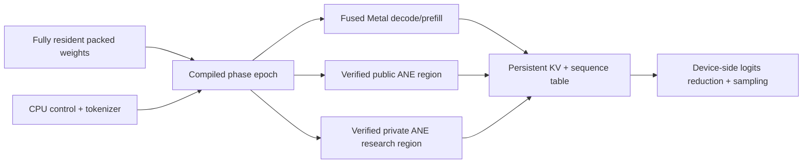

# Maximum-speed runtime policy

Status: shared policy and planner gates are implemented. An evidence-gated
resident MLX route now improves the continuous-batching control for exact
Qwen/Gemma and short-Llama batch-one workloads. Full-resident native
Metal/Core ML/private-ANE LLM programs remain staged performance work. Strata
does not yet claim a compute-kernel win over optimized MLX-LM.

## Public parameters

```json
{
  "optimization_mode": "maximum_speed",
  "ssd_offload": {"mode": "disabled"},
  "ane_execution": "public_auto",
  "allow_private_apis": false,
  "allowed_targets": ["mlx", "metal", "coreml", "cpu", "ane"],
  "minimum_speedup_percent": 5.0,
  "require_mlx_fallback": true
}
```

`maximum_speed` rejects `ssd_offload=auto|required`. The complete model must
pass full-residency admission; Strata rejects instead of silently paging.
Capacity remains an explicit separate profile:

```json
{
  "optimization_mode": "capacity",
  "ssd_offload": {
    "mode": "required",
    "storage_target_id": "approved-internal-ssd",
    "max_resident_weight_bytes": 671088640,
    "prefetch_distance": 0,
    "io_workers": 1
  }
}
```

The strict parser is `RuntimePerformancePolicy.from_parameters`. Its identity
digest enters the plan cache key, so a plan measured with SSD or ANE disabled
cannot be reused under a different policy.

## Immediate resident fast path

`src/ollm/runtime/resident_mlx.py` implements the first executable speed
policy. On the pinned Apple M1 target it selects direct single-sequence MLX-LM
generation only for hardware-validated model/runtime/workload fingerprints:

- Qwen3 0.6B, 512 prompt / 128 output: +10.01% end-to-end;
- Llama 3.2 1B, 512 / 32: +4.93% end-to-end;
- Gemma 3 1B, 512 / 128: +11.63% end-to-end.

Llama 512/128 regressed 2.22%, so that workload retains `BatchGenerator`.
Unknown shapes, versions, revisions, concurrent sequences, batch sizes above
one, and non-disabled SSD policy also retain `BatchGenerator`. These gains
remove serving-route overhead while both routes still use MLX-LM and the GPU;
they do not constitute the native Metal/ANE win targeted below.

## Cross-runtime selection rule

MLX is the compatibility oracle and recovery plan. CPU, custom Metal, Core ML,
and direct ANE all pass the same gates:

1. The policy allows the target.
2. The hardware exposes the required compute unit.
3. The target supports the exact operation, dtype, shape, layout, and phase.
4. An independent correctness record passes for the complete fingerprint.
5. Hardware timing covers the complete prefill or decode phase, including
   layout conversion, dispatch, synchronization, and readback.
6. Median throughput is at least the configured margin above comparable MLX.

Kernel-only, compilation-only, configuration-only, and synthetic evidence
cannot displace MLX. The default margin is 5%; it is adjustable but explicit.

| Runtime target | Maximum-speed role | Promotion boundary |
|---|---|---|
| MLX | broad compatibility and state-safe fallback | selected until another complete phase wins |
| CPU | tokenization, sampling, stop logic, small transforms | only tensor work that beats MLX including handoff |
| Metal | fused quantized projection, attention, MLP, KV, sampling epochs | exact-token parity and full-phase win |
| Core ML | public Apple-managed CPU/GPU/ANE coarse regions | compile, prediction, readback, Instruments, full-phase win |
| Direct ANE | opt-in private research, fixed compiled coarse regions | `private_research`, exact envelope, full-phase win |

## Intelligent ANE use

ANE is a candidate, not a quota. `ane_execution` has three modes:

| Mode | Behavior |
|---|---|
| `disabled` | Direct ANE is ineligible; Core ML is configured as `cpuAndGPU` |
| `public_auto` | Core ML is configured as `all`; direct private ANE is ineligible |
| `private_research` | Direct ANE may qualify only with `allow_private_apis=true` |

Apple documents `MLComputeUnits.all` as permission for Core ML to choose among
available units, including ANE. It is not proof that a particular operation
ran on ANE. Strata therefore requires Core ML/Neural Engine Instruments or an
equivalent measured execution receipt plus numerical validation.

The reverse-engineered research informs these design choices without copying a
third-party runtime:

- [`maderix/ANE`](https://github.com/maderix/ANE) demonstrates in-memory MIL
  compile/load/evaluate lifecycle and documents private-API limitations.
- [`skyfallsin/ane.cpp`](https://github.com/skyfallsin/ane.cpp) reports that
  constant-weight convolution kernels, fused regions, W-lane batching, and a
  persistent compiled process matter; its current single-stream results remain
  hardware- and model-specific.
- Apple's public [`ml-ane-transformers`](https://github.com/apple/ml-ane-transformers)
  shows ANE-oriented transformer mapping through supported Core ML.

The first intended placements are:

- long/chunked prefill projections when fixed token lanes amortize dispatch;
- coarse fused MLP/projection regions with weights baked into compiled programs;
- a small draft or MTP model that can overlap target-model Metal decode;
- background and multi-request throughput lanes where ANE batching wins.

Single-token decode is not assumed to benefit. Consecutive transformer
operations are data-dependent; sending every projection to ANE and attention
back to Metal can lose to one GPU epoch through dispatch and synchronization.

## Native route to an MLX-LM win

The general fast path must be a compiled capsule, not the current Python/MLX
laboratory:



Priority order:

1. Persistent native model slot with weights and KV allocated once.
2. Quantized Metal decode epoch: fused RMSNorm/QKV, online attention, output,
   fused SwiGLU, and device-side top-k/greedy reduction.
3. Chunked prefill epoch specialized by head dimension and context bucket.
4. Continuous decode batching and prefix/KV reuse.
5. Resident ANE worker with compile-once fixed-shape projection families.
6. Compare Metal-only, public Core ML hybrid, and private-ANE hybrid plans for
   every exact model/hardware/workload fingerprint.

The promotion scorecard remains model-wide: TTFT, prompt and decode rate,
aggregate throughput, peak memory, energy, thermal state, exact tokens, and
failure behavior. Strata has not achieved the MLX-LM win until those receipts
pass for at least one supported full model and then generalize across the model
ladder.

## Current M1 ANE boundary

On Apple M1, macOS 26.5.2 build 25F84, the isolated private probe currently
compiles, loads, dispatches, reads back, and numerically verifies one FP16
projection with logical shape `[64,256] @ [256,256].T`. A fresh qualification
on 2026-08-25 observed 0.404 ms inside `evaluateWithQoS`; compile, load, layout,
process startup, and model-wide handoffs were excluded. This is hardware
qualification, not an LLM throughput result and not planner-eligible timing.

The new resident benchmark then compiled and loaded that program once per
trial, reused the request and IOSurfaces, and ran five serialized trials of
five warmups plus fifty measured dispatches. Across trials, the median of the
trial medians was 0.250 ms and the median trial p95 was 0.298 ms, with zero
numerical error. An earlier isolated trial was materially faster, so it was not
used as the headline. This removes compile/process lifecycle from the repeated
path and supports building a resident worker, but it still excludes layout
bridges and a complete transformer phase. Raw evidence is
[`apple_m1_ane_resident_projection_benchmark_2026_08_25.json`](../benchmarks/results/apple_m1_ane_resident_projection_benchmark_2026_08_25.json).
