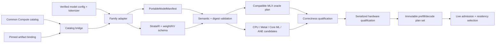

# Model-Adaptive Architecture

Status: canonical model-compatibility architecture, 2026-08-24. The typed
schema in `src/ollm/core/model_manifest.py` is current executable contract
evidence. Native lowering, catalog ingestion, and most family adapters remain
target work.

## Decision

Strata is capability-driven, not model-name-driven. A model name selects an
immutable artifact; its versioned semantic manifest determines how Strata
validates, lowers, plans, admits, executes, and pages that artifact.

Common Compute is the first catalog and deployment adapter. It does not own the
engine graph, backend scheduler, residency policy, or evidence store. The same
Strata model manifest must work through the standalone CLI, daemon, embedded
library, and Common Compute XPC adapter.

This separation lets Common Compute add models without adding branches such as
`if model_id == ...` to the hot path. A new model is admitted only when its
artifact, tokenizer, semantics, compatible baseline, and optimized plans have
the required evidence.

## Common Compute inventory snapshot

The public Common Compute v2 catalog returned 61 `text.generate` entries on
2026-08-24:

| Public status | Count | What it proves |
|---|---:|---|
| `live` | 1 | Publicly advertised production status for `apple-foundation-3b` |
| `preview` | 41 | Cataloged preview surface; not proof of available fleet capacity or successful execution on every Mac |
| `coming_soon` | 19 | Product intent only |

The preview surface spans Llama, Qwen, Gemma, Phi, Mistral/Devstral, SmolLM,
MiniCPM, DeepSeek distills, GLM, GPT-OSS, and dense, MoE, and hybrid variants.
`gpt-oss-20b` is already a preview catalog entry. The current provider source
pins `mlx-community/gpt-oss-20b-MXFP4-Q8` at revision
`773a7da77e569019bb0fd17a554b263738d669a3` under the MLX Swift 3.31.4
architecture ceiling. `gpt-oss-120b` is a target addition and must not be
advertised as available until its exact artifact and compatible provider path
are pinned and qualified.

The public catalog is a product catalog. Its ID, status, minimum-memory hint,
and approximate weight size are not sufficient to compile a model. Strata
needs a separate machine-readable semantic manifest.

## Four records, four owners

| Record | Owner | Required content | May change when |
|---|---|---|---|
| Product catalog | Common Compute | Public ID, lifecycle status, capabilities, coarse memory tier | Product rollout changes |
| Artifact binding | Common Compute provider or standalone importer | Repository/location, immutable revision, content digest, format, license/policy | A new artifact is deliberately pinned |
| Portable model manifest | Strata adapter | Exact architecture, tokenizer protocol, tensor/quantization semantics, weight-group schema | Model or adapter semantics change |
| Qualification overlay | Strata evidence store plus host | Hardware fingerprint, OS/runtime revisions, shape envelope, correctness and performance evidence | Hardware/software/evidence changes |

These records are joined by immutable IDs. A catalog status never promotes a
backend plan, and a locally successful plan never changes public availability.

## Portable model contract

The executable `PortableModelManifest` freezes:

- schema version, model ID, artifact kind, immutable revision and digest;
- exact weight format, quantization, and byte count;
- architecture class and source `model_type`;
- layer count, hidden size, context limit, normalization, and feature flags;
- query/KV head geometry, positional encoding, attention sinks, and a repeating
  or layer-exact attention schedule;
- dense or sparse-MoE feed-forward semantics, including expert cardinality,
  top-k routing, activation, and expert weight format;
- tokenizer revision/digest, vocabulary, prompt protocol, and template digest;
- declared model capabilities.

The canonical serialization has a stable SHA-256 identity. Plans, compilation
caches, weight packs, tokenizer caches, and evidence records key on that
identity, never only on a friendly model name.

The next schema increment adds the tensor-name mapping, tied/shared parameter
rules, logits transforms, KV layout, recurrent-state layout, and per-tensor
quantization blocks. Those are frozen before a native adapter consumes real
weights.

## Architecture classes

The catalog name is not authoritative. The importer reads the pinned model
configuration and produces one of these semantic classes.

| Class | Representative Common Compute entries | State model | Primary specialization |
|---|---|---|---|
| System hosted | `apple-foundation-3b` | Opaque Apple-owned session | System API adapter; no local weight or SSD control |
| Dense transformer | Llama, dense Qwen, Phi, Mistral, dense Gemma, SmolLM, distilled dense models | Per-layer KV | Fused dense blocks, GQA-aware KV, resident or sequential layer groups |
| Sparse MoE transformer | GPT-OSS, Mixtral, Qwen A3B, Gemma A4B/E, GLM/DeepSeek MoE variants | KV plus router/expert working set | Pinned backbone/router with separately resident expert groups |
| Hybrid transformer | Qwen Next/other attention-recurrent hybrids after config validation | KV plus recurrent/state-space state | Layer-exact state schema and mixed attention/state-space lowering |

Unknown model types, operations, layouts, or quantizers fail closed to an
already-qualified whole-model MLX compatibility adapter. If no compatible
adapter exists, import is rejected. Strata does not guess an architecture from
the model ID.

## End-to-end compilation and selection



There are no backend choices in the manifest. The manifest describes meaning;
hardware capabilities and evidence decide execution.

At model import:

1. Resolve an immutable local artifact or an opaque system-model binding.
2. Verify config, tokenizer, template/protocol, tensor inventory, byte ranges,
   and digests before allocation.
3. Lower exact semantics into StrataIR, weight groups, KV/recurrent state, and
   prefill/decode shape envelopes.
4. Construct a whole-model compatible baseline.
5. Generate candidate segmented plans from backend capabilities.
6. Promote only candidates with numerical parity and then comparable hardware
   evidence for the exact fingerprint.

At request admission:

1. Join the model manifest with the live `HardwareProfile`, platform state,
   service objective, request bounds, and qualified storage targets.
2. Calculate model, KV/recurrent state, activation, workspace, prefetch, cache,
   and safety-headroom bytes.
3. Select full residency, bounded SSD-paged residency, or reject/defer/reroute.
4. Select immutable prefill and decode plans independently.
5. Replan only at documented safe boundaries.

## SoC execution policy

Strata does not divide every layer among every engine. It gives each engine
work only when the measured end-to-end plan improves.

| Resource | Default ownership | Promotion rule |
|---|---|---|
| CPU | Protocol, tokenization, chat rendering, scheduling, admission, storage verification, sampling, small control reductions | Always available; tensor-heavy CPU kernels need their own evidence |
| GPU through MLX/Metal | Whole-model compatibility, dynamic attention, KV mutation, irregular MoE routing, custom quantized kernels | Correct compatible baseline, then measured custom-kernel win |
| ANE through Core ML | Supported fixed/bucketed prefill or projection segments | Compile, dispatch, readback, numerical parity, and end-to-end win |
| Private ANE worker | Research-only exact segments | Same proof plus isolated worker, timeout, quarantine, and verified fallback |
| Unified memory | Active weights, KV/recurrent state, activations, workspaces, backend caches | Single accountant and admission reservation |
| Approved internal/external SSD | Immutable cold weight packs and optional cold inactive state | Positive storage qualification and a plan whose measured stalls meet objective |

The GPU remains the general execution spine. ANE is a selectively promoted
coprocessor because fixed-shape compilation, tensor handoffs, and private API
risk can outweigh its arithmetic throughput. CPU/ANE/GPU concurrency is useful
only where dependencies permit overlap, such as verified next-weight prefetch,
CPU sampling/control, GPU decode, or an independent ANE segment.

## Residency by semantic group

The manifest and adapter create atomic weight groups. The residency manager
then chooses groups; it never pages arbitrary bytes needed by an in-flight
kernel.

### Dense transformer

- Prefer full residency when the safe budget covers weights plus bounded KV.
- Under paging, retain embeddings, final norm, and logits head when beneficial;
  stream contiguous transformer-block groups through a double-buffered window.
- Prefetch group `N+1` while group `N` executes only when the measured overlap
  is real and all bytes are reserved.

### Sparse MoE transformer

- Keep attention, normalization, router, KV, and small shared tensors resident.
- Represent each layer's expert bank as independently checksum-addressable
  groups, with an optional measured hot-expert cache.
- Exact router results determine the required experts. Predictive prefetch may
  reduce stalls but can never replace exact routing or consume unreserved
  memory.
- If expert misses dominate decode, use a larger resident window, alternate
  quantization, smaller model, or reroute. Unbounded SSD thrashing is a reject,
  not a plan.

### Hybrid transformer

- Derive state size and update rules per layer instead of applying the standard
  KV equation universally.
- Pin recurrent state; page immutable weights only.
- Batch only requests whose state schema, phase, and shape envelope match.

### System-hosted model

- Call the Apple system API behind its adapter.
- Record opaque system execution in receipts.
- Do not claim control of weights, Metal kernels, ANE placement, or SSD
  residency.

## GPT-OSS first-class family

Both GPT-OSS models use the same adapter family and different immutable
manifests.

| Property | GPT-OSS 20B | GPT-OSS 120B |
|---|---:|---:|
| Layers | 24 | 36 |
| Total parameters | 21B | 117B |
| Active parameters/token | 3.6B | 5.1B |
| Experts/layer | 32 | 128 |
| Active experts/token | 4 | 4 |
| Native context | 128k | 128k |
| Common Compute state | Preview and provider-pinned | Target addition; not currently cataloged |

Shared semantic requirements include MXFP4 expert weights, 2,880-wide hidden
and expert-intermediate dimensions, 64 query heads, 8 KV heads, 64-wide heads,
RoPE/YaRN, per-head attention sinks, alternating 128-token sliding-window and
dense attention, the clamped gated SwiGLU variant, and the `o200k_harmony`
tokenizer/protocol. These are compilation semantics, not optional tuning hints.

The first GPT-OSS plan family is:

```text
CPU: Harmony rendering, tokenization, admission, scheduler, sampling
GPU: embedding, attention/KV, exact router, MXFP4 expert kernels, logits
ANE: off by default; promote only proven fixed-shape projection/prefill segments
SSD: optional cold expert/layer packs; always staged into reserved unified memory
```

For 20B, full residency is the primary target on sufficiently large Common
Compute Macs, with paging used to prove the mechanism and serve constrained
machines only when latency remains acceptable. For 120B, high-memory full
residency is preferred; lower-memory service is an explicitly storage-bound
plan requiring real SSD and end-to-end qualification. The 120B artifact is not
downloaded or pinned until the user chooses its model/SSD destination.

## Common Compute bridge

Common Compute passes a versioned request and a catalog binding into the local
Strata service. The bridge resolves the binding to an installed manifest digest
and returns only bounded runtime facts:

```text
start(model_id, manifest_digest, prompt, bounds, objective, request_id)
  -> accepted(model_slot_id, plan_id, residency_mode)
  -> token(sequence, text)*
  -> exactly_one_terminal_receipt(
       model_digest, hardware_fingerprint, plan_id,
       prompt_tokens, output_tokens, timings, evidence_class)
```

Common Compute may route using coarse advertised envelopes. Strata makes final
per-Mac admission decisions from live memory, thermal/power policy, installed
artifacts, verified plans, and approved storage. A preview catalog entry with
no locally qualified manifest is a structured decline, not an attempted load.

## Promotion gates

A model becomes Strata-compatible only when all required gates pass:

1. **Manifest:** immutable artifact and tokenizer identities; complete semantic
   validation; license/policy accepted by the integrating product.
2. **Baseline correctness:** deterministic prompt, prefill logits, incremental
   decode logits/KV, tokenizer/chat rendering, sampling, and stop behavior match
   an independent oracle.
3. **Memory:** byte accounting matches measured peak within an explicit error
   envelope; pressure and cancellation release reservations.
4. **Backend:** each optimized segment has exact-envelope numerical evidence
   and a state-safe fallback.
5. **Hardware:** chip, macOS build, shapes, dtype, warmup, iterations, numerical
   error, timing boundaries, thermals, and storage target are recorded.
6. **Service:** streaming, cancellation, deadline, receipt, restart, soak, and
   Common Compute canary behavior pass.

Catalog breadth does not bypass these gates. Compatibility lands family by
family; performance lands operation envelope by operation envelope.

## Implementation sequence

1. Finish manifest JSON decoding, canonical schema, tensor mapping, and golden
   Swift/Python fixtures.
2. Build the Common Compute catalog-to-manifest bridge without changing the
   existing public catalog schema.
3. Implement one dense adapter using generated weights, then prove prefill,
   incremental decode, KV, and full/paged residency.
4. Implement GPT-OSS 20B semantics with generated MoE fixtures and an MXFP4
   oracle before any model download.
5. Add native Metal dense, attention, router, and MXFP4 expert kernels behind
   evidence gates.
6. Qualify selective Core ML/ANE segments; retain GPU-only baseline plans.
7. Pin and canary GPT-OSS 20B on Common Compute.
8. Add the GPT-OSS 120B catalog/artifact only after a suitable host and
   user-approved SSD destination exist for real qualification.

## Primary references

- Common Compute live model-first catalog:
  <https://api.commoncompute.ai/v2/catalog>
- OpenAI GPT-OSS architecture and availability:
  <https://openai.com/index/introducing-gpt-oss/>
- OpenAI GPT-OSS model card:
  <https://openai.com/index/gpt-oss-model-card/>
- OpenAI reference implementation and executable model configuration:
  <https://github.com/openai/gpt-oss/blob/main/gpt_oss/torch/model.py>
