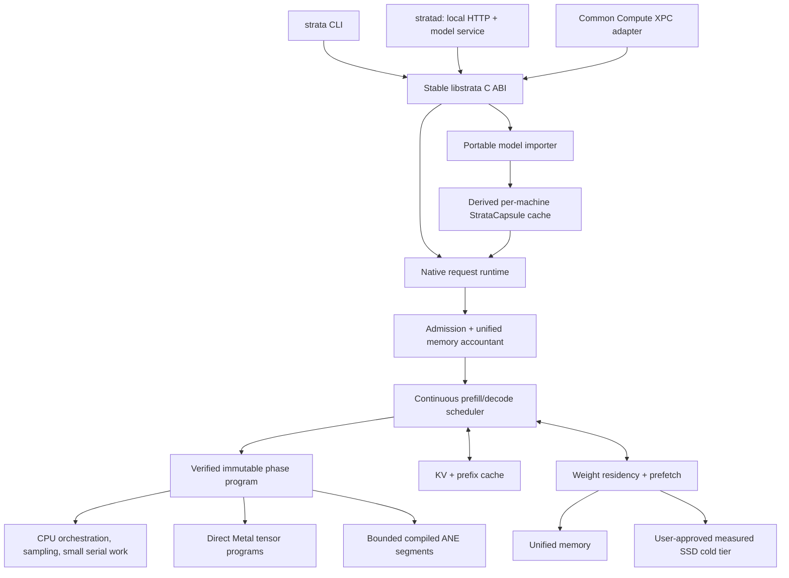

# Strata Standalone Runtime

Status: target product boundary. Existing Python, MLX, Metal, and ANE pieces are
identified as current only where repository tests or recorded hardware evidence
support them.

## Product boundary

Strata is a standalone Apple-Silicon LLM engine, not a Common Compute-specific
worker. It should be usable through a command-line client, a local daemon, or a
stable library API. Common Compute is the first integration and proving ground,
connected through an adapter that owns its fleet and billing concepts.

The open core must not contain Common Compute leases, billing, provider
identity, fleet routing, or task-envelope types. Those remain in the outer
adapter. The adapter may translate a Common Compute job into the same public
Strata request used by local callers.

## Implementation stack

| Layer | Intended implementation | Responsibility |
|---|---|---|
| `libstrata` | C ABI over a C++20 core | Stable embedding surface, lifecycle, requests, events, cancellation |
| Runtime core | C++20 | Model slots, admission, scheduling, memory accounting, plans, evidence |
| Apple bridge | Objective-C++ | Metal, IOSurface, Accelerate/BNNS, signposts, platform state |
| GPU programs | Metal Shading Language | Fused prefill/decode kernels and persistent tensor storage |
| Service shell | Swift | `stratad`, local HTTP, launchd/XPC integration, Keychain and sandboxing |
| Compatibility lane | MLX/MLX Swift | Correctness baseline and fallback while native coverage grows |
| Lab only | Python `ollm` | Import experiments, golden fixtures, planner simulation, evidence analysis |

Python is not in the production token-generation hot path. The `ollm` import
namespace remains until a deliberate compatibility migration.

## Models and compiled artifacts

Public input formats should remain portable, beginning with GGUF and
safetensors plus tokenizer metadata. Import produces an immutable logical model
manifest. Installation then derives a local `StrataCapsule` keyed by:

- model digest and quantization;
- Strata compiler and kernel revisions;
- chip family, OS build, and supported feature set;
- selected shape buckets and maximum context policy.

A capsule may contain packed weights, compiled Metal libraries, bounded ANE
artifacts, prefill/decode program variants, buffer layouts, and correctness and
performance evidence. It is a rebuildable cache, not a replacement model
format and not the only copy of user data.

## Using the whole SoC intelligently

Strata optimizes useful capability, not utilization percentages.

| Engine | Default ownership | Why |
|---|---|---|
| Performance CPU cores | tokenizer, scheduler, sampling, admission, packing, small irregular operators | Low launch cost and strong serial performance |
| Efficiency CPU cores | telemetry, cache bookkeeping, asynchronous I/O completion | Keeps control work away from latency-critical threads |
| GPU | attention, dense/MoE projections, normalization and fused transformer programs | Flexible high-throughput unified-memory compute |
| ANE | only exact compiled segments whose complete measured plan wins | Efficient fixed-shape compute, but compilation and handoffs are material |
| Media/display engines | no inference role unless an actual model operator maps to a supported API | Occupancy without useful work is not a goal |
| SSD | cold model and optional KV tier after qualification | Capacity tier only; bytes execute after reaching unified memory |

Concurrency should usually be coarse grained. CPU control and sampling can
overlap GPU/ANE work. Independent requests may occupy different engines when
memory bandwidth and handoff measurements show an end-to-end win. Splitting a
single layer across engines is disallowed by default because synchronization,
layout conversion, duplicate residency, and shared-memory contention can cost
more than the arithmetic saved.

## Phase programs and safe adaptation

Prefill and decode have different shapes and receive separate programs. Each
program is a verified ordered list of native segments with explicit buffers,
layouts, ownership, and synchronization. Useful variants include prompt-length
buckets, batch-width buckets, memory-residency modes, and supported backend
combinations.

The runtime selects a variant at model installation, model load, request
admission, a prefill chunk boundary, or a decode-iteration boundary. It never
changes a live kernel graph in the middle of an operation. The selected variant
must fit the granted memory budget and have matching correctness evidence.

## Minimum standalone product

The first externally useful release needs:

1. `strata run`, `strata serve`, model list/pull/import, streaming, cancellation,
   and structured metrics.
2. A stable C ABI and versioned local HTTP protocol.
3. One real model family with tokenizer, quantized weights, prefill, decode, KV,
   sampling, and deterministic correctness tests.
4. A direct-Metal path plus a supported fallback, selected by recorded evidence.
5. Memory admission, continuous batching, prefix/KV accounting, and clean
   out-of-memory rejection.
6. A reproducible benchmark and evidence bundle for every published claim.

Common Compute should consume this product through its adapter, canary it behind
a feature flag, and supply production reliability evidence. Before open-source
release, audit dependency/model licenses, private-API separation, generated
artifacts, repository provenance, secrets, and the current license ownership.

