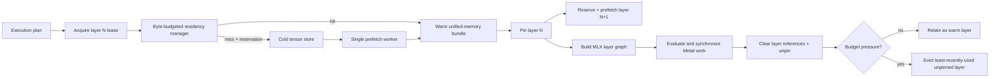
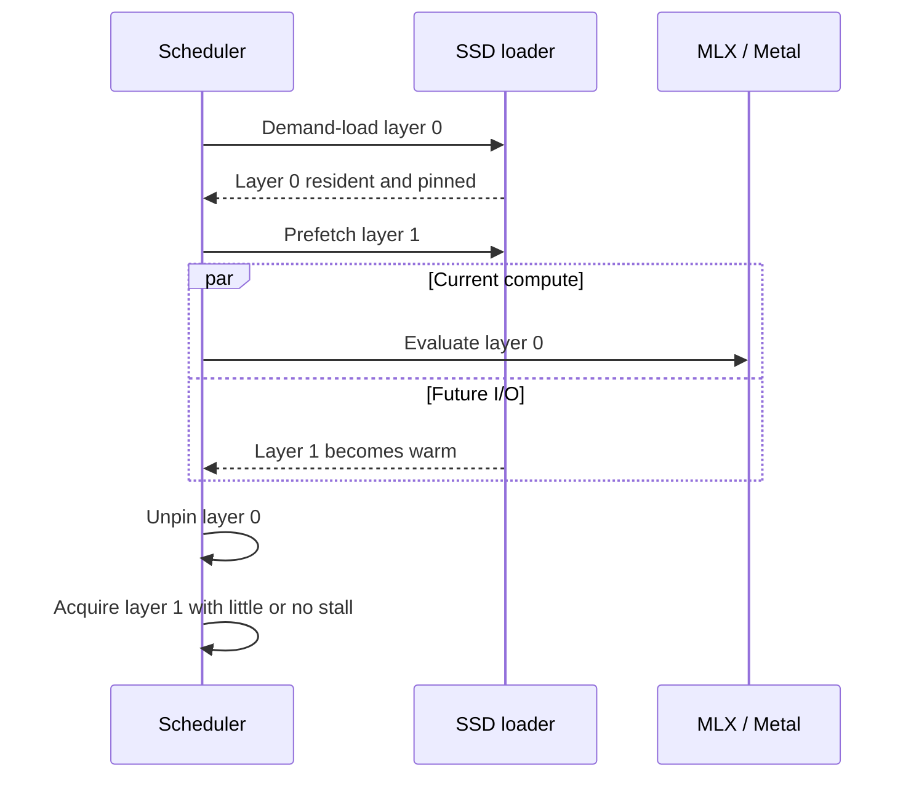
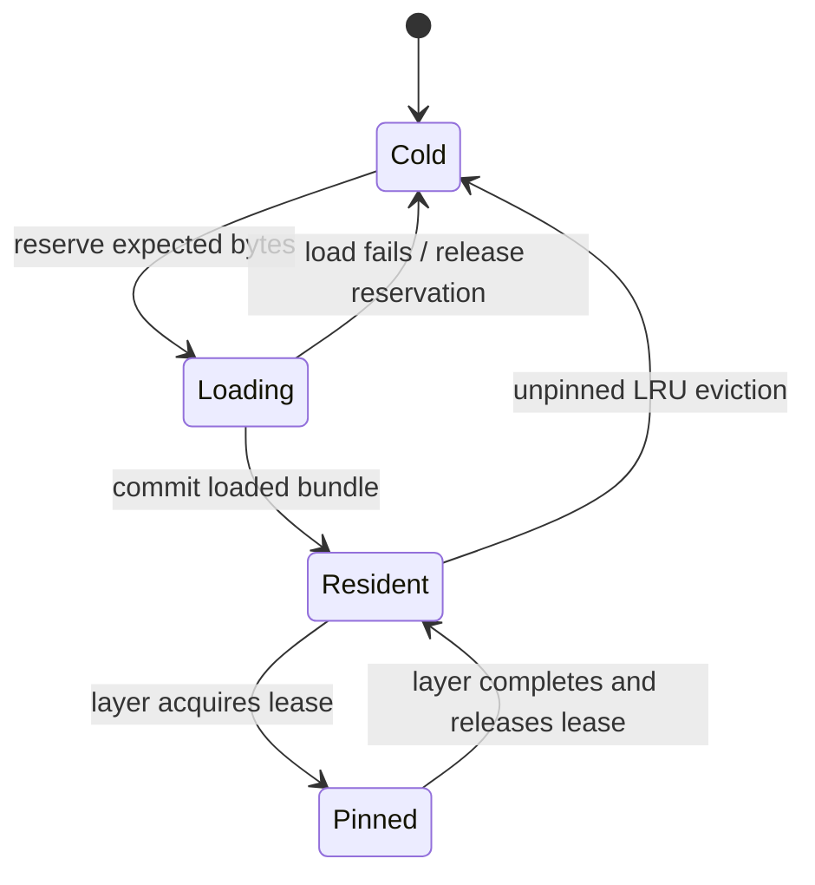

# Strata Governor

Strata Governor is the Apple-Silicon-native control plane for memory-tiered
inference. It gives decoder-layer weights an explicit byte cost, reserves
unified-memory capacity before starting I/O, overlaps the next exact layer load
with current MLX work, and retains the hottest layers across decode calls.

It does not claim direct SSD-to-GPU transfer. Apple Silicon uses unified memory,
so the physical path remains:

```text
SSD -> host/unified-memory allocation -> MLX array -> Metal execution
```

## Architecture



The runtime-neutral planner owns storage, residency, prefetch, pinning, and
eviction. MLX continues to own tensor graphs and Metal kernels.

## Dense execution timeline



MLX is lazy: constructing an array expression does not prove that its kernels
have executed. Strata therefore evaluates and synchronizes each governed layer
before clearing that layer's model references. Without this boundary, the lazy
graph can retain weight tensors from every prior layer and defeat paging.

## Memory rule

The suggested warm-weight budget is:

\[
B_{\text{warm}}
=
f\left(W_{\text{recommended}}-M_{\text{active}}-M_{\text{safety}}\right)
\]

| Symbol | Meaning |
|---|---|
| \(B_{\text{warm}}\) | Maximum bytes reserved for warm weight groups |
| \(f\) | Configurable headroom fraction; the default suggestion is 0.75 |
| \(W_{\text{recommended}}\) | Metal's maximum recommended working-set size |
| \(M_{\text{active}}\) | Bytes currently active in MLX |
| \(M_{\text{safety}}\) | Capacity reserved for KV cache, activations, macOS, and other work |

The helper only suggests a budget. It does not silently change MLX global
memory, cache, or wired-memory limits.

## Overlap rule

For adjacent layers, the unavoidable demand stall is approximately:

\[
t_{\text{stall}}
=
\max\left(0, t_{\text{load}}(N+1)-t_{\text{compute}}(N)\right)
\]

| Symbol | Meaning |
|---|---|
| \(t_{\text{load}}(N+1)\) | Time to make the next layer resident |
| \(t_{\text{compute}}(N)\) | Synchronized MLX/Metal execution time for the current layer |
| \(t_{\text{stall}}\) | Time inference waits for weights after current compute ends |

Trace records distinguish total load duration from demand stall duration. A
prefetch mechanism is only useful when measured stall falls.

## Residency state machine



Pinned groups cannot be evicted. Loading reservations count against the hard
budget, preventing double buffering from causing an untracked temporary memory
spike.

## Local Apple Silicon profile

The development machine used for this slice reported:

| Field | Observed value |
|---|---:|
| Chip | Apple M1 |
| Unified memory | 16 GiB |
| Metal recommended working set | approximately 11.84 GiB |
| Installed MLX | 0.31.1 |

These values are machine-specific and are detected at runtime through
`mlx.core.device_info()` and MLX memory counters.

## Current code map

| Component | Repository path |
|---|---|
| Tensor and group contracts | `src/ollm/core/` |
| Existing-loader adapter | `src/ollm/storage/tensor_store.py` |
| Manifest-to-model-spec conversion | `src/ollm/storage/manifest.py` |
| Byte-budgeted LRU | `src/ollm/scheduling/residency_manager.py` |
| Background exact prefetch | `src/ollm/scheduling/prefetch_scheduler.py` |
| Dense execution pipeline | `src/ollm/scheduling/dense_pipeline.py` |
| MLX profile and pipeline builder | `src/ollm/backends/mlx_governor.py` |
| Llama integration | `src/ollm/llama_mlx.py` |
| DeepSeek integration | `src/ollm/deepseek_mlx.py` |

## Usage

```python
from ollm import TensorTracer
from ollm.backends.mlx_governor import (
    detect_mlx_hardware,
    suggested_residency_budget,
)
from ollm.llama_mlx import MLXLlamaForCausalLM

profile = detect_mlx_hardware()
budget = suggested_residency_budget(profile)
tracer = TensorTracer()

model = MLXLlamaForCausalLM(
    config,
    tracer=tracer,
    weight_loader=loader,
    memory_budget_bytes=budget,
)
```

The custom Llama governor path currently requires the project's `gds_export`
manifest. The DeepSeek adapter can use its indexed safetensor loader. Standard
`mlx_lm` models are not yet adapted to the governor.

## Verification

The deterministic suite verifies:

- Reservations and resident values never exceed the byte budget.
- Pinned weights cannot be evicted.
- Next-layer loading begins before current-layer compute.
- A one-layer budget safely falls back to demand loading.
- Governed Llama output matches the non-governed MLX path.
- A full-budget second forward reuses each layer without reloading it.

The synthetic benchmark command is:

```bash
PYTHONPATH=src python benchmarks/benchmark_memory_governor.py
```

With 12 modeled layers, 12 ms modeled load time, 18 ms modeled compute time,
two warm layers, and two passes, the local run modeled 1.68x wall-time speedup
and reduced aggregate acquisition stall to about 29 ms. This is a scheduler
overlap model driven by sleeps; it is not an SSD, token-throughput, or real-model
benchmark.

## Still required

- Benchmark actual layer files on the target storage device.
- Record page-cache state and effective SSD bandwidth.
- Add adaptive budget changes based on KV-cache growth and memory pressure.
- Add MoE expert groups and exact router-driven acquisition.
- Adapt standard `mlx_lm` model modules without forking their kernels.

Official MLX references:

- [Using Streams](https://ml-explore.github.io/mlx/build/html/usage/using_streams.html)
- [Transforms and asynchronous evaluation](https://ml-explore.github.io/mlx/build/html/python/transforms.html)
- [Memory management API](https://github.com/ml-explore/mlx/blob/main/docs/src/python/memory_management.rst)
