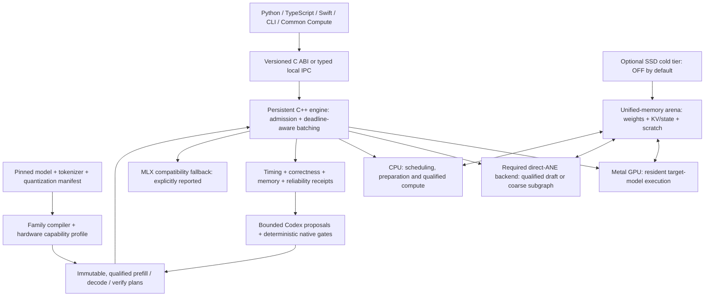

# Strata Native Runtime v2 — execution-first Apple-Silicon architecture

Design decision: September 7, 2026. Status: proposed replacement topology,
not an implemented runtime or a demonstrated speed advantage.

This document is saved on the Mac's internal data volume. The failed external
drive was not accessed. The surviving older worktree and Codex edit history are
recovery inputs, not a verified reconstruction of the latest source tree.
No repositories, packages, models or benchmark datasets were downloaded.

## 1. The decision

Build a **model-family compiler plus a persistent native inference engine**.
Optimize the complete request's critical path. Do not make general-purpose
CPU/GPU/ANE dispatch, Python orchestration, or individual microbenchmark wins
the architectural center.

The engine should consume an immutable execution plan, keep tensors and model
state resident, and advance many requests through bounded prefill/decode steps.
Runtime adaptation selects already-qualified plans; it does not rewrite kernels
or change model semantics while serving a request.

Primary implementation:

- C++20: model semantics, lowering, scheduling, memory ownership, sampling
  contracts, admission, native benchmark gates and plan selection.
- Objective-C++: Metal, direct private-ANE execution, Core ML, IOSurface,
  process lifecycle, Apple telemetry and storage integration. Objective-C is
  acceptable for the narrow reverse-engineered ANE bridge.
- Metal Shading Language: the GPU tensor hot path, including device-side
  quantization decoding, attention, expert computation and sampling.
- Python, TypeScript and Swift: bindings, application integration and experiments;
  no alternate tensor execution implementation in these wrappers.

Language alone is not the speedup. MLX already executes native GPU operations.
Strata must remove actual work, memory transfers, launches, synchronization,
padding or scheduling delay relative to a matched MLX implementation.

## 2. What "beat Darkbloom" means

Public source reviewed at Darkbloom revision
`0b46b1618d43cae3ae3d8e0fde1a9cc6d974e9d0` (September 7).
Its current inference design describes in-process MLX, a persistent engine per
resident model, continuous batching, chunked prefill, capability-gated state
caching and speculative execution. Merely adding these features is not proof
of superiority. [Darkbloom inference design](https://github.com/Layr-Labs/d-inference/blob/0b46b1618d43cae3ae3d8e0fde1a9cc6d974e9d0/docs/architecture/inference.md)

The user's pasted timeline claims a 3–4x prefill improvement, but does not give a
complete reproducible model/hardware/workload/baseline tuple. Do not multiply
that claim into a universal target. Darkbloom's July report describes specific
work-elimination and packed-prefill changes, with separate production timing
measurements and confounders; those are not interchangeable with that headline.
[July report](https://github.com/Layr-Labs/d-inference/blob/0b46b1618d43cae3ae3d8e0fde1a9cc6d974e9d0/docs/reports/2026-07-25-prefill-and-fleet-performance-findings.md)

Maintain four separate result categories:

1. Native operator versus an independent numerical oracle.
2. Complete model versus pinned MLX-LM on the same Mac.
3. Local serving versus a pinned Darkbloom engine and its exact dependencies,
   using equivalent model artifacts and request semantics.
4. Common Compute service results including network, routing and queueing.

Fleet tokens/day are demand and fleet-scale metrics, not single-Mac kernel
benchmarks. Local Strata cannot claim to beat a remote service by omitting its
network or security costs. No authenticated or paid competitor load is authorized
by this design work.

Keep the previously agreed target of at least 1.25x MLX-LM prefill and decode
throughput for every cell advertised as accelerated. Add a **proposed** direct
competitor gate of at least 1.10x local Darkbloom service goodput at matched
latency and correctness constraints. These are engineering targets, not results
or promises for all models. Failure in one cell cannot disappear into an average.

Include llama.cpp and newer native competitors in the comparison matrix before
claiming "fastest on Mac." For example, BaseRT's authors report substantial
M5 prefill gains from specialized Metal kernels; those are external claims to
reproduce, not Strata results. [BaseRT paper](https://arxiv.org/abs/2607.19438)

## 3. Topology



The diagram separates ownership and policy. Shared physical memory does not
remove synchronization, conversion, allocation or bandwidth costs. An ANE
worker may need its own compatible buffers, charged to the same process-wide
resource budget.

## 4. Compile models into semantic, phase-specific programs

The compiler consumes a manifest, not a model-name heuristic. Pin model revision,
weight/shard digests, quantization encoding, tokenizer, chat template, adapters,
attention variants, position handling, state layout and required operators.
Repacking changes physical layout without silently changing decoded weight values.
Lossy requantization creates a distinct model-quality comparison.

Lower to three programs: `prefill`, `decode`, and optional `verify`. Each contains
tensor layouts, bounded shape buckets, resource lifetimes, kernel variants,
dependency edges, state writes and permitted readback points. Compile kernels
and create pipeline states before admitting requests; cache them by source,
compiler, OS, device family, model and shape identities.

Family adapters must make the following distinctions explicit:

| Family semantics | Required native specialization |
|---|---|
| Dense GQA, including applicable Llama/Qwen distills | Grouped attention, model-specific RoPE, dense gated MLP and exact norm conventions |
| GLM / DeepSeek MLA variants | Compressed latent state, separate positional component, cache layout and absorbed/unabsorbed projection choices |
| Routed MoE | Exact router scoring and correction semantics, selected-expert computation, shared experts and weighted reduction |
| GPT-OSS | Exact packed weight format, attention pattern, router, output/token protocol and expert kernels |
| Hybrid/recurrent models | Per-layer recurrent and convolutional state in addition to attention state; transactional checkpoint/restore |
| Vision or other modalities | Separate adapters, shape budgets and parity gates; never assume a text-only optimization preserves these paths |

Friendly names do not confer native support. DeepSeek distills may use Llama or
Qwen semantics; not every GLM or DeepSeek model uses the same attention/router.
Unknown architectures route through supported MLX compatibility or reject
explicitly. "Any model loads" and "every model is natively accelerated" are
different milestones.

## 5. GPU: two different performance problems

### Prefill — reuse data and eliminate unnecessary computation

1. Compute prompt logits only for positions the caller needs. Intermediate
   chunks usually need no vocabulary projection; ordinary generation needs the
   final prompt position. Prompt-logprob APIs require a separate program.
2. Fuse normalization/projections or activation/projections when measured
   register pressure and occupancy justify it. Fusion is a candidate, not a rule.
3. Use tiled matrix multiplication with quantized values unpacked near their
   consumer. Compare direct quantized and bounded materialized paths; never
   require a full FP16 model expansion just to execute quantized weights.
4. Use tiled, numerically stable attention that avoids materializing the full
   attention-score matrix. Preserve absolute positions, masks and sliding windows.
5. Pack compatible requests into layer-major work. Compare packed/ragged versus
   rectangular layouts with padding counted; shape compatibility includes model
   state semantics, not merely token count.
6. Keep intermediate activations and KV writes device-resident. Prune final-layer
   unused rows only where a dependency analysis proves no requested output or
   state write depends on them.

Maintain a broadly supported Metal kernel tier and a separately qualified Metal
tensor/MPP tier. Apple documents GPU Neural Accelerators on M5/A19 and tensor
operations for custom kernels; these are **not the dedicated ANE**. Select by
actual device/OS/toolchain capabilities, not by assuming M1 supports M5 paths.
[Apple Metal tensor session](https://developer.apple.com/videos/play/wwdc2026/330/)

### Decode — minimize bytes moved and host intervention

- Specialized quantized matrix-vector kernels for one request; small-batch
  matrix kernels when concurrency makes weight reuse worthwhile.
- Fuse dequantization into consumption where advantageous; retain bounded
  alternative layouts for the hardware's measured crossover points.
- Read only required experts, retain the useful latent representation for MLA,
  and avoid expanding all expert weights or duplicating KV heads.
- Sample on-device where the requested sampler is supported. Read back compact
  token/status records, not the whole logits vector every iteration.
- Reuse resources and prebuilt pipeline states. Encode dependent work in
  bounded batches, with explicit hazards/fences; do not wait after every layer.
- Do not use one giant uninterruptible command buffer. Check cancellation and
  backpressure at bounded boundaries; retire submitted work before reclaiming
  any buffers it can still reference.

For one autoregressive stream, a useful diagnostic lower bound is
`step_time >= max(required_DRAM_bytes / effective_bandwidth,
required_operations / effective_compute_rate)`.
This ignores additional overhead and therefore is not a throughput prediction.
Measure bytes at the appropriate cache/DRAM boundary. For batched decode, report
both aggregate output throughput and per-request inter-token latency.

## 6. ANE: required reverse-engineered native backend

User requirement: the reverse-engineered ANE path is mandatory engineering
scope. A public Core ML adapter is supplementary and cannot substitute for
implementing or demonstrating the direct private-ANE backend. Study
reverse-engineering references such as maderix/ANE and Orion, then implement
Strata's own narrow ABI and qualification tests. Preserve source attribution and
license obligations if any code is later reused; inspiration does not mean
relabeling copied code. maderix explicitly describes its work as research, not
a production inference framework. [ANE reference](https://github.com/maderix/ANE)
[Orion](https://arxiv.org/abs/2603.06728)

Initial candidate order:

1. A small resident draft model with fixed shape buckets, followed by target
   verification on the GPU.
2. Coarse, repeatedly reused projection/MLP or encoder segments with a stable
   compatible layout and enough work to amortize dispatch.
3. Wider phase execution only after full state, position and numerical semantics
   are verified. Do not presume complete ANE execution is the fastest choice.

The native direct-ANE bridge owns this explicit pipeline:

```text
trusted family/shape plan -> bounded MIL graph and weight descriptors
  -> private compiler/client capability and version checks
  -> compiled artifact -> loaded executable -> compatible IOSurface buffers
  -> direct ANE evaluation -> completion -> readback and numerical verification
  -> qualified draft/segment state returned to the native engine
```

Keep compile, load, input preparation, evaluation, synchronization and readback
as separate timed operations. Cache compiled artifacts and loaded executables
under separate budgets; loaded lifetimes end explicitly on unload or worker
retirement. Probe each private method signature and reject ABI/OS mismatches;
never assume reverse-engineered symbols remain stable across macOS versions.
No caller-supplied arbitrary MIL or private selector strings enter the service.

For speculative execution, acceptance must preserve the target distribution
with the appropriate verifier, or exact greedy behavior for greedy mode. Count
only accepted output tokens. Charge draft compute, verification, rejection,
extra memory and transfer costs. Drafting and verification for the same request
have dependencies; they are not magically simultaneous. Cross-request overlap
is a separate contention experiment.

ANE qualification requires compile, real dispatch, readback, numerical checks,
placement evidence, warm/cold timing and an enclosing-phase win. Selecting an
ANE-capable Core ML configuration alone proves none of these. Revalidate on OS
and compiler changes. Record unsupported shapes, compile limits and failures.

Keep private-framework work in a restartable isolated worker, not a production
process's unconditional startup path. Charge IPC and layout conversion costs.
IOSurface sharing is used only when actual dtype/stride/access compatibility
is demonstrated. A compile artifact cache is not live weight paging.

Controls: `ane=off|auto|required`, selecting the direct private backend for
qualified experimental deployment profiles. `off` is the A/B control. `auto`
may choose GPU/MLX when direct ANE does not improve the declared objective, and
must report that ANE was not used. `required` rejects at admission if the plan
cannot execute verified direct-ANE work; an execution failure fails the request
or performs an explicitly disclosed permitted recovery, never a silent
GPU-only success. Core ML execution does not satisfy `required` in this track.

Private API use remains an explicit deployment decision with OS qualification
and a disable switch. The user has requested this engineering track; this is
not a claim of public-API support or unrestricted deployment compatibility.
Keeping ANE idle can be the fastest plan for some workloads, but zero ANE use
cannot satisfy the ANE implementation milestone.

**ANE acceptance:** at least one complete qualified LLM request path must use
the direct backend, have nonzero verified ANE dispatches, preserve the target's
correctness contract, and produce paired ANE-on/off end-to-end evidence. The
performance milestone additionally requires an enclosing-request advantage
within the declared latency/memory limits. If that gain is absent, report
"direct execution verified, speed gain unproven" and keep optimizing; do not
mark ANE acceleration complete based on discovery, a Core ML setting or a
single projection microbenchmark. This gate does not require every layer or
every model to execute on ANE.

## 7. CPU and memory hierarchy

CPU responsibilities: bounded admission/scheduling, tokenization preparation,
resource bookkeeping, asynchronous storage preparation, stream formatting and
small independently qualified compute. Use C++ with NEON or Accelerate where
measured. Keep latency-critical work separate from background preparation;
request QoS without promising private core-pinning behavior.

CPU tensor work must not repeatedly steal the GPU's bandwidth for the same hot
weights. Compare overlap with serialization; multiple active engines share
power and memory limits. Test whole requests before splitting a layer.

One physical-memory budget covers weights, attention/recurrent state, scratch,
speculation, ANE duplication, staging and OS headroom. Account for aliases by
physical allocation identity, not by summing every view's logical size.

Use stable arenas, reusable scratch, bounded metadata pools and explicit
lifetimes. CPU/GPU hardware caches are managed by hardware: software can improve
layout/locality, but cannot promise arbitrary pinning into L2 or the system cache.
Treat software weight caches, KV pages, prefix state and compiled pipelines as
separate caches with distinct identities and budgets.

KV/state policy:

- Compare contiguous storage for simple single-stream cases with paged storage
  for variable concurrent requests; neither is universally fastest.
- Use immutable shared prefix pages with reference counts and copy-on-write.
- A reusable prefix binds tenant/security scope, exact token IDs, model,
  tokenizer/template, adapters, position configuration and state format.
- Hybrid models require a complete reusable state checkpoint, not attention KV
  alone. Speculation commits/rolls back all affected state together.
- Quantized KV is an independent quality/performance experiment, never an
  invisible memory-saving change.

## 8. SSD: explicit capacity option, not the default speed path

`storage.ssd_mode = off | weights | prefix | weights_and_prefix`, default `off`.
No implicit switch under pressure. `off` disables Strata-managed inference-time
weight paging and disk prefix reuse; it does not disable initial model loading
or macOS's own swap. Observe swap/pressure and reject or reduce admission instead
of claiming resident-only evidence when the OS is paging heavily.

When enabled, require an approved SSD path, a free-space reserve and bounded
resident/staging/disk budgets. Treat weight paging and reusable prefix-state
storage as separate mechanisms. Prefer coalesced aligned reads into reusable
staging or measured Metal I/O paths. The path remains SSD to memory to compute.

For MoE, cache likely hot experts and prefetch only within strict budgets; route
predictions may warm the cache but must never replace the exact model router.
Late misses incur measured demand stalls. Dense sequential weight paging is
principally a capacity mode and can dominate latency if bytes per step exceed
the storage budget. Do not advertise an SSD-capacity result as a resident win.

Use manifests/checksums and atomic cache publication. Corrupt/missing prefix
artifacts fall back to recomputation; failed mandatory weight reads retire the
request safely. Default to memory-resident active state, not continuous swapping
of a live request's hot KV. Apply tenant isolation and deletion policy to any
persistent prompt-derived state. The failed HDD is never an experiment target.

## 9. Native continuous batching and the request lifecycle

Use one scheduler/owner per device with model slots under a process-wide memory
budget. Avoid one model load, one worker creation, or one exclusive GPU lease
per request. Do not mix different model weights into a batch.

At each bounded step:

1. Retire completions; process cancellation and output-backpressure notices.
2. Reserve actual state/scratch headroom before admitting waiting requests.
3. Estimate decode obligations and select a prefill quota from measured profiles.
4. Form compatible shape buckets; choose a qualified prefill/decode/verify plan.
5. Encode work and submit. Overlap only independent preparation with execution.
6. Publish compact output events, update state ownership and record timing.

Separate interactive and throughput objectives. Protect inter-token deadlines,
but age waiting prompts to prevent starvation. Batch size and prefill chunk size
are bounded choices, not fixed "max out the GPU" constants. Shrink or stop
admission on memory/thermal pressure. Plan switches require compatible state or
an explicitly costed migration at a safe boundary.

Changing batch geometry can affect floating-point trajectories. Darkbloom's
September 6 Qwen diagnostic explicitly distinguishes per-index repeatability
from universal token equality across batch positions. Test both numerical and
generation behavior for each supported execution geometry; do not assume a
seed alone makes every schedule equivalent.
[Qwen diagnostic](https://github.com/Layr-Labs/d-inference/blob/0b46b1618d43cae3ae3d8e0fde1a9cc6d974e9d0/docs/reports/2026-09-06-qwen36-uniform-prefill.md)

## 10. Stable interfaces and source layout

Proposed layout in the eventual recovered/rebuilt repository:

```text
native/include/strata.h             versioned C ABI, opaque handles
native/model/                      manifests, validation, family adapters
native/compiler/                   phase IR, fusion/layout/lifetime planning
native/runtime/                    engine, admission, batching, state ownership
native/memory/                     arenas, KV/prefix/expert cache, residency
native/backends/metal/             Objective-C++ executor and capabilities
native/backends/ane/               required direct-ANE bridge + isolated worker
native/backends/coreml/            supplementary public-framework adapter
native/backends/cpu/               NEON/Accelerate kernels
native/kernels/metal/              prefill, decode, MLA, MoE, sampling variants
native/storage/                    approved SSD I/O and artifact publication
native/bench/                      native clocks, correctness/resource gates
native/search/                     bounded candidates and promotion registry
bindings/python/                   ollm compatibility wrapper
bindings/typescript/               typed IPC or optional N-API adapter
bindings/swift/                    C ABI or XPC adapter
adapters/commoncompute/            provider contract, capacity and stream events
tests/fixtures/                    tiny generated model families
benchmarks/                         pinned baselines, workloads, raw receipts
docs/design/                       contracts and architecture decisions
```

ABI operations: `create`, `load_model`, `submit`, `poll_events`, `cancel`,
`get_capacity`, `unload_model`, `destroy`. Use opaque generation-stamped handles,
explicit struct sizes/versions, fixed-width fields, capacities and status codes;
do not expose STL or Objective-C objects. Document which calls copy caller
buffers and which retain them, thread-safety, and error ownership.

Request: model handle, token IDs or a validated text request, sampling policy,
output limit, deadline, tenant/cache scope and workload profile. Events: accepted,
token batch, usage, finished, cancelled, failed. Preserve exactly one terminal
event, bounded queues and safe buffer lifetimes after cancellation.

Bindings transport requests and events, not whole tensors between layers.
Use a persistent typed local connection for TypeScript/daemon integration. XPC
is an optional macOS application boundary, not a per-kernel RPC. Common Compute
retains networking, identity and billing; Strata owns device execution and
advertises measured capacity instead of a fixed one-request GPU slot.

Fallback is request/phase-explicit. A failing native path must not silently
restart after emitting output or continue from incompatible state. Recover only
from a valid checkpoint under the declared policy; otherwise report failure.
Record actual backend and fallback time in all receipts.

## 11. Benchmark and promotion contract

Screen with tiny generated fixtures, then designated locally available models;
ask for a destination before downloading anything. Last-known M1 results do not
qualify M5 paths or prove a large GLM/DeepSeek model fits the current device.

Workload dimensions:

| Dimension | Initial bounded matrix |
|---|---|
| Models | One dense GQA canary; one small generated MLA/MoE canary; later exact Common Compute artifacts |
| Prompt tokens | 128, 512, 2,048, 8,192 where supported |
| Requested output | 32, 128, 512; separate fixed-length throughput from natural-stop workloads |
| Concurrency | 1, 2, 4, 8 within memory and deadline limits |
| Cache | Process cold; resident weights/prefix miss; exact prefix hit; mixed arrivals |
| Storage | SSD off; separately qualified weight and prefix modes |
| Speculation | Off control; qualified on with acceptance/rollback accounting |
| Hardware | Exact chip/core/memory/OS tuple; separate power and thermal profiles |

Start with a small screening subset, not its whole Cartesian product. Retained
candidates progress to the declared full matrix and held-out workloads.

Required timing boundaries: request receipt, queue admission, template/tokenize
completion, model ready, first/last prefill launch, first generated token ID,
first user-visible generated content, each decode completion and terminal event.
Role headers or empty SSE chunks do not count as first content.

Metrics: prefill input tok/s; target-confirmed output tok/s; per-request
inter-token p50/p95/p99; TTFT and first-content latency; aggregate goodput of
requests meeting declared SLOs; queue and end-to-end latency; rejection/error
rates; peak physical footprint; state/scratch/weight allocation; cache hit/miss
and saved computation; bytes read and I/O stalls; compile/load time; draft
acceptance; energy/token and thermal state where actually measured.

Record backend work with signposts/native GPU timestamps and explicit handoff
events. Overlapping CPU/GPU/ANE durations must not be summed into an invented
request duration. Shared SoC energy is not automatically attributable per engine;
use unavailable/null when counters or privileges are absent.

Every receipt binds source/build/artifact/model/baseline digests, compiler flags,
OS build, hardware, dtype/shape/quantization, seeds, prompt/template hashes,
warmup, iterations, arrival schedule, cache/storage/speculation state, timing
units, numerical errors, telemetry availability and raw sample references.

Gate order:

1. Build and ABI/schema validation, bounded resource and input checks.
2. Independent tensor oracle checks, complete-layer/state checks, tokenizer and
   sampling checks, then real-model generation/quality tests.
3. Matched single-request and serving baselines, including cold and uncached
   controls. Validate the baseline harness before trusting a speedup.
4. At least five independently restarted paired measurement rounds for retained
   candidates, alternating order, sufficient warmup, and raw distributions.
   Use a predeclared paired confidence calculation; confidence intervals crossing
   a promotion threshold fail the performance gate. Collect enough requests for
   meaningful tail-latency comparisons rather than claiming p99 from five points.
5. Native accelerated cells must satisfy the 1.25x MLX throughput target plus
   predeclared TTFT/inter-token/quality/memory limits. A direct Darkbloom win needs
   its own matched evidence; a faster-than-MLX result cannot substitute for it.
6. Cancellation, invalid input, OOM/admission, slow consumer, worker crash,
   cache corruption and repeated-load tests; then a sustained serving soak before
   Common Compute promotion. No competing hardware benchmark runs.

No threshold relaxation after seeing a failure. No post-hoc omission of slow
prompts, early-stop bias, cached-vs-uncached comparisons, precision changes or
draft-token counting. Component-only evidence remains non-promotable for serving.

## 12. Bounded architecture search

Codex consumes a bottleneck/evidence delta and proposes at most four candidates
per batch, each changing one dominant hypothesis. Initial budget: two proposal
rounds, eight candidates, an explicit time limit and scratch cap. This is a
proposed operating policy, not a background automation started by this document.

Each proposal binds its parent, exact writable paths, source and baseline
identities, affected family/shapes, mechanism, expected direction, correctness
hazards, resource limits, measured stop condition and rollback artifact. Examples:
change a Metal tile; remove an unnecessary logits projection; change a prefill
quota; change a bounded expert grouping layout. "Use all compute" is not a testable
candidate.

Deterministic native validators build, test, measure and select workload-specific
Pareto candidates. Codex cannot waive gates. Select by actual bottleneck: byte
traffic for bandwidth-limited decode, reuse/work elimination for prefill,
scheduling for queue delay, and admission/residency for memory pressure. Amdahl's
law constrains the end-to-end upside of any one component.

Serving uses a versioned immutable registry, not an LLM on the hot path. Apply
updates at safe state-compatible boundaries. Repeated errors, stalls or resource
violations disable the exact qualified profile and retain its failure evidence.
Automatic fallback must obey the stream/checkpoint contract above.

## 13. Development order and definition of done

1. **Recover a durable source base on a user-chosen internal-SSD path.** Preserve
   raw recovered material separately; never blindly replay old patches over a
   newer source. Recover code and receipts where possible, inventory gaps, rerun
   tests. Commit small reviewed increments and obtain approval before pushing.
   Keep a second independent backup; Git alone does not preserve untracked work.
2. **Freeze ABI, phase/state contracts and the baseline harness.** Include the
   direct-ANE compile/load/evaluate/unload contract and `auto/off/required`
   semantics. Build a tiny generated full-model fixture, trace real timing
   boundaries, and prove actual direct-ANE compile/dispatch/readback early.
3. **Finish one dense native model path.** Prefill work elimination, resident
   quantized projections/attention/MLP, KV, sampling and streaming. Compare the
   complete loop against MLX, not just the new kernel.
4. **Add native serving improvements.** Deadline-aware batching, capacity
   admission, cache correctness and cancellation; measure SLO-constrained goodput.
5. **Complete the GLM/DeepSeek and GPT-OSS family work.** Recover useful router
   fixtures, then MLA/state handling and full expert pipelines. Do not advertise
   a routing primitive as a complete MoE runtime.
6. **Complete the required direct-ANE integrated path and hardware-specific
   acceleration.** Qualify the ANE resident-draft or coarse-segment path with
   complete LLM ANE-on/off comparisons. Qualify M5 GPU tensor paths on appropriate
   hardware, plus opt-in SSD capacity and prefix modes. Keep independent controls
   for each. The ANE gate cannot be waived by a GPU-only throughput win.
7. **Fleet validation and Common Compute rollout.** Exact artifact/hardware
   canaries, bounded concurrency and soak, repeatable comparison bundles, honest
   per-cell support/performance tables, and reversible promotion.

A milestone is done when its integrated path passes the gates, not when its
files or wrappers exist. The first credible win is a reproducible complete-model
and serving result on one declared configuration; breadth follows without
replacing evidence with the claim that every Mac or LLM must improve.

## 14. What is preserved from Strata

Retain manifest-first family identification, the native C++/Objective-C++/Metal
direction, MLX as oracle/fallback, separate residency modes, evidence receipts,
bounded proposals and safe promotion. Prior router and prefill work are useful
recovery candidates, not proof that this v2 topology is already running.

The structural changes are: whole-phase compilation instead of ad hoc operation
routing; explicit device-resident state ownership; prefill work elimination as a
first-class pass; native deadline-aware serving; separate GPU-neural/ANE tracks;
and end-to-end gates that must pass before a local kernel win becomes a claim.
